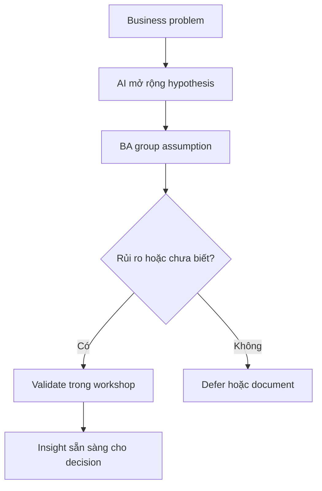

# Discovery với AI

<div class="lesson-meta">
  <span>Quy trình BA được tăng cường bởi AI</span>
  <span>Software BA</span>
  <span>Core</span>
</div>

## Learning outcomes

- Dùng AI tạo hypothesis và interview plan.
- Tách assumption, evidence và decision trước workshop.
- Biến output AI thành discovery agenda tốt hơn.

## Why this matters for BA work

<div class="ba-callout">
AI có thể mở rộng discovery, nhưng BA vẫn phải quyết định điều gì cần validate với stakeholder thật.
</div>

Business Analyst đứng giữa problem framing, ý nghĩa từ stakeholder, constraint triển khai và product decision. Trong công việc có AI, vị trí này quan trọng hơn vì ngôn ngữ chưa rõ có thể tạo false certainty rất nhanh. Bài này đưa ra một control thực tế để áp dụng trước khi output AI trở thành scope, backlog hoặc delivery commitment.

## Mental model or core concept

Discovery là giảm uncertainty, không phải tạo tài liệu cho đủ. AI hỗ trợ đề xuất actor, constraint, risk và question, nhưng output nên trở thành hypothesis backlog. BA sau đó validate hoặc reject hypothesis bằng user, data, policy và stakeholder decision.

## Practical BA example

Với claim approval automation, AI gợi ý fraud check, SLA tier, escalation path và missing document scenario. BA chuyển chúng thành workshop question và ưu tiên assumption rủi ro nhất: ai được override, policy nào áp dụng và exception hợp lệ là gì.

## Diagram



## BA artifact

### Discovery Hypothesis Backlog

| Hypothesis | Evidence cần có | Cách validate | Decision owner |
| --- | --- | --- | --- |
| Claim giá trị cao cần manager review. | Policy threshold và historical claim data. | Review policy và data sample. | Claims operations lead |
| Missing document trigger customer notification. | Support script hiện tại và customer journey. | Interview support agent. | Customer service manager |
| Fraud risk thay đổi SLA. | Fraud rule và compliance constraint. | Compliance workshop. | Risk owner |
| Manual override phải audit. | Audit policy và regulator expectation. | Security review. | Compliance lead |

## AI collaboration prompt

```text
Tạo discovery hypothesis backlog cho business problem này. Bao gồm actor, assumption, evidence needed, validation method, decision owner, risk level và workshop question. Chưa viết final requirement.
```

## Mistakes to avoid

- Yêu cầu AI viết requirement trước khi map uncertainty.
- Xem generated question là discovery đầy đủ.
- Bỏ qua decision owner.
- Ưu tiên câu hỏi dễ thay vì assumption rủi ro.

## Apply this tomorrow

1. Chuyển agenda workshop tiếp theo thành hypothesis.
2. Nhờ AI tìm stakeholder group còn thiếu.
3. Thêm evidence needed cạnh mỗi assumption.
4. Mở workshop bằng decisions required, không chỉ topic.

## What a BA should remember

- Discovery output là validated learning.
- AI mở rộng question space; stakeholder validate nó.
- Artifact discovery tốt cho thấy điều gì chưa biết.
