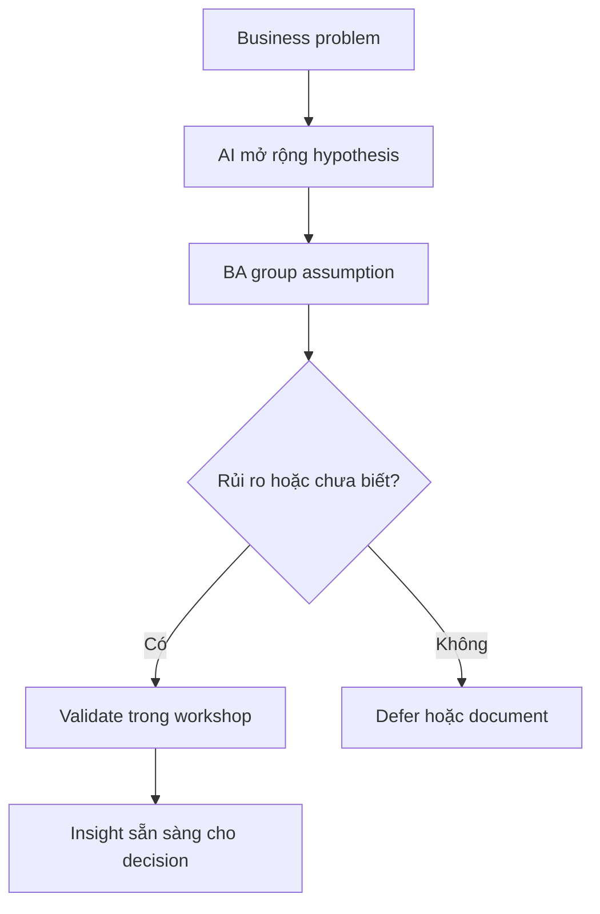

# Discovery với AI

<div class="lesson-meta">
  <span>Quy trình BA được tăng cường bởi AI</span>
  <span>Software BA</span>
  <span>Core</span>
</div>

## Learning outcomes

- Dùng AI tạo hypothesis và interview plan.
- Tách assumption, evidence và decision trước workshop.
- Biến output AI thành discovery agenda tốt hơn.

## Why this matters for BA work

<div class="ba-callout">
AI có thể mở rộng discovery, nhưng BA vẫn phải quyết định điều gì cần validate với stakeholder thật.
</div>

Bài này quan trọng vì AI có thể làm discovery có vẻ nhanh hơn nhưng âm thầm thay uncertainty bằng completeness tự bịa. Giá trị của BA là biến suggestion của AI thành hypothesis, không phải conclusion. Workflow discovery tốt dùng AI để mở rộng question space, rồi dùng evidence, workshop, interview và data để quyết định điều gì đúng.

## Common difficulties for BAs

Trong Quy trình BA được tăng cường bởi AI, Discovery với AI trở nên khó khi notes lộn xộn, decision mới validate một phần và stakeholder context chưa đầy đủ phải nhanh chóng thành artifact chung. BA nên kiểm tra các điểm dưới đây trước khi xem artifact có AI hỗ trợ là đủ sẵn sàng cho stakeholder decision hoặc handoff.

| Khó khăn | Vì sao khó trong công việc BA | BA nên xử lý thế nào |
| --- | --- | --- |
| Yêu cầu AI viết requirement trước khi map uncertainty. | Lỗi "Yêu cầu AI viết requirement trước khi map uncertainty." xuất hiện khi team bàn về source attribution, conflict visibility, workshop decision flow và backlog readiness nhưng chưa thống nhất source nào authoritative. AI có thể làm disagreement nghe mượt hơn, nên BA phải giữ uncertainty visible. | Áp dụng control này: giữ speaker/source attribution visible cho đến khi stakeholder chịu trách nhiệm xác nhận ý nghĩa. Sau đó dùng pattern tốt hơn "Trước hết yêu cầu hypothesis, assumption, evidence needed và workshop question." và hỏi ai phải approve artifact trước khi nó ảnh hưởng scope, build, test hoặc release. |
| Xem generated question là discovery đầy đủ. | Với Discovery với AI, điểm khó là AI có thể mở rộng discovery, nhưng BA vẫn phải quyết định điều gì cần validate với stakeholder thật. Pattern yếu rất dễ xảy ra vì AI có thể tạo câu trả lời trôi chảy trước khi BA check ownership, source freshness hoặc decision right. | Áp dụng control này: giữ speaker/source attribution visible cho đến khi stakeholder chịu trách nhiệm xác nhận ý nghĩa. Sau đó dùng pattern tốt hơn "Validate actor bằng process map, org role, customer journey và decision right." và hỏi ai phải approve artifact trước khi nó ảnh hưởng scope, build, test hoặc release. |
| Bỏ qua decision owner. | Điểm này khó khi Discovery Hypothesis Backlog được kỳ vọng hỗ trợ validated working artifact. Nếu BA không challenge draft, unsupported assumption có thể đi vào planning, testing hoặc stakeholder communication. | Áp dụng control này: giữ speaker/source attribution visible cho đến khi stakeholder chịu trách nhiệm xác nhận ý nghĩa. Sau đó dùng pattern tốt hơn "Rank hypothesis theo business impact, evidence gap và decision urgency." và hỏi ai phải approve artifact trước khi nó ảnh hưởng scope, build, test hoặc release. |

## Where this applies in real projects

Dùng bài này khi discovery hoặc refinement tạo nhiều raw input hơn mức BA có thể synthesize an toàn bằng tay trong thời gian có sẵn. Output thực tế không phải document dài hơn; đó là Discovery Hypothesis Backlog có đủ evidence, ownership và decision clarity cho cuộc trao đổi tiếp theo của dự án.

| Thời điểm trong dự án | Cách áp dụng bài học | Output cụ thể của BA |
| --- | --- | --- |
| Discovery | Chuyển agenda workshop tiếp theo thành hypothesis. | Discovery Hypothesis Backlog thể hiện source attribution, conflict visibility, workshop decision flow và backlog readiness, trong đó action "Chuyển agenda workshop tiếp theo thành hypothesis." được chuyển thành decision, requirement, checklist hoặc question có thể review ở meeting tiếp theo. |
| Synthesis | Nhờ AI tìm stakeholder group còn thiếu. | Discovery Hypothesis Backlog thể hiện source evidence, trong đó action "Nhờ AI tìm stakeholder group còn thiếu." được chuyển thành decision, requirement, checklist hoặc question có thể review ở meeting tiếp theo. |
| Refinement | Thêm evidence needed cạnh mỗi assumption. | Discovery Hypothesis Backlog thể hiện decision owner, trong đó action "Thêm evidence needed cạnh mỗi assumption." được chuyển thành decision, requirement, checklist hoặc question có thể review ở meeting tiếp theo. |

## If this is missing

Nếu thiếu Discovery với AI, signal quan trọng từ interview, ticket, process note hoặc decision có thể mất trước khi đi vào backlog. BA vẫn có thể khôi phục, nhưng phải chuyển draft AI bóng bẩy trở lại thành evidence, assumption, owner và decision test được.

| Nếu thiếu | Ảnh hưởng tới dự án | Cách khôi phục |
| --- | --- | --- |
| Yêu cầu AI viết requirement từ business problem | Model sẽ biến uncertainty của discovery thành scope quá sớm. | Khôi phục bằng pattern tốt hơn: Trước hết yêu cầu hypothesis, assumption, evidence needed và workshop question. Rework Discovery Hypothesis Backlog cho đến khi nó lộ rõ source attribution, conflict visibility, workshop decision flow và backlog readiness, và không share như bản final cho tới khi evidence, ownership và validation path explicit. |
| Xem stakeholder list do AI tạo là final | Owner nội bộ, regulator hoặc operational user quan trọng có thể bị thiếu. | Khôi phục bằng pattern tốt hơn: Validate actor bằng process map, org role, customer journey và decision right. Rework Discovery Hypothesis Backlog cho đến khi nó lộ rõ source attribution, conflict visibility, workshop decision flow và backlog readiness, và không share như bản final cho tới khi evidence, ownership và validation path explicit. |
| Ưu tiên câu hỏi dễ trả lời | Team có thể né assumption rủi ro nhất cho tới lúc delivery. | Khôi phục bằng pattern tốt hơn: Rank hypothesis theo business impact, evidence gap và decision urgency. Rework Discovery Hypothesis Backlog cho đến khi nó lộ rõ source attribution, conflict visibility, workshop decision flow và backlog readiness, và không share như bản final cho tới khi evidence, ownership và validation path explicit. |

## Mental model or core concept

Discovery là giảm uncertainty, không phải tạo tài liệu cho đủ. AI hỗ trợ đề xuất actor, constraint, risk và question, nhưng output nên trở thành hypothesis backlog. BA sau đó validate hoặc reject hypothesis bằng user, data, policy và stakeholder decision.

## Practical BA example

Với claim approval automation, AI gợi ý fraud check, SLA tier, escalation path và missing document scenario. BA chuyển chúng thành workshop question và ưu tiên assumption rủi ro nhất: ai được override, policy nào áp dụng và exception hợp lệ là gì.

## Diagram



## BA artifact

### Discovery Hypothesis Backlog

| Hypothesis | Evidence cần có | Cách validate | Decision owner |
| --- | --- | --- | --- |
| Claim giá trị cao cần manager review. | Policy threshold và historical claim data. | Review policy và data sample. | Claims operations lead |
| Missing document trigger customer notification. | Support script hiện tại và customer journey. | Interview support agent. | Customer service manager |
| Fraud risk thay đổi SLA. | Fraud rule và compliance constraint. | Compliance workshop. | Risk owner |
| Manual override phải audit. | Audit policy và regulator expectation. | Security review. | Compliance lead |

## AI expert note

AI hữu ích trong discovery vì nó tạo alternative actor, edge case, risk và interview angle rất nhanh. Nguy hiểm là anchoring: khi đã có list trôi chảy, stakeholder có thể ngừng khám phá. BA phải label rõ hypothesis, evidence needed, validation method và decision owner trước khi chuyển bất kỳ phần nào thành requirement.

## Bad vs better example

| Cách làm yếu | Vì sao fail | Cách làm BA tốt hơn |
| --- | --- | --- |
| Yêu cầu AI viết requirement từ business problem | Model sẽ biến uncertainty của discovery thành scope quá sớm. | Trước hết yêu cầu hypothesis, assumption, evidence needed và workshop question. |
| Xem stakeholder list do AI tạo là final | Owner nội bộ, regulator hoặc operational user quan trọng có thể bị thiếu. | Validate actor bằng process map, org role, customer journey và decision right. |
| Ưu tiên câu hỏi dễ trả lời | Team có thể né assumption rủi ro nhất cho tới lúc delivery. | Rank hypothesis theo business impact, evidence gap và decision urgency. |

## Stakeholder questions to ask

| Stakeholder | Câu hỏi | Vì sao BA hỏi |
| --- | --- | --- |
| Product owner | Discovery với AI cần cải thiện outcome nào, và trade-off nào có thể chấp nhận? | Ngăn output AI tối ưu cho mục tiêu mơ hồ. |
| Engineering lead | Source, system, data hoặc constraint nào khiến Discovery Hypothesis Backlog khó implement? | Biến technical constraint ẩn thành requirement question visible. |
| QA lead | Rule, exception hoặc user state nào phải test được trước khi tin artifact này? | Chuyển wording trôi chảy của AI thành behavior quan sát được. |
| Operations hoặc support | Failure path nào tạo manual work nếu nguyên tắc "Discovery output là validated learning" bị bỏ qua? | Làm rõ support load, exception handling và operating impact. |

## Decision log entries

| Decision item | Option cần capture | Owner | Evidence cần có |
| --- | --- | --- | --- |
| Scope boundary cho Discovery Hypothesis Backlog | Must-have, later, out of scope | Product owner | Business outcome và release constraint |
| Authority cho source attribution, conflict visibility, workshop decision flow và backlog readiness | Documented source, stakeholder decision, assumption cần validate | BA + stakeholder chịu trách nhiệm | Source ID, date và approval status |
| Review gate trước handoff | Peer review, QA review, engineering review, formal approval | BA lead hoặc project lead | Risk level và receiving-team readiness |
| Cách recover nếu Yêu cầu AI viết requirement trước khi map uncertainty. | Rewrite, defer, escalate hoặc validation workshop | Decision owner | Impact lên scope, testability và release risk |

## Definition of Ready / Done

| Gate | Tín hiệu ready | Tín hiệu done |
| --- | --- | --- |
| Definition of Ready | Source cho source attribution, conflict visibility, workshop decision flow và backlog readiness được label và còn hiệu lực. | Discovery Hypothesis Backlog có thể review mà không phải đoán missing context. |
| Definition of Ready | Open assumption có owner và validation path. | Stakeholder có thể accept, reject hoặc defer từng assumption. |
| Definition of Done | Artifact áp dụng control: giữ speaker/source attribution visible cho đến khi stakeholder chịu trách nhiệm xác nhận ý nghĩa. | Delivery, QA hoặc governance team có thể hành động dựa trên artifact. |
| Definition of Done | Pattern yếu "Yêu cầu AI viết requirement trước khi map uncertainty." đã được kiểm tra explicit. | Không unsupported AI claim nào bị xem như requirement đã approve. |

## Before and after artifact example

| Before | Risk trong draft AI | Revision của senior BA |
| --- | --- | --- |
| Prompt: "Create Discovery Hypothesis Backlog cho Discovery với AI." | Model có thể tự bịa source fact, owner, threshold hoặc implementation rule. | Thêm source, scope boundary, source authority, output schema và instruction: Trước hết yêu cầu hypothesis, assumption, evidence needed và workshop question. |
| Draft statement: "Chuyển agenda workshop tiếp theo thành hypothesis." | Action hữu ích nhưng chưa gắn decision owner hoặc acceptance signal. | Rewrite thành project step có owner, expected artifact, review gate và evidence cần trước handoff. |
| Paragraph nghe final về validated working artifact | Tone có thể che uncertainty và approval còn thiếu. | Chuyển thành bảng fact, assumption, decision needed, risk và validation question. |

## Manual verification after AI output

| Lens kiểm tra | Manual check | Pass signal |
| --- | --- | --- |
| Evidence | Trace mọi statement quan trọng trong Discovery Hypothesis Backlog về source, decision hoặc assumption có label. | Không unsupported claim nào còn bị ẩn. |
| Completeness | Check source attribution, conflict visibility, workshop decision flow và backlog readiness theo intended audience và receiving team. | Artifact trả lời được điều product, engineering, QA và operations cần. |
| Testability | Hỏi QA có tạo được positive, negative, boundary và exception scenario không. | Wording mơ hồ được rewrite hoặc log thành question. |
| Accountability | Confirm ai approve, ai review và ai xử lý khi artifact sai. | Owner và escalation path explicit. |

## AI collaboration prompt

```text
Tạo discovery hypothesis backlog cho business problem này. Bao gồm actor, assumption, evidence needed, validation method, decision owner, risk level và workshop question. Chưa viết final requirement.
```

## Mistakes to avoid

- Yêu cầu AI viết requirement trước khi map uncertainty.
- Xem generated question là discovery đầy đủ.
- Bỏ qua decision owner.
- Ưu tiên câu hỏi dễ thay vì assumption rủi ro.

## Apply this tomorrow

1. Chuyển agenda workshop tiếp theo thành hypothesis.
2. Nhờ AI tìm stakeholder group còn thiếu.
3. Thêm evidence needed cạnh mỗi assumption.
4. Mở workshop bằng decisions required, không chỉ topic.

## What a BA should remember

- Discovery output là validated learning.
- AI mở rộng question space; stakeholder validate nó.
- Artifact discovery tốt cho thấy điều gì chưa biết.
