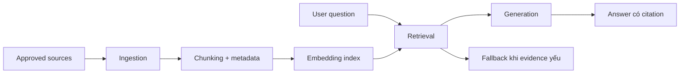

# Embeddings, RAG và product knowledge

<div class="lesson-meta">
  <span>Nền tảng AI cho Business Analyst</span>
  <span>Software BA</span>
  <span>Core</span>
</div>

## Learning outcomes

- Giải thích RAG pipeline và các điểm quality có thể fail.
- Viết requirement BA cho source authority, freshness, access và citation.
- Định nghĩa retrieval quality metric cho AI assistant.

## Why this matters for BA work

<div class="ba-callout">
Với BA, RAG không chỉ là UI chatbot; trọng tâm là governance tri thức nào hệ thống được phép tin.
</div>

Business Analyst đứng giữa problem framing, ý nghĩa từ stakeholder, constraint triển khai và product decision. Trong công việc có AI, vị trí này quan trọng hơn vì ngôn ngữ chưa rõ có thể tạo false certainty rất nhanh. Bài này đưa ra một control thực tế để áp dụng trước khi output AI trở thành scope, backlog hoặc delivery commitment.

## Mental model or core concept

RAG retrieve tài liệu nguồn trước khi model generate answer. Nó chỉ tăng grounding khi source đúng được index, chunk, rank, permission và cite đúng. BA đặc tả RAG phải định nghĩa knowledge contract: tài liệu nào được tính, conflict xử lý ra sao và assistant làm gì khi evidence yếu.

## Practical BA example

Một HR policy assistant trả lời câu hỏi maternity leave từ cả policy 2024 và handbook 2021 đã obsolete. BA bổ sung requirement về source priority, effective date, citation display, conflict warning và fallback sang HR khi hệ thống thấy policy conflict.

## Diagram



## BA artifact

### RAG Knowledge Contract

| Requirement area | Đặc tả BA | Quality metric | Failure mode |
| --- | --- | --- | --- |
| Source authority | Chỉ dùng approved policy repository và HR knowledge base. | 100% answer cite approved source. | Assistant cite stale PDF. |
| Freshness | Effective date phải visible và source mới được rank cao hơn. | Freshness error dưới 1%. | Policy cũ override rule mới. |
| Access control | Chỉ retrieve document user được phép xem. | Không leakage cross-role trong test. | Policy manager-only lộ cho employee. |
| Fallback | Nếu citation không đủ confident, trả lời kèm escalation path. | Fallback được dùng cho unsupported question. | Assistant tự bịa policy. |

## AI collaboration prompt

```text
Draft requirement RAG cho assistant này. Bao gồm source inventory, chunking assumption, access control, citation behavior, conflict handling, fallback, retrieval metric và test scenario. Tách must-have control khỏi nice-to-have UX.
```

## Mistakes to avoid

- Xem RAG là magic accuracy.
- Bỏ qua document ownership và freshness.
- Quên access control trong retrieval.
- Chỉ đo answer tone thay vì retrieval correctness.

## Apply this tomorrow

1. Liệt kê authoritative source cho một AI assistant idea.
2. Định nghĩa hệ thống làm gì khi hai source conflict.
3. Viết một test question bắt buộc trigger fallback.
4. Thêm citation requirement vào feature spec.

## What a BA should remember

- RAG quality bắt đầu từ knowledge governance.
- Cite source sai vẫn là sai.
- BA requirement phải cover retrieval, không chỉ generated answer.
