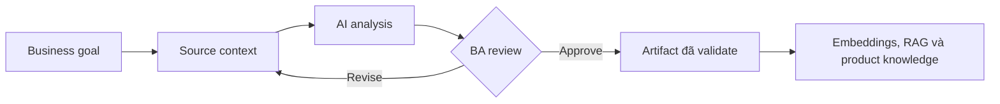

# Embeddings, RAG và product knowledge

<div class="lesson-meta">
  <span>Nền tảng AI cho Business Analyst</span>
  <span>Software BA</span>
  <span>Core</span>
</div>

## Learning outcomes

- Giải thích embeddings, rag và product knowledge bằng ngôn ngữ business.
- Áp dụng concept vào workflow BA thực tế.
- Dùng output AI như draft có evidence, không xem là sự thật tự động.
- Xác định câu hỏi review BA phải hỏi trước khi chia sẻ artifact.

## Why this matters for BA work

AI thay đổi cách tạo ra artifact phân tích, nhưng không thay thế trách nhiệm của BA về clarity, evidence và decision.

<div class="ba-callout">
Hiểu cách RAG truy xuất tri thức và vì sao retrieval quality quan trọng hơn giao diện chatbot đẹp.
</div>

## Core concept

Pattern hữu ích cho BA là controlled collaboration: cung cấp business context cho model, yêu cầu structured output, bắt buộc có evidence, rồi review theo goal, rule, risk và decision của stakeholder.

## Practical BA example

Một support chatbot trả lời sai chính sách hoàn tiền vì index cả policy cũ và mới. BA cần đặc tả freshness, authority, source ranking, conflict handling và yêu cầu citation.

## Diagram



## BA workflow

1. Đóng khung business question trước khi mở AI tool.
2. Cung cấp source context và constraint rõ ràng.
3. Yêu cầu structured output có mapping về source.
4. Chạy critique pass để tìm ambiguity, gap, risk và testability.
5. Chuyển kết quả thành artifact mà team có thể inspect và cùng chịu ownership.

## Prompt hoặc template

```text
Hãy định nghĩa knowledge contract cho tính năng RAG này: source system, độ mới dữ liệu, access control, citation rule, xử lý conflict, fallback answer và quality metric.
```

## What a BA should remember

- AI là bộ tăng tốc reasoning, không phải decision owner.
- Mọi claim quan trọng phải grounded vào source context hoặc stakeholder confirmation.
- BA giỏi giữ review loop rõ ràng: draft, critique, revise, validate.
