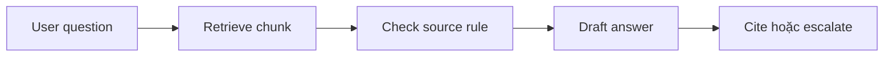
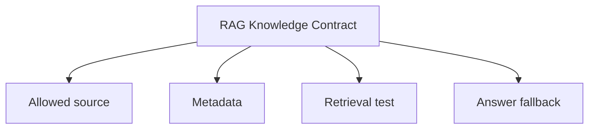

# Embeddings, RAG và knowledge

<div class="lesson-meta">
  <span>AI foundations cho Business Analyst</span>
  <span>Software BA</span>
  <span>Core</span>
</div>

## Story mode: project walkthrough

<div class="story-mode-panel">
  <p class="story-eyebrow">Story prototype</p>
  <h3>Policy assistant tìm policy sai nhanh hơn</h3>
  <p class="story-intro">Team xây policy assistant cho support nội bộ. Demo trả lời rất nhanh, nhưng lại lấy travel policy đã hết hiệu lực vì chưa ai định nghĩa source authority.</p>
  <div class="story-scene-grid">
<article class="story-scene">
  <span>Scene 1</span>
  <b>01</b>
  <strong>Demo làm cả phòng ấn tượng</strong>
  <p>Assistant trả lời trong vài giây và cite document nhìn có vẻ liên quan.</p>
</article>
<article class="story-scene">
  <span>Scene 2</span>
  <b>02</b>
  <strong>Answer lấy từ thư viện sai</strong>
  <p>Maya thấy policy được cite đã bị archive sáu tháng trước.</p>
</article>
<article class="story-scene">
  <span>Scene 3</span>
  <b>03</b>
  <strong>Knowledge trở thành requirement</strong>
  <p>Cô viết rule cho allowed source, chunk ownership, freshness và fallback.</p>
</article>
<article class="story-scene">
  <span>Scene 4</span>
  <b>04</b>
  <strong>Assistant an toàn hơn</strong>
  <p>Demo sau đó từ chối source cũ và yêu cầu human review khi confidence thấp.</p>
</article>
  </div>
  <div class="visual-takeaway-strip">
<span>RAG cần governance cho source</span>
<span>Retrieval không phải approval</span>
<span>Fallback là một phần của answer</span>
  </div>
</div>

## AI words in plain English

| Thuật ngữ AI | Hiểu đơn giản | BA dùng để làm gì |
| --- | --- | --- |
| Embedding | Cách biểu diễn ý nghĩa text bằng số. | Giúp hệ thống tìm nội dung liên quan, nhưng không chứng minh nội dung đúng. |
| Vector search | Search theo ý nghĩa thay vì keyword y hệt. | Dùng cho policy, FAQ và knowledge base có wording khác nhau. |
| RAG | Retrieve document trước, rồi generate answer dựa trên document đó. | BA đặc tả source, citation rule và xử lý khi retrieval yếu. |
| Chunk | Một phần nhỏ của document dùng để retrieval. | Định nghĩa chunk size, owner, date và metadata section. |

## Reality check: tình huống thường gặp trong dự án

<div class="fact-card-grid">
<article class="fact-card">
  <strong>Search trả về cái liên quan, không chắc là đúng</strong>
  <span>Định nghĩa source authority trước khi test answer quality.</span>
  <p>Document gần nghĩa vẫn có thể cũ hoặc không được phép dùng.</p>
</article>
<article class="fact-card">
  <strong>Citation tạo cảm giác yên tâm giả</strong>
  <span>Review citation relevance, không chỉ citation presence.</span>
  <p>Answer có citation nhưng cite sai section.</p>
</article>
<article class="fact-card">
  <strong>Knowledge thay đổi liên tục</strong>
  <span>Thêm freshness và ownership vào knowledge contract.</span>
  <p>Policy, product limit và SOP có thể hết hiệu lực.</p>
</article>
</div>

## Visual walkthrough



## Visual decision map

<div class="visual-ba-map">
  <h3>RAG Knowledge Contract: what the BA should look for</h3>
<div>
  <strong>Knowledge scope</strong>
  <span>Document nào được phép dùng.</span>
  <em>Loại draft, archive và personal note.</em>
</div>
<div>
  <strong>Retrieval quality</strong>
  <span>Chunk nào được trả về.</span>
  <em>Check relevance, freshness và coverage.</em>
</div>
<div>
  <strong>Answer behavior</strong>
  <span>Assistant nói gì khi evidence yếu.</span>
  <em>Dùng refusal, escalation hoặc clarification.</em>
</div>
</div>

## Learning outcomes

- Giải thích RAG không quá kỹ thuật.
- Viết requirement cho knowledge source và retrieval behavior.
- Định nghĩa fallback khi evidence yếu hoặc conflict.

## Why this matters for BA work

<div class="ba-callout">
RAG chỉ hữu ích khi BA định nghĩa rõ knowledge tin cậy, retrieval boundary và behavior của answer.
</div>

Bài này quan trọng vì nhiều team nói muốn chatbot nhưng nhu cầu thật là truy cập knowledge tin cậy. BA phải định nghĩa knowledge contract: source nào được dùng, freshness được check ra sao, citation được review thế nào và khi nào assistant phải từ chối trả lời.

## Common difficulties for BAs

| Khó khăn | Vì sao khó với BA | BA xử lý thế nào |
| --- | --- | --- |
| Stakeholder nghĩ RAG nghĩa là assistant biết policy công ty. | RAG chỉ retrieve từ source và setup được cung cấp. | Định nghĩa allowed source, excluded source, metadata và review ownership. |
| Citation nhìn rất thuyết phục. | Citation có thể trỏ tới paragraph liên quan nhưng không trả lời câu hỏi. | Test citation relevance bằng câu hỏi thật và edge case. |
| Document lộn xộn. | File duplicate, archive và conflict làm giảm answer quality. | Tạo backlog cleanup knowledge trước khi hứa automation. |

## Where this applies in real projects

| Thời điểm dự án | Việc BA làm | Output cụ thể |
| --- | --- | --- |
| Internal policy assistant | Định nghĩa source authority và fallback khi thiếu policy. | RAG Knowledge Contract. |
| Support knowledge base | Map user question với approved answer source. | Question-source coverage matrix. |
| Đánh giá vendor | Hỏi vendor xử lý document cũ, conflict và restricted thế nào. | RAG evaluation checklist. |

## If this is missing

Nếu thiếu requirement cho RAG, assistant có thể trả lời rất nhanh từ knowledge sai.

| Nếu thiếu | Ảnh hưởng dự án | Cách khôi phục |
| --- | --- | --- |
| Không có source authority | Assistant có thể retrieve archive hoặc draft content. | Tạo allowed-source register. |
| Không review citation | User tin answer dù citation không liên quan. | Thêm citation relevance test. |
| Không có fallback behavior | Assistant đoán khi evidence yếu. | Định nghĩa refusal và human handoff rule. |

## Mental model or core concept

RAG không phải trí nhớ thần kỳ. Đó là pattern có kiểm soát: retrieve context tin cậy, generate answer và show evidence đủ để review.

## Practical BA example

Với câu hỏi HR policy, Maya định nghĩa chỉ article đã approve trên HR portal được dùng. Nếu hai article conflict, assistant phải show cả hai và route tới HR thay vì tự chọn.

## Diagram



## BA artifact

### RAG Knowledge Contract

| Dòng artifact | BA cần viết gì | Dấu hiệu sẵn sàng | Dấu hiệu rủi ro |
| --- | --- | --- | --- |
| Source scope | Library được approve, content bị loại, owner. | Chỉ source tin cậy được index. | Archive xuất hiện trong answer. |
| Metadata | Date, version, department, confidentiality. | Có thể filter freshness. | Rule cũ và mới bị trộn. |
| Question coverage | User question đại diện và expected source. | Retrieval test được. | Demo chỉ dùng câu dễ. |
| Fallback | Clarify, refuse hoặc hand off. | Evidence yếu có đường an toàn. | Assistant tự lấp khoảng trống. |

## AI expert note

Requirement RAG tốt xem knowledge là product behavior, không chỉ là data ingestion. BA chuyên gia hỏi source được govern thế nào, retrieval được evaluate ra sao và assistant xử lý thế nào khi evidence thiếu, cũ, restricted hoặc mâu thuẫn.

## Bad vs better example

| Cách làm yếu | Vì sao fail | Cách BA làm tốt hơn |
| --- | --- | --- |
| Upload mọi document và test ba câu dễ. | System có thể pass demo nhưng fail khi dùng thật. | Tạo question-source coverage test set. |
| Nghĩ citation nghĩa là đúng. | Citation có thể không support answer. | Review passage được cite có thật sự trả lời question không. |
| Bỏ qua restricted content. | User có thể thấy thông tin không được phép. | Thêm requirement access control và source filtering. |

## Stakeholder questions to ask

| Stakeholder | Câu hỏi | Vì sao BA hỏi |
| --- | --- | --- |
| Product owner | Which outcome should Embeddings, RAG và knowledge improve first? | Keeps AI work tied to business value. |
| Engineering lead | Which source, system, or constraint could make RAG Knowledge Contract hard to implement? | Turns hidden technical constraints into requirement questions. |
| QA lead | Which behavior must be testable before we trust this artifact? | Converts fluent AI text into observable checks. |
| Operations or support | What failure path creates manual work after release? | Surfaces support load and fallback needs. |

## Decision log entries

| Decision item | Option cần capture | Owner | Evidence cần có |
| --- | --- | --- | --- |
| Scope boundary for RAG Knowledge Contract | Must-have, later, out of scope | Product owner | Business outcome and release constraint |
| Authority for Allowed source and Metadata | Documented source, stakeholder decision, assumption to validate | BA + accountable stakeholder | Source ID, date, and approval status |
| Review gate before handoff | Peer review, QA review, engineering review, formal approval | BA lead or project lead | Risk level and receiving-team readiness |
| Recovery if Gọi mọi knowledge problem là chatbot. | Rewrite, defer, escalate, or run validation workshop | Decision owner | Impact on scope, testability, and release risk |

## Definition of Ready / Done

| Gate | Ready signal | Done signal |
| --- | --- | --- |
| Definition of Ready | Sources for Allowed source are named. | RAG Knowledge Contract can be reviewed without guessing context. |
| Definition of Ready | Open assumptions have owners and validation paths. | Stakeholders can accept, reject, or defer each assumption. |
| Definition of Done | The artifact applies this principle: RAG chỉ hữu ích khi BA định nghĩa rõ knowledge tin cậy, retrieval boundary và behavior của answer. | Delivery, QA, or governance teams can act on it. |
| Definition of Done | The weak pattern "Upload mọi document và test ba câu dễ." has been checked. | No unsupported AI claim is treated as approved scope. |

## Before and after artifact example

| Before | Rủi ro từ AI draft | Senior BA revision |
| --- | --- | --- |
| Prompt: "Create RAG Knowledge Contract." | The model may invent source facts, owners, or thresholds. | Add sources, scope boundary, output schema, and review criteria. |
| Draft statement: "Định nghĩa source authority và fallback khi thiếu policy." | Useful, but not tied to owner or acceptance signal. | Rewrite as a project step with owner, expected artifact, and review gate. |
| Final-looking paragraph | Tone may hide uncertainty or missing stakeholder approval. | Convert into fact, assumption, decision needed, risk, and validation question. |

## Manual verification after AI output

| Verification lens | Manual check | Pass signal |
| --- | --- | --- |
| Evidence | Trace important statements in RAG Knowledge Contract to a source, decision, or labeled assumption. | No unsupported claim remains hidden. |
| Completeness | Check Allowed source, Metadata, Retrieval test, Answer fallback against the intended audience. | Product, Engineering, QA, and Operations have what they need. |
| Testability | Ask whether QA can create positive, negative, boundary, and exception scenarios. | Ambiguous wording is rewritten or logged as a question. |
| Accountability | Confirm who approves, who reviews, and who acts when output is wrong. | Owners and escalation path are explicit. |

## AI collaboration prompt

```text
Thiết kế RAG knowledge contract cho assistant này. Bao gồm allowed source, excluded source, metadata, freshness rule, access rule, sample question, citation behavior và fallback khi evidence yếu hoặc conflict.
```

## Mistakes to avoid

- Gọi mọi knowledge problem là chatbot.
- Index document trước khi định nghĩa source authority.
- Chỉ test happy path question.

## Apply this tomorrow

1. Chọn một ý tưởng knowledge assistant và list allowed source.
2. Viết năm câu hỏi thật và expected source ID.
3. Định nghĩa answer khi không tìm thấy trusted source.

## What a BA should remember

- RAG quality bắt đầu từ knowledge quality.
- Có citation chưa đủ.
- Fallback là một phần của requirement.
