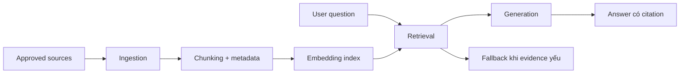

# Embeddings, RAG và product knowledge

<div class="lesson-meta">
  <span>Nền tảng AI cho Business Analyst</span>
  <span>Software BA</span>
  <span>Core</span>
</div>

## Learning outcomes

- Giải thích RAG pipeline và các điểm quality có thể fail.
- Viết requirement BA cho source authority, freshness, access và citation.
- Định nghĩa retrieval quality metric cho AI assistant.

## Why this matters for BA work

<div class="ba-callout">
Với BA, RAG không chỉ là UI chatbot; trọng tâm là governance tri thức nào hệ thống được phép tin.
</div>

Bài này quan trọng vì nhiều tổ chức gọi tính năng là RAG trong khi requirement thật là governance tri thức đáng tin. Nếu BA chỉ đặc tả chat interface, assistant có thể retrieve material cũ, không được phép xem hoặc conflict. Định nghĩa source authority, freshness, permission, citation behavior và fallback mới biến RAG thành capability dùng được.

## Common difficulties for BAs

Trong Nền tảng AI cho Business Analyst, Embeddings, RAG và product knowledge trở nên khó khi stakeholder muốn câu trả lời AI thật đơn giản trong khi vấn đề thật phụ thuộc vào capability của model, data readiness, boundary của tool và risk của business decision. BA nên kiểm tra các điểm dưới đây trước khi xem artifact có AI hỗ trợ là đủ sẵn sàng cho stakeholder decision hoặc handoff.

| Khó khăn | Vì sao khó trong công việc BA | BA nên xử lý thế nào |
| --- | --- | --- |
| Xem RAG là magic accuracy. | Lỗi "Xem RAG là magic accuracy." xuất hiện khi team bàn về problem fit, model boundary, data dependency và decision risk nhưng chưa thống nhất source nào authoritative. AI có thể làm disagreement nghe mượt hơn, nên BA phải giữ uncertainty visible. | Áp dụng control này: yêu cầu model so sánh option AI và non-AI trước khi draft requirement. Sau đó dùng pattern tốt hơn "Tạo knowledge contract gồm source inventory, owner, effective date và access rule." và hỏi ai phải approve artifact trước khi nó ảnh hưởng scope, build, test hoặc release. |
| Bỏ qua document ownership và freshness. | Với Embeddings, RAG và product knowledge, điểm khó là Với BA, RAG không chỉ là UI chatbot; trọng tâm là governance tri thức nào hệ thống được phép tin. Pattern yếu rất dễ xảy ra vì AI có thể tạo câu trả lời trôi chảy trước khi BA check ownership, source freshness hoặc decision right. | Áp dụng control này: yêu cầu model so sánh option AI và non-AI trước khi draft requirement. Sau đó dùng pattern tốt hơn "Đo retrieval precision, citation support, fallback rate và conflict detection." và hỏi ai phải approve artifact trước khi nó ảnh hưởng scope, build, test hoặc release. |
| Quên access control trong retrieval. | Điểm này khó khi RAG Knowledge Contract được kỳ vọng hỗ trợ solution-shape decision. Nếu BA không challenge draft, unsupported assumption có thể đi vào planning, testing hoặc stakeholder communication. | Áp dụng control này: yêu cầu model so sánh option AI và non-AI trước khi draft requirement. Sau đó dùng pattern tốt hơn "Hiển thị conflict warning, cite cả hai source và route tới owner chịu trách nhiệm." và hỏi ai phải approve artifact trước khi nó ảnh hưởng scope, build, test hoặc release. |

## Where this applies in real projects

Dùng bài này khi một AI idea mới đi vào discovery, vendor discussion, roadmap planning hoặc feasibility analysis. Output thực tế không phải document dài hơn; đó là RAG Knowledge Contract có đủ evidence, ownership và decision clarity cho cuộc trao đổi tiếp theo của dự án.

| Thời điểm trong dự án | Cách áp dụng bài học | Output cụ thể của BA |
| --- | --- | --- |
| Idea intake | Liệt kê authoritative source cho một AI assistant idea. | RAG Knowledge Contract thể hiện problem fit, model boundary, data dependency và decision risk, trong đó action "Liệt kê authoritative source cho một AI assistant idea." được chuyển thành decision, requirement, checklist hoặc question có thể review ở meeting tiếp theo. |
| Feasibility review | Định nghĩa hệ thống làm gì khi hai source conflict. | RAG Knowledge Contract thể hiện source evidence, trong đó action "Định nghĩa hệ thống làm gì khi hai source conflict." được chuyển thành decision, requirement, checklist hoặc question có thể review ở meeting tiếp theo. |
| Solution framing | Viết một test question bắt buộc trigger fallback. | RAG Knowledge Contract thể hiện decision owner, trong đó action "Viết một test question bắt buộc trigger fallback." được chuyển thành decision, requirement, checklist hoặc question có thể review ở meeting tiếp theo. |

## If this is missing

Nếu thiếu Embeddings, RAG và product knowledge, team có thể chọn tool trước khi hiểu problem shape, tạo automation tốn kém nhưng không khớp business outcome. BA vẫn có thể khôi phục, nhưng phải chuyển draft AI bóng bẩy trở lại thành evidence, assumption, owner và decision test được.

| Nếu thiếu | Ảnh hưởng tới dự án | Cách khôi phục |
| --- | --- | --- |
| Đặc tả answer phải dùng company document | Câu này không nói document nào approved, current hoặc visible cho từng role. | Khôi phục bằng pattern tốt hơn: Tạo knowledge contract gồm source inventory, owner, effective date và access rule. Rework RAG Knowledge Contract cho đến khi nó lộ rõ problem fit, model boundary, data dependency và decision risk, và không share như bản final cho tới khi evidence, ownership và validation path explicit. |
| Chỉ evaluate answer có nghe helpful không | Answer thân thiện vẫn có thể cite nhầm policy hoặc miss source tốt hơn. | Khôi phục bằng pattern tốt hơn: Đo retrieval precision, citation support, fallback rate và conflict detection. Rework RAG Knowledge Contract cho đến khi nó lộ rõ problem fit, model boundary, data dependency và decision risk, và không share như bản final cho tới khi evidence, ownership và validation path explicit. |
| Để assistant trả lời khi source conflict | User có thể hành động theo rule sai trong khi hệ thống rất tự tin. | Khôi phục bằng pattern tốt hơn: Hiển thị conflict warning, cite cả hai source và route tới owner chịu trách nhiệm. Rework RAG Knowledge Contract cho đến khi nó lộ rõ problem fit, model boundary, data dependency và decision risk, và không share như bản final cho tới khi evidence, ownership và validation path explicit. |

## Mental model or core concept

RAG retrieve tài liệu nguồn trước khi model generate answer. Nó chỉ tăng grounding khi source đúng được index, chunk, rank, permission và cite đúng. BA đặc tả RAG phải định nghĩa knowledge contract: tài liệu nào được tính, conflict xử lý ra sao và assistant làm gì khi evidence yếu.

## Practical BA example

Một HR policy assistant trả lời câu hỏi maternity leave từ cả policy 2024 và handbook 2021 đã obsolete. BA bổ sung requirement về source priority, effective date, citation display, conflict warning và fallback sang HR khi hệ thống thấy policy conflict.

## Diagram



## BA artifact

### RAG Knowledge Contract

| Requirement area | Đặc tả BA | Quality metric | Failure mode |
| --- | --- | --- | --- |
| Source authority | Chỉ dùng approved policy repository và HR knowledge base. | 100% answer cite approved source. | Assistant cite stale PDF. |
| Freshness | Effective date phải visible và source mới được rank cao hơn. | Freshness error dưới 1%. | Policy cũ override rule mới. |
| Access control | Chỉ retrieve document user được phép xem. | Không leakage cross-role trong test. | Policy manager-only lộ cho employee. |
| Fallback | Nếu citation không đủ confident, trả lời kèm escalation path. | Fallback được dùng cho unsupported question. | Assistant tự bịa policy. |

## AI expert note

RAG quality thường fail ở retrieval trước khi fail ở generation. Spec BA mạnh phải cover ingestion ownership, metadata, chunking assumption, ranking priority, access control, source conflict handling và retrieval evaluation. Tone của answer là thứ yếu; test chính là hệ thống có tìm đúng evidence cho đúng user hay không.

## Bad vs better example

| Cách làm yếu | Vì sao fail | Cách làm BA tốt hơn |
| --- | --- | --- |
| Đặc tả answer phải dùng company document | Câu này không nói document nào approved, current hoặc visible cho từng role. | Tạo knowledge contract gồm source inventory, owner, effective date và access rule. |
| Chỉ evaluate answer có nghe helpful không | Answer thân thiện vẫn có thể cite nhầm policy hoặc miss source tốt hơn. | Đo retrieval precision, citation support, fallback rate và conflict detection. |
| Để assistant trả lời khi source conflict | User có thể hành động theo rule sai trong khi hệ thống rất tự tin. | Hiển thị conflict warning, cite cả hai source và route tới owner chịu trách nhiệm. |

## Stakeholder questions to ask

| Stakeholder | Câu hỏi | Vì sao BA hỏi |
| --- | --- | --- |
| Product owner | Embeddings, RAG và product knowledge cần cải thiện outcome nào, và trade-off nào có thể chấp nhận? | Ngăn output AI tối ưu cho mục tiêu mơ hồ. |
| Engineering lead | Source, system, data hoặc constraint nào khiến RAG Knowledge Contract khó implement? | Biến technical constraint ẩn thành requirement question visible. |
| QA lead | Rule, exception hoặc user state nào phải test được trước khi tin artifact này? | Chuyển wording trôi chảy của AI thành behavior quan sát được. |
| Operations hoặc support | Failure path nào tạo manual work nếu nguyên tắc "RAG quality bắt đầu từ knowledge governance" bị bỏ qua? | Làm rõ support load, exception handling và operating impact. |

## Decision log entries

| Decision item | Option cần capture | Owner | Evidence cần có |
| --- | --- | --- | --- |
| Scope boundary cho RAG Knowledge Contract | Must-have, later, out of scope | Product owner | Business outcome và release constraint |
| Authority cho problem fit, model boundary, data dependency và decision risk | Documented source, stakeholder decision, assumption cần validate | BA + stakeholder chịu trách nhiệm | Source ID, date và approval status |
| Review gate trước handoff | Peer review, QA review, engineering review, formal approval | BA lead hoặc project lead | Risk level và receiving-team readiness |
| Cách recover nếu Xem RAG là magic accuracy. | Rewrite, defer, escalate hoặc validation workshop | Decision owner | Impact lên scope, testability và release risk |

## Definition of Ready / Done

| Gate | Tín hiệu ready | Tín hiệu done |
| --- | --- | --- |
| Definition of Ready | Source cho problem fit, model boundary, data dependency và decision risk được label và còn hiệu lực. | RAG Knowledge Contract có thể review mà không phải đoán missing context. |
| Definition of Ready | Open assumption có owner và validation path. | Stakeholder có thể accept, reject hoặc defer từng assumption. |
| Definition of Done | Artifact áp dụng control: yêu cầu model so sánh option AI và non-AI trước khi draft requirement. | Delivery, QA hoặc governance team có thể hành động dựa trên artifact. |
| Definition of Done | Pattern yếu "Xem RAG là magic accuracy." đã được kiểm tra explicit. | Không unsupported AI claim nào bị xem như requirement đã approve. |

## Before and after artifact example

| Before | Risk trong draft AI | Revision của senior BA |
| --- | --- | --- |
| Prompt: "Create RAG Knowledge Contract cho Embeddings, RAG và product knowledge." | Model có thể tự bịa source fact, owner, threshold hoặc implementation rule. | Thêm source, scope boundary, source authority, output schema và instruction: Tạo knowledge contract gồm source inventory, owner, effective date và access rule. |
| Draft statement: "Liệt kê authoritative source cho một AI assistant idea." | Action hữu ích nhưng chưa gắn decision owner hoặc acceptance signal. | Rewrite thành project step có owner, expected artifact, review gate và evidence cần trước handoff. |
| Paragraph nghe final về solution-shape decision | Tone có thể che uncertainty và approval còn thiếu. | Chuyển thành bảng fact, assumption, decision needed, risk và validation question. |

## Manual verification after AI output

| Lens kiểm tra | Manual check | Pass signal |
| --- | --- | --- |
| Evidence | Trace mọi statement quan trọng trong RAG Knowledge Contract về source, decision hoặc assumption có label. | Không unsupported claim nào còn bị ẩn. |
| Completeness | Check problem fit, model boundary, data dependency và decision risk theo intended audience và receiving team. | Artifact trả lời được điều product, engineering, QA và operations cần. |
| Testability | Hỏi QA có tạo được positive, negative, boundary và exception scenario không. | Wording mơ hồ được rewrite hoặc log thành question. |
| Accountability | Confirm ai approve, ai review và ai xử lý khi artifact sai. | Owner và escalation path explicit. |

## AI collaboration prompt

```text
Draft requirement RAG cho assistant này. Bao gồm source inventory, chunking assumption, access control, citation behavior, conflict handling, fallback, retrieval metric và test scenario. Tách must-have control khỏi nice-to-have UX.
```

## Mistakes to avoid

- Xem RAG là magic accuracy.
- Bỏ qua document ownership và freshness.
- Quên access control trong retrieval.
- Chỉ đo answer tone thay vì retrieval correctness.

## Apply this tomorrow

1. Liệt kê authoritative source cho một AI assistant idea.
2. Định nghĩa hệ thống làm gì khi hai source conflict.
3. Viết một test question bắt buộc trigger fallback.
4. Thêm citation requirement vào feature spec.

## What a BA should remember

- RAG quality bắt đầu từ knowledge governance.
- Cite source sai vẫn là sai.
- BA requirement phải cover retrieval, không chỉ generated answer.
