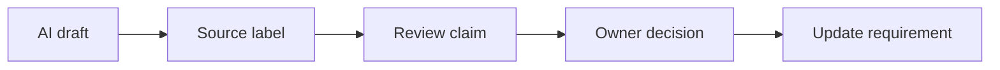
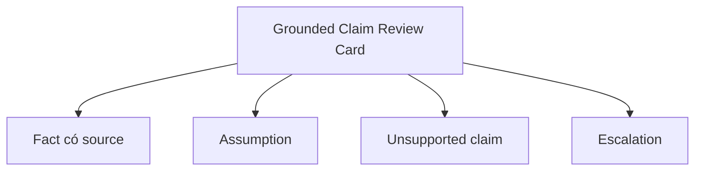

# Hallucination và source grounding

<div class="lesson-meta">
  <span>AI foundations cho Business Analyst</span>
  <span>Software BA</span>
  <span>Core</span>
</div>

## Story mode: project walkthrough

<div class="story-mode-panel">
  <p class="story-eyebrow">Story prototype</p>
  <h3>Maya bắt được một câu trả lời tự tin trước khi nó thành scope</h3>
  <p class="story-intro">Trong dự án redesign support portal, AI viết câu trả lời refund policy rất mượt. Nghe có vẻ hoàn chỉnh, nhưng Maya thấy nó trộn policy cũ với exception rule mới.</p>
  <div class="story-scene-grid">
<article class="story-scene">
  <span>Scene 1</span>
  <b>01</b>
  <strong>Câu trả lời nghe rất chính thức</strong>
  <p>Model nói refund luôn được xử lý trong ba ngày. Cả phòng thích vì câu chữ rõ.</p>
</article>
<article class="story-scene">
  <span>Scene 2</span>
  <b>02</b>
  <strong>Source trail yếu</strong>
  <p>Maya hỏi rule này nằm ở document nào. Model không chỉ được source approved hiện tại.</p>
</article>
<article class="story-scene">
  <span>Scene 3</span>
  <b>03</b>
  <strong>Rule được grounding</strong>
  <p>Cô đưa policy ID, effective date và yêu cầu đánh dấu unsupported claim.</p>
</article>
<article class="story-scene">
  <span>Scene 4</span>
  <b>04</b>
  <strong>Backlog thay đổi</strong>
  <p>Artifact cuối cùng tách rule có source, câu hỏi policy còn mở và decision cần Product approve.</p>
</article>
  </div>
  <div class="visual-takeaway-strip">
<span>Viết mượt không có nghĩa là đúng</span>
<span>Source ID bảo vệ scope</span>
<span>Unsupported claim phải thành câu hỏi</span>
  </div>
</div>

## AI words in plain English

| Thuật ngữ AI | Hiểu đơn giản | BA dùng để làm gì |
| --- | --- | --- |
| Hallucination | Câu trả lời AI nghe hợp lý nhưng sai hoặc không có evidence. | Chặn trước khi nó đi vào requirement, demo hoặc email stakeholder. |
| Grounding | Gắn từng ý quan trọng với source tin cậy. | Yêu cầu AI ghi source ID, section hoặc decision record. |
| Citation | Chỉ dẫn câu trả lời lấy từ đâu. | Dùng để review, sau đó kiểm tra thủ công với claim rủi ro cao. |
| Unsupported claim | Câu không có source hoặc owner. | Đưa vào câu hỏi, không đưa vào scope. |

## Reality check: tình huống thường gặp trong dự án

<div class="fact-card-grid">
<article class="fact-card">
  <strong>Câu chữ quá tự tin</strong>
  <span>Yêu cầu tách source-backed, assumed và unsupported.</span>
  <p>AI có thể viết policy nghe chắc hơn evidence thực tế.</p>
</article>
<article class="fact-card">
  <strong>Document nhiều phiên bản</strong>
  <span>Gắn nhãn source date, owner và approval status.</span>
  <p>PDF cũ và meeting note mới có thể bị trộn thành một câu trả lời mượt.</p>
</article>
<article class="fact-card">
  <strong>Stakeholder muốn dùng ngay</strong>
  <span>Chặn final use cho tới khi evidence được check.</span>
  <p>Câu trả lời đẹp rất dễ được paste vào Jira hoặc email.</p>
</article>
</div>

## Visual walkthrough



## Visual decision map

<div class="visual-ba-map">
  <h3>Grounded Claim Review Card: what the BA should look for</h3>
<div>
  <strong>Fact</strong>
  <span>Có source hiện tại hoặc decision đã approve.</span>
  <em>Giữ lại và lưu source ID.</em>
</div>
<div>
  <strong>Assumption</strong>
  <span>Nghe hợp lý nhưng chưa approve.</span>
  <em>Gán owner và validation question.</em>
</div>
<div>
  <strong>Hallucination risk</strong>
  <span>Nghe hữu ích nhưng không có source.</span>
  <em>Loại khỏi scope cho tới khi verify.</em>
</div>
</div>

## Learning outcomes

- Tách fact, assumption và unsupported AI claim.
- Viết prompt bắt buộc source grounding.
- Tạo review gate cho text AI rủi ro cao.

## Why this matters for BA work

<div class="ba-callout">
AI có thể trả lời rất chắc nhưng sai; BA cần output có source trước khi requirement đi tiếp.
</div>

Bài này quan trọng vì artifact của BA lan rất nhanh. Một câu policy sai có thể thành acceptance criterion, release note, support script hoặc giả định với vendor. Grounding giúp AI vẫn nhanh nhưng evidence đủ rõ để Product, QA, Engineering và Operations review.

## Common difficulties for BAs

| Khó khăn | Vì sao khó với BA | BA xử lý thế nào |
| --- | --- | --- |
| Câu trả lời có giọng rất chuyên nghiệp. | Stakeholder dễ tin style hơn evidence khi output rõ và đẹp. | Yêu cầu AI gắn nhãn từng ý quan trọng là có source, assumption hoặc unsupported. |
| Source nằm rải rác ở document cũ và mới. | Model có thể merge rule cũ với decision mới mà không báo. | Gắn ID, date, owner và status cho từng source trước khi phân tích. |
| Team muốn nhanh. | Review bị xem là chậm dù nó giảm rework. | Dùng checklist grounding ngắn để chỉ deep check claim có impact cao. |

## Where this applies in real projects

| Thời điểm dự án | Việc BA làm | Output cụ thể |
| --- | --- | --- |
| Review requirement liên quan policy | Kiểm tra mỗi rule có link tới policy hoặc decision hiện tại. | Bảng requirement có source ID và owner. |
| Summary cho stakeholder | Đánh dấu fact, assumption và open question. | Summary an toàn để đưa vào meeting review. |
| Thiết kế AI assistant | Định nghĩa câu nào assistant được trả lời, câu nào phải escalate. | Answer boundary và fallback rule. |

## If this is missing

Nếu thiếu grounding, project có thể chấp nhận text rất tự tin nhưng chưa ai approve.

| Nếu thiếu | Ảnh hưởng dự án | Cách khôi phục |
| --- | --- | --- |
| AI viết rule không có evidence | QA có thể test sai behavior. | Chuyển statement thành open question và gắn source cần kiểm tra. |
| Policy cũ và mới bị trộn | User nhận answer không nhất quán sau release. | Review source freshness trước sign-off. |
| Không có owner approve statement rủi ro | Khi bị challenge sẽ không rõ ai chịu trách nhiệm. | Thêm owner, review gate và escalation path. |

## Mental model or core concept

Xem mọi câu trả lời AI là draft cần source trail. BA không cần nghi ngờ mọi thứ; BA cần làm evidence visible.

## Practical BA example

Với refund flow, AI nói premium customer được bypass manager approval. Maya check source và thấy rule đó chỉ áp dụng cho enterprise customer. Cô sửa requirement và thêm câu hỏi validation cho pricing tier.

## Diagram



## BA artifact

### Grounded Claim Review Card

| Dòng artifact | BA cần viết gì | Dấu hiệu sẵn sàng | Dấu hiệu rủi ro |
| --- | --- | --- | --- |
| Claim | Một statement về policy, rule hoặc decision. | Statement cụ thể và test được. | Claim rộng nhưng không có source. |
| Source | Document ID, section, date, owner. | Reviewer mở được evidence. | Source thiếu hoặc cũ. |
| Status | Fact, assumption, unsupported hoặc conflict. | Status hiện rõ trước approval. | Mọi thứ trông như final. |
| Next action | Approve, revise, ask hoặc remove. | Owner và due date rõ. | Không ai own risk. |

## AI expert note

Ở góc nhìn AI reviewer, tôi không quan tâm câu văn hay bằng việc mỗi claim quan trọng có evidence trace được không. Output có grounding giúp AI tăng tốc drafting mà không biến model thành người ra decision ẩn.

## Bad vs better example

| Cách làm yếu | Vì sao fail | Cách BA làm tốt hơn |
| --- | --- | --- |
| Paste policy do AI viết thẳng vào Jira. | Requirement có thể chứa rule bịa hoặc rule cũ. | Bắt buộc source ID và approval status cho mỗi rule. |
| Hỏi AI có tự tin không. | Model confidence không phải business evidence. | Hỏi evidence, assumption và missing source. |
| Chỉ review đoạn kết luận. | Claim rủi ro có thể nằm trong summary rất gọn. | Review từng claim khi impact cao. |

## Stakeholder questions to ask

| Stakeholder | Câu hỏi | Vì sao BA hỏi |
| --- | --- | --- |
| Product owner | Which outcome should Hallucination và source grounding improve first? | Keeps AI work tied to business value. |
| Engineering lead | Which source, system, or constraint could make Grounded Claim Review Card hard to implement? | Turns hidden technical constraints into requirement questions. |
| QA lead | Which behavior must be testable before we trust this artifact? | Converts fluent AI text into observable checks. |
| Operations or support | What failure path creates manual work after release? | Surfaces support load and fallback needs. |

## Decision log entries

| Decision item | Option cần capture | Owner | Evidence cần có |
| --- | --- | --- | --- |
| Scope boundary for Grounded Claim Review Card | Must-have, later, out of scope | Product owner | Business outcome and release constraint |
| Authority for Fact có source and Assumption | Documented source, stakeholder decision, assumption to validate | BA + accountable stakeholder | Source ID, date, and approval status |
| Review gate before handoff | Peer review, QA review, engineering review, formal approval | BA lead or project lead | Risk level and receiving-team readiness |
| Recovery if Tin paragraph mượt mà không review source. | Rewrite, defer, escalate, or run validation workshop | Decision owner | Impact on scope, testability, and release risk |

## Definition of Ready / Done

| Gate | Ready signal | Done signal |
| --- | --- | --- |
| Definition of Ready | Sources for Fact có source are named. | Grounded Claim Review Card can be reviewed without guessing context. |
| Definition of Ready | Open assumptions have owners and validation paths. | Stakeholders can accept, reject, or defer each assumption. |
| Definition of Done | The artifact applies this principle: AI có thể trả lời rất chắc nhưng sai; BA cần output có source trước khi requirement đi tiếp. | Delivery, QA, or governance teams can act on it. |
| Definition of Done | The weak pattern "Paste policy do AI viết thẳng vào Jira." has been checked. | No unsupported AI claim is treated as approved scope. |

## Before and after artifact example

| Before | Rủi ro từ AI draft | Senior BA revision |
| --- | --- | --- |
| Prompt: "Create Grounded Claim Review Card." | The model may invent source facts, owners, or thresholds. | Add sources, scope boundary, output schema, and review criteria. |
| Draft statement: "Kiểm tra mỗi rule có link tới policy hoặc decision hiện tại." | Useful, but not tied to owner or acceptance signal. | Rewrite as a project step with owner, expected artifact, and review gate. |
| Final-looking paragraph | Tone may hide uncertainty or missing stakeholder approval. | Convert into fact, assumption, decision needed, risk, and validation question. |

## Manual verification after AI output

| Verification lens | Manual check | Pass signal |
| --- | --- | --- |
| Evidence | Trace important statements in Grounded Claim Review Card to a source, decision, or labeled assumption. | No unsupported claim remains hidden. |
| Completeness | Check Fact có source, Assumption, Unsupported claim, Escalation against the intended audience. | Product, Engineering, QA, and Operations have what they need. |
| Testability | Ask whether QA can create positive, negative, boundary, and exception scenarios. | Ambiguous wording is rewritten or logged as a question. |
| Accountability | Confirm who approves, who reviews, and who acts when output is wrong. | Owners and escalation path are explicit. |

## AI collaboration prompt

```text
Review draft bên dưới. Tạo table gồm Claim, Source ID, Evidence, Assumption, Unsupported Claim, Risk và Question for Owner. Không xem claim nào là fact nếu nó không nằm trong supplied sources.
```

## Mistakes to avoid

- Tin paragraph mượt mà không review source.
- Trộn draft note với approved policy.
- Đưa unsupported claim vào acceptance criteria.

## Apply this tomorrow

1. Lấy một AI summary và đánh dấu fact, assumption, unsupported claim.
2. Thêm source ID vào một requirement table.
3. Yêu cầu AI liệt kê phần nó không verify được.

## What a BA should remember

- Text mượt vẫn cần evidence.
- Grounding là quality control của BA.
- Unsupported claim thuộc về question, không thuộc scope.
