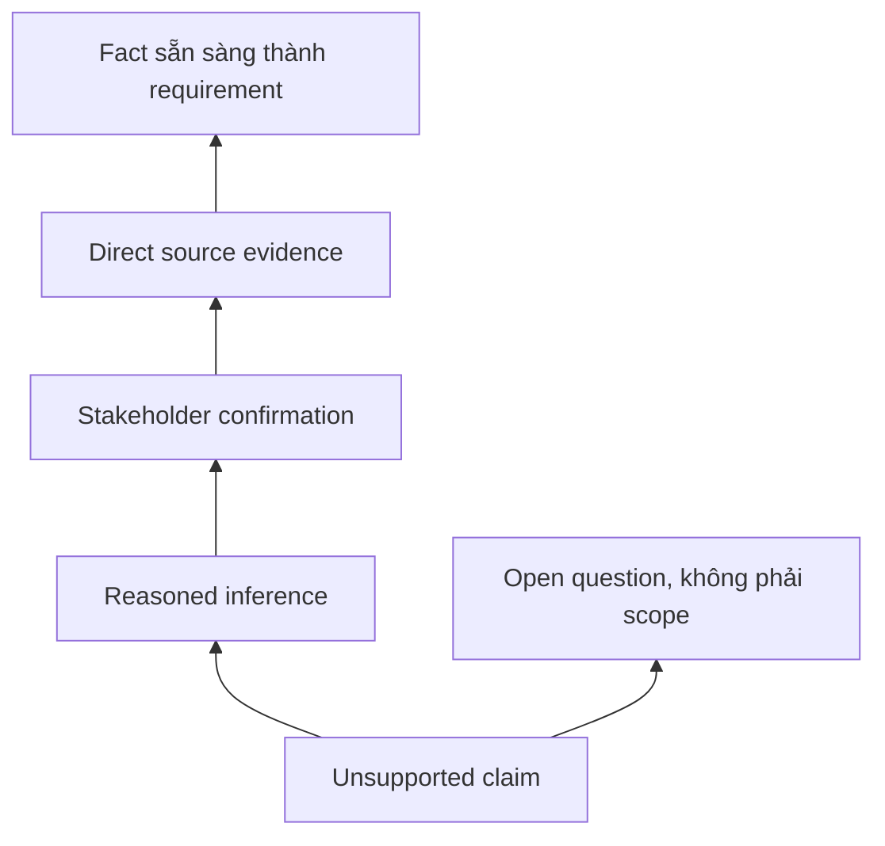

# Hallucination và source grounding

<div class="lesson-meta">
  <span>Nền tảng AI cho Business Analyst</span>
  <span>Software BA</span>
  <span>Core</span>
</div>

## Learning outcomes

- Nhận diện các pattern hallucination thường gặp.
- Yêu cầu evidence, citation và label unsupported claim.
- Thiết kế review gate trước khi output AI đi vào delivery artifact.

## Why this matters for BA work

<div class="ba-callout">
BA phải đưa evidence discipline vào cách dùng AI để text nghe hợp lý không biến thành requirement sai.
</div>

Bài này quan trọng vì một câu hallucination có thể biến thành requirement, test case, vendor score hoặc estimate nếu không bị challenge sớm. Công việc BA biến ngôn ngữ thành commitment. Grounding rule làm evidence visible, chuyển unsupported claim thành question và ngăn AI prose tự tin trở thành false certainty của dự án.

## Common difficulties for BAs

Trong Nền tảng AI cho Business Analyst, Hallucination và source grounding trở nên khó khi stakeholder muốn câu trả lời AI thật đơn giản trong khi vấn đề thật phụ thuộc vào capability của model, data readiness, boundary của tool và risk của business decision. BA nên kiểm tra các điểm dưới đây trước khi xem artifact có AI hỗ trợ là đủ sẵn sàng cho stakeholder decision hoặc handoff.

| Khó khăn | Vì sao khó trong công việc BA | BA nên xử lý thế nào |
| --- | --- | --- |
| Xem wording tự tin là evidence. | Lỗi "Xem wording tự tin là evidence." xuất hiện khi team bàn về problem fit, model boundary, data dependency và decision risk nhưng chưa thống nhất source nào authoritative. AI có thể làm disagreement nghe mượt hơn, nên BA phải giữ uncertainty visible. | Áp dụng control này: yêu cầu model so sánh option AI và non-AI trước khi draft requirement. Sau đó dùng pattern tốt hơn "Kiểm tra claim-to-source support và ghi evidence level trong requirement table." và hỏi ai phải approve artifact trước khi nó ảnh hưởng scope, build, test hoặc release. |
| Để AI cite source nhưng source không thật sự support claim. | Với Hallucination và source grounding, điểm khó là BA phải đưa evidence discipline vào cách dùng AI để text nghe hợp lý không biến thành requirement sai. Pattern yếu rất dễ xảy ra vì AI có thể tạo câu trả lời trôi chảy trước khi BA check ownership, source freshness hoặc decision right. | Áp dụng control này: yêu cầu model so sánh option AI và non-AI trước khi draft requirement. Sau đó dùng pattern tốt hơn "Đưa unsupported claim vào open question có owner và validation method." và hỏi ai phải approve artifact trước khi nó ảnh hưởng scope, build, test hoặc release. |
| Bỏ qua stakeholder confirmation cho rule suy luận. | Điểm này khó khi Evidence Ladder được kỳ vọng hỗ trợ solution-shape decision. Nếu BA không challenge draft, unsupported assumption có thể đi vào planning, testing hoặc stakeholder communication. | Áp dụng control này: yêu cầu model so sánh option AI và non-AI trước khi draft requirement. Sau đó dùng pattern tốt hơn "Định nghĩa evidence level theo risk tier và business impact." và hỏi ai phải approve artifact trước khi nó ảnh hưởng scope, build, test hoặc release. |

## Where this applies in real projects

Dùng bài này khi một AI idea mới đi vào discovery, vendor discussion, roadmap planning hoặc feasibility analysis. Output thực tế không phải document dài hơn; đó là Evidence Ladder có đủ evidence, ownership và decision clarity cho cuộc trao đổi tiếp theo của dự án.

| Thời điểm trong dự án | Cách áp dụng bài học | Output cụ thể của BA |
| --- | --- | --- |
| Idea intake | Thêm cột evidence vào một requirement table. | Evidence Ladder thể hiện problem fit, model boundary, data dependency và decision risk, trong đó action "Thêm cột evidence vào một requirement table." được chuyển thành decision, requirement, checklist hoặc question có thể review ở meeting tiếp theo. |
| Feasibility review | Yêu cầu AI mark unsupported claim trong một draft hiện có. | Evidence Ladder thể hiện source evidence, trong đó action "Yêu cầu AI mark unsupported claim trong một draft hiện có." được chuyển thành decision, requirement, checklist hoặc question có thể review ở meeting tiếp theo. |
| Solution framing | Tạo danh sách authoritative source cho một feature. | Evidence Ladder thể hiện decision owner, trong đó action "Tạo danh sách authoritative source cho một feature." được chuyển thành decision, requirement, checklist hoặc question có thể review ở meeting tiếp theo. |

## If this is missing

Nếu thiếu Hallucination và source grounding, team có thể chọn tool trước khi hiểu problem shape, tạo automation tốn kém nhưng không khớp business outcome. BA vẫn có thể khôi phục, nhưng phải chuyển draft AI bóng bẩy trở lại thành evidence, assumption, owner và decision test được.

| Nếu thiếu | Ảnh hưởng tới dự án | Cách khôi phục |
| --- | --- | --- |
| Chấp nhận claim có citation mà không mở source | Citation có thể chỉ liên quan gần, đã cũ hoặc không support đúng claim. | Khôi phục bằng pattern tốt hơn: Kiểm tra claim-to-source support và ghi evidence level trong requirement table. Rework Evidence Ladder cho đến khi nó lộ rõ problem fit, model boundary, data dependency và decision risk, và không share như bản final cho tới khi evidence, ownership và validation path explicit. |
| Rewrite unsupported AI claim thành requirement mượt hơn | Wording tốt làm evidence yếu khó phát hiện hơn. | Khôi phục bằng pattern tốt hơn: Đưa unsupported claim vào open question có owner và validation method. Rework Evidence Ladder cho đến khi nó lộ rõ problem fit, model boundary, data dependency và decision risk, và không share như bản final cho tới khi evidence, ownership và validation path explicit. |
| Dùng cùng evidence threshold cho mọi requirement | Low-risk copy và regulated decision cần control khác nhau. | Khôi phục bằng pattern tốt hơn: Định nghĩa evidence level theo risk tier và business impact. Rework Evidence Ladder cho đến khi nó lộ rõ problem fit, model boundary, data dependency và decision risk, và không share như bản final cho tới khi evidence, ownership và validation path explicit. |

## Mental model or core concept

Hallucination không chỉ là vấn đề của model; nó là vấn đề process. Nếu team nhận output AI mà không có evidence rule, unsupported claim có thể trở thành scope, estimate và test case. Grounding nghĩa là statement quan trọng phải gắn với source, stakeholder confirmation hoặc assumption được label rõ.

## Practical BA example

Khi evaluate vendor, AI nói Tool A hỗ trợ real-time audit export. Trang vendor không hề nói vậy. BA dùng grounding rule sẽ mark claim là unsupported, hỏi vendor trực tiếp và tránh đưa false requirement vào selection scorecard.

## Diagram



## BA artifact

### Evidence Ladder

| Mức evidence | Dùng trong artifact? | Label cần dùng | Ví dụ |
| --- | --- | --- | --- |
| Direct source | Có | Source-backed fact | Policy page ghi SLA 24 giờ. |
| Stakeholder confirmation | Có | Confirmed decision | Ops manager approve manual override. |
| Reasoned inference | Có điều kiện | Assumption to validate | Case high-risk có thể cần audit. |
| No support | Không | Unsupported claim | Vendor capability không có tài liệu. |

## AI expert note

Control thực tế không chỉ là yêu cầu AI cite source. BA phải kiểm tra source được cite có thật sự support claim không, quyết định evidence level nào chấp nhận được và yêu cầu fallback khi support yếu. Với requirement high-impact, grounding nên là format của artifact, không phải note review tùy chọn.

## Bad vs better example

| Cách làm yếu | Vì sao fail | Cách làm BA tốt hơn |
| --- | --- | --- |
| Chấp nhận claim có citation mà không mở source | Citation có thể chỉ liên quan gần, đã cũ hoặc không support đúng claim. | Kiểm tra claim-to-source support và ghi evidence level trong requirement table. |
| Rewrite unsupported AI claim thành requirement mượt hơn | Wording tốt làm evidence yếu khó phát hiện hơn. | Đưa unsupported claim vào open question có owner và validation method. |
| Dùng cùng evidence threshold cho mọi requirement | Low-risk copy và regulated decision cần control khác nhau. | Định nghĩa evidence level theo risk tier và business impact. |

## Stakeholder questions to ask

| Stakeholder | Câu hỏi | Vì sao BA hỏi |
| --- | --- | --- |
| Product owner | Hallucination và source grounding cần cải thiện outcome nào, và trade-off nào có thể chấp nhận? | Ngăn output AI tối ưu cho mục tiêu mơ hồ. |
| Engineering lead | Source, system, data hoặc constraint nào khiến Evidence Ladder khó implement? | Biến technical constraint ẩn thành requirement question visible. |
| QA lead | Rule, exception hoặc user state nào phải test được trước khi tin artifact này? | Chuyển wording trôi chảy của AI thành behavior quan sát được. |
| Operations hoặc support | Failure path nào tạo manual work nếu nguyên tắc "Grounding bảo vệ team khỏi false clarity" bị bỏ qua? | Làm rõ support load, exception handling và operating impact. |

## Decision log entries

| Decision item | Option cần capture | Owner | Evidence cần có |
| --- | --- | --- | --- |
| Scope boundary cho Evidence Ladder | Must-have, later, out of scope | Product owner | Business outcome và release constraint |
| Authority cho problem fit, model boundary, data dependency và decision risk | Documented source, stakeholder decision, assumption cần validate | BA + stakeholder chịu trách nhiệm | Source ID, date và approval status |
| Review gate trước handoff | Peer review, QA review, engineering review, formal approval | BA lead hoặc project lead | Risk level và receiving-team readiness |
| Cách recover nếu Xem wording tự tin là evidence. | Rewrite, defer, escalate hoặc validation workshop | Decision owner | Impact lên scope, testability và release risk |

## Definition of Ready / Done

| Gate | Tín hiệu ready | Tín hiệu done |
| --- | --- | --- |
| Definition of Ready | Source cho problem fit, model boundary, data dependency và decision risk được label và còn hiệu lực. | Evidence Ladder có thể review mà không phải đoán missing context. |
| Definition of Ready | Open assumption có owner và validation path. | Stakeholder có thể accept, reject hoặc defer từng assumption. |
| Definition of Done | Artifact áp dụng control: yêu cầu model so sánh option AI và non-AI trước khi draft requirement. | Delivery, QA hoặc governance team có thể hành động dựa trên artifact. |
| Definition of Done | Pattern yếu "Xem wording tự tin là evidence." đã được kiểm tra explicit. | Không unsupported AI claim nào bị xem như requirement đã approve. |

## Before and after artifact example

| Before | Risk trong draft AI | Revision của senior BA |
| --- | --- | --- |
| Prompt: "Create Evidence Ladder cho Hallucination và source grounding." | Model có thể tự bịa source fact, owner, threshold hoặc implementation rule. | Thêm source, scope boundary, source authority, output schema và instruction: Kiểm tra claim-to-source support và ghi evidence level trong requirement table. |
| Draft statement: "Thêm cột evidence vào một requirement table." | Action hữu ích nhưng chưa gắn decision owner hoặc acceptance signal. | Rewrite thành project step có owner, expected artifact, review gate và evidence cần trước handoff. |
| Paragraph nghe final về solution-shape decision | Tone có thể che uncertainty và approval còn thiếu. | Chuyển thành bảng fact, assumption, decision needed, risk và validation question. |

## Manual verification after AI output

| Lens kiểm tra | Manual check | Pass signal |
| --- | --- | --- |
| Evidence | Trace mọi statement quan trọng trong Evidence Ladder về source, decision hoặc assumption có label. | Không unsupported claim nào còn bị ẩn. |
| Completeness | Check problem fit, model boundary, data dependency và decision risk theo intended audience và receiving team. | Artifact trả lời được điều product, engineering, QA và operations cần. |
| Testability | Hỏi QA có tạo được positive, negative, boundary và exception scenario không. | Wording mơ hồ được rewrite hoặc log thành question. |
| Accountability | Confirm ai approve, ai review và ai xử lý khi artifact sai. | Owner và escalation path explicit. |

## AI collaboration prompt

```text
Review câu trả lời này theo source được cung cấp. Trả về bảng gồm claim, evidence level, source ID, confidence, phần unsupported và validation question. Không rewrite unsupported claim thành fact.
```

## Mistakes to avoid

- Xem wording tự tin là evidence.
- Để AI cite source nhưng source không thật sự support claim.
- Bỏ qua stakeholder confirmation cho rule suy luận.
- Không label assumption trong BRD hoặc user story.

## Apply this tomorrow

1. Thêm cột evidence vào một requirement table.
2. Yêu cầu AI mark unsupported claim trong một draft hiện có.
3. Tạo danh sách authoritative source cho một feature.
4. Dùng câu 'not supported by provided sources' trong review prompt.

## What a BA should remember

- Grounding bảo vệ team khỏi false clarity.
- Unsupported claim nên trở thành câu hỏi, không phải requirement.
- Chất lượng citation quan trọng hơn độ trôi chảy của answer.
