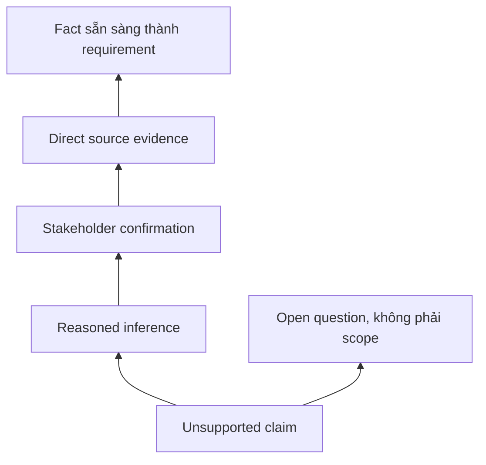

# Hallucination và source grounding

<div class="lesson-meta">
  <span>Nền tảng AI cho Business Analyst</span>
  <span>Software BA</span>
  <span>Core</span>
</div>

## Learning outcomes

- Nhận diện các pattern hallucination thường gặp.
- Yêu cầu evidence, citation và label unsupported claim.
- Thiết kế review gate trước khi output AI đi vào delivery artifact.

## Why this matters for BA work

<div class="ba-callout">
BA phải đưa evidence discipline vào cách dùng AI để text nghe hợp lý không biến thành requirement sai.
</div>

Business Analyst đứng giữa problem framing, ý nghĩa từ stakeholder, constraint triển khai và product decision. Trong công việc có AI, vị trí này quan trọng hơn vì ngôn ngữ chưa rõ có thể tạo false certainty rất nhanh. Bài này đưa ra một control thực tế để áp dụng trước khi output AI trở thành scope, backlog hoặc delivery commitment.

## Mental model or core concept

Hallucination không chỉ là vấn đề của model; nó là vấn đề process. Nếu team nhận output AI mà không có evidence rule, unsupported claim có thể trở thành scope, estimate và test case. Grounding nghĩa là statement quan trọng phải gắn với source, stakeholder confirmation hoặc assumption được label rõ.

## Practical BA example

Khi evaluate vendor, AI nói Tool A hỗ trợ real-time audit export. Trang vendor không hề nói vậy. BA dùng grounding rule sẽ mark claim là unsupported, hỏi vendor trực tiếp và tránh đưa false requirement vào selection scorecard.

## Diagram



## BA artifact

### Evidence Ladder

| Mức evidence | Dùng trong artifact? | Label cần dùng | Ví dụ |
| --- | --- | --- | --- |
| Direct source | Có | Source-backed fact | Policy page ghi SLA 24 giờ. |
| Stakeholder confirmation | Có | Confirmed decision | Ops manager approve manual override. |
| Reasoned inference | Có điều kiện | Assumption to validate | Case high-risk có thể cần audit. |
| No support | Không | Unsupported claim | Vendor capability không có tài liệu. |

## AI collaboration prompt

```text
Review câu trả lời này theo source được cung cấp. Trả về bảng gồm claim, evidence level, source ID, confidence, phần unsupported và validation question. Không rewrite unsupported claim thành fact.
```

## Mistakes to avoid

- Xem wording tự tin là evidence.
- Để AI cite source nhưng source không thật sự support claim.
- Bỏ qua stakeholder confirmation cho rule suy luận.
- Không label assumption trong BRD hoặc user story.

## Apply this tomorrow

1. Thêm cột evidence vào một requirement table.
2. Yêu cầu AI mark unsupported claim trong một draft hiện có.
3. Tạo danh sách authoritative source cho một feature.
4. Dùng câu 'not supported by provided sources' trong review prompt.

## What a BA should remember

- Grounding bảo vệ team khỏi false clarity.
- Unsupported claim nên trở thành câu hỏi, không phải requirement.
- Chất lượng citation quan trọng hơn độ trôi chảy của answer.
