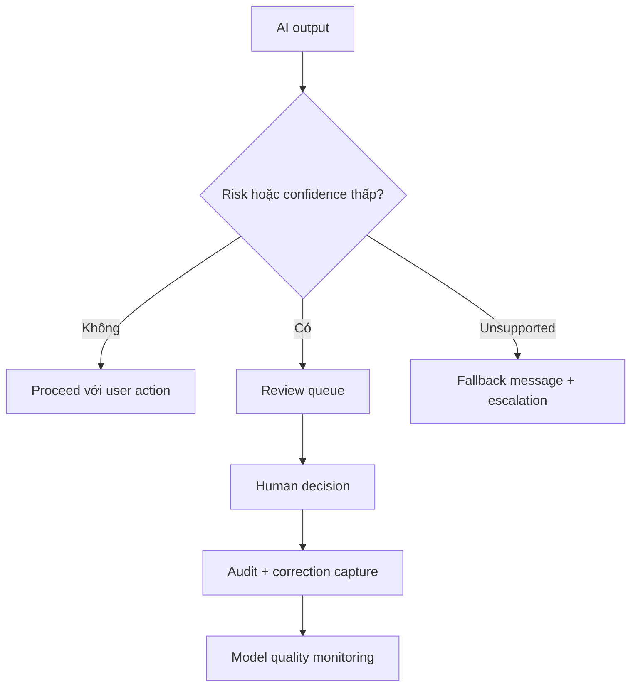

# Human review, monitoring và fallback

<div class="lesson-meta">
  <span>Xây dựng sản phẩm có AI dưới góc nhìn BA</span>
  <span>Software BA</span>
  <span>Advanced</span>
</div>

## Learning outcomes

- Thiết kế human-in-the-loop workflow.
- Đặc tả fallback và escalation requirement.
- Định nghĩa monitoring event cho AI quality và risk.

## Why this matters for BA work

<div class="ba-callout">
Sản phẩm AI có trách nhiệm cần path rõ cho uncertainty, escalation, correction và quality monitoring.
</div>

Bài này quan trọng vì human review thường được viết như safeguard mơ hồ, rồi fail khi operation cần queue, SLA, decision right và audit trail thật. AI product cần fallback và monitoring được thiết kế. BA phải đặc tả điều gì xảy ra khi confidence thấp, risk cao hoặc evidence thiếu.

## Common difficulties for BAs

Trong Xây dựng sản phẩm có AI dưới góc nhìn BA, Human review, monitoring và fallback trở nên khó khi hành vi AI product có uncertainty, safety boundary, evaluation design, fallback, monitoring và user trust concern. BA nên kiểm tra các điểm dưới đây trước khi xem artifact có AI hỗ trợ là đủ sẵn sàng cho stakeholder decision hoặc handoff.

| Khó khăn | Vì sao khó trong công việc BA | BA nên xử lý thế nào |
| --- | --- | --- |
| Viết 'human can review' mà thiếu workflow detail. | Lỗi "Viết 'human can review' mà thiếu workflow detail." xuất hiện khi team bàn về AI task boundary, evaluation set, human review, fallback, telemetry và harm control nhưng chưa thống nhất source nào authoritative. AI có thể làm disagreement nghe mượt hơn, nên BA phải giữ uncertainty visible. | Áp dụng control này: đưa confidence, refusal, escalation, correction capture và monitoring vào requirement. Sau đó dùng pattern tốt hơn "Đặc tả review trigger, routing, reviewer action, SLA, audit record và owner." và hỏi ai phải approve artifact trước khi nó ảnh hưởng scope, build, test hoặc release. |
| Không có SLA cho review queue. | Với Human review, monitoring và fallback, điểm khó là Sản phẩm AI có trách nhiệm cần path rõ cho uncertainty, escalation, correction và quality monitoring. Pattern yếu rất dễ xảy ra vì AI có thể tạo câu trả lời trôi chảy trước khi BA check ownership, source freshness hoặc decision right. | Áp dụng control này: đưa confidence, refusal, escalation, correction capture và monitoring vào requirement. Sau đó dùng pattern tốt hơn "Giải thích limitation, cung cấp next step an toàn và route sang support hoặc manual process." và hỏi ai phải approve artifact trước khi nó ảnh hưởng scope, build, test hoặc release. |
| Fallback message che giấu uncertainty. | Điểm này khó khi Human-in-the-Loop Flow Requirements được kỳ vọng hỗ trợ AI feature operating contract. Nếu BA không challenge draft, unsupported assumption có thể đi vào planning, testing hoặc stakeholder communication. | Áp dụng control này: đưa confidence, refusal, escalation, correction capture và monitoring vào requirement. Sau đó dùng pattern tốt hơn "Track override rate, unsupported query, error category, drift signal và review outcome." và hỏi ai phải approve artifact trước khi nó ảnh hưởng scope, build, test hoặc release. |

## Where this applies in real projects

Dùng bài này khi BA đang đặc tả feature mà output AI làm thay đổi user action, operational workload hoặc customer experience. Output thực tế không phải document dài hơn; đó là Human-in-the-Loop Flow Requirements có đủ evidence, ownership và decision clarity cho cuộc trao đổi tiếp theo của dự án.

| Thời điểm trong dự án | Cách áp dụng bài học | Output cụ thể của BA |
| --- | --- | --- |
| AI behavior design | Định nghĩa một low-confidence trigger. | Human-in-the-Loop Flow Requirements thể hiện AI task boundary, evaluation set, human review, fallback, telemetry và harm control, trong đó action "Định nghĩa một low-confidence trigger." được chuyển thành decision, requirement, checklist hoặc question có thể review ở meeting tiếp theo. |
| Evaluation planning | Viết fallback message trung thực và hữu ích. | Human-in-the-Loop Flow Requirements thể hiện source evidence, trong đó action "Viết fallback message trung thực và hữu ích." được chuyển thành decision, requirement, checklist hoặc question có thể review ở meeting tiếp theo. |
| Operations handoff | Thêm reason code cho human override. | Human-in-the-Loop Flow Requirements thể hiện decision owner, trong đó action "Thêm reason code cho human override." được chuyển thành decision, requirement, checklist hoặc question có thể review ở meeting tiếp theo. |

## If this is missing

Nếu thiếu Human review, monitoring và fallback, feature có thể release mà thiếu confidence rule, human review trigger, fallback path hoặc monitoring event rõ ràng. BA vẫn có thể khôi phục, nhưng phải chuyển draft AI bóng bẩy trở lại thành evidence, assumption, owner và decision test được.

| Nếu thiếu | Ảnh hưởng tới dự án | Cách khôi phục |
| --- | --- | --- |
| Viết rằng human can review AI output | Không có trigger, queue, role, SLA hoặc decision authority. | Khôi phục bằng pattern tốt hơn: Đặc tả review trigger, routing, reviewer action, SLA, audit record và owner. Rework Human-in-the-Loop Flow Requirements cho đến khi nó lộ rõ AI task boundary, evaluation set, human review, fallback, telemetry và harm control, và không share như bản final cho tới khi evidence, ownership và validation path explicit. |
| Dùng fallback message nghe quá tự tin | User không hiểu uncertainty hoặc next safe action. | Khôi phục bằng pattern tốt hơn: Giải thích limitation, cung cấp next step an toàn và route sang support hoặc manual process. Rework Human-in-the-Loop Flow Requirements cho đến khi nó lộ rõ AI task boundary, evaluation set, human review, fallback, telemetry và harm control, và không share như bản final cho tới khi evidence, ownership và validation path explicit. |
| Chỉ monitor uptime và latency | System có thể available nhưng output vẫn low-quality hoặc risky. | Khôi phục bằng pattern tốt hơn: Track override rate, unsupported query, error category, drift signal và review outcome. Rework Human-in-the-Loop Flow Requirements cho đến khi nó lộ rõ AI task boundary, evaluation set, human review, fallback, telemetry và harm control, và không share như bản final cho tới khi evidence, ownership và validation path explicit. |

## Mental model or core concept

Human-in-the-loop không phải lời hứa mơ hồ rằng con người có thể can thiệp. Nó là workflow được thiết kế: trigger condition, reviewer role, queue, SLA, decision option, user messaging, audit, correction capture và monitoring. Fallback phải safe, visible và đo được.

## Practical BA example

AI loan document checker flag missing document. Nếu confidence cao, nó suggest next action; nếu confidence thấp hoặc document type regulated, nó route đến reviewer. BA đặc tả queue priority, reason code, reviewer action, customer message và audit trail.

## Diagram



## BA artifact

### Human-in-the-Loop Flow Requirements

| Flow part | Requirement | Example | Metric |
| --- | --- | --- | --- |
| Trigger | Định nghĩa khi nào human review bắt đầu. | Confidence < 0.8 hoặc regulated document. | Trigger accuracy theo case type. |
| Reviewer action | Liệt kê allowed decision. | Approve, reject, request info, override. | Review completion SLA. |
| Fallback | Định nghĩa safe response khi AI không trả lời được. | Show escalation message và create task. | Fallback resolution time. |
| Monitoring | Capture quality và drift signal. | Track override theo category. | Override rate trend. |

## AI expert note

Human-in-the-loop là operating workflow, không phải slogan. Requirement chuyên gia định nghĩa trigger condition, reviewer role, allowed action, escalation, user messaging, correction capture, quality monitoring và accountability. Fallback thành công khi giữ được user trust và business safety, không phải khi che giấu AI đã fail.

## Bad vs better example

| Cách làm yếu | Vì sao fail | Cách làm BA tốt hơn |
| --- | --- | --- |
| Viết rằng human can review AI output | Không có trigger, queue, role, SLA hoặc decision authority. | Đặc tả review trigger, routing, reviewer action, SLA, audit record và owner. |
| Dùng fallback message nghe quá tự tin | User không hiểu uncertainty hoặc next safe action. | Giải thích limitation, cung cấp next step an toàn và route sang support hoặc manual process. |
| Chỉ monitor uptime và latency | System có thể available nhưng output vẫn low-quality hoặc risky. | Track override rate, unsupported query, error category, drift signal và review outcome. |

## Stakeholder questions to ask

| Stakeholder | Câu hỏi | Vì sao BA hỏi |
| --- | --- | --- |
| Product owner | Human review, monitoring và fallback cần cải thiện outcome nào, và trade-off nào có thể chấp nhận? | Ngăn output AI tối ưu cho mục tiêu mơ hồ. |
| Engineering lead | Source, system, data hoặc constraint nào khiến Human-in-the-Loop Flow Requirements khó implement? | Biến technical constraint ẩn thành requirement question visible. |
| QA lead | Rule, exception hoặc user state nào phải test được trước khi tin artifact này? | Chuyển wording trôi chảy của AI thành behavior quan sát được. |
| Operations hoặc support | Failure path nào tạo manual work nếu nguyên tắc "Human review là workflow requirement" bị bỏ qua? | Làm rõ support load, exception handling và operating impact. |

## Decision log entries

| Decision item | Option cần capture | Owner | Evidence cần có |
| --- | --- | --- | --- |
| Scope boundary cho Human-in-the-Loop Flow Requirements | Must-have, later, out of scope | Product owner | Business outcome và release constraint |
| Authority cho AI task boundary, evaluation set, human review, fallback, telemetry và harm control | Documented source, stakeholder decision, assumption cần validate | BA + stakeholder chịu trách nhiệm | Source ID, date và approval status |
| Review gate trước handoff | Peer review, QA review, engineering review, formal approval | BA lead hoặc project lead | Risk level và receiving-team readiness |
| Cách recover nếu Viết 'human can review' mà thiếu workflow detail. | Rewrite, defer, escalate hoặc validation workshop | Decision owner | Impact lên scope, testability và release risk |

## Definition of Ready / Done

| Gate | Tín hiệu ready | Tín hiệu done |
| --- | --- | --- |
| Definition of Ready | Source cho AI task boundary, evaluation set, human review, fallback, telemetry và harm control được label và còn hiệu lực. | Human-in-the-Loop Flow Requirements có thể review mà không phải đoán missing context. |
| Definition of Ready | Open assumption có owner và validation path. | Stakeholder có thể accept, reject hoặc defer từng assumption. |
| Definition of Done | Artifact áp dụng control: đưa confidence, refusal, escalation, correction capture và monitoring vào requirement. | Delivery, QA hoặc governance team có thể hành động dựa trên artifact. |
| Definition of Done | Pattern yếu "Viết 'human can review' mà thiếu workflow detail." đã được kiểm tra explicit. | Không unsupported AI claim nào bị xem như requirement đã approve. |

## Before and after artifact example

| Before | Risk trong draft AI | Revision của senior BA |
| --- | --- | --- |
| Prompt: "Create Human-in-the-Loop Flow Requirements cho Human review, monitoring và fallback." | Model có thể tự bịa source fact, owner, threshold hoặc implementation rule. | Thêm source, scope boundary, source authority, output schema và instruction: Đặc tả review trigger, routing, reviewer action, SLA, audit record và owner. |
| Draft statement: "Định nghĩa một low-confidence trigger." | Action hữu ích nhưng chưa gắn decision owner hoặc acceptance signal. | Rewrite thành project step có owner, expected artifact, review gate và evidence cần trước handoff. |
| Paragraph nghe final về AI feature operating contract | Tone có thể che uncertainty và approval còn thiếu. | Chuyển thành bảng fact, assumption, decision needed, risk và validation question. |

## Manual verification after AI output

| Lens kiểm tra | Manual check | Pass signal |
| --- | --- | --- |
| Evidence | Trace mọi statement quan trọng trong Human-in-the-Loop Flow Requirements về source, decision hoặc assumption có label. | Không unsupported claim nào còn bị ẩn. |
| Completeness | Check AI task boundary, evaluation set, human review, fallback, telemetry và harm control theo intended audience và receiving team. | Artifact trả lời được điều product, engineering, QA và operations cần. |
| Testability | Hỏi QA có tạo được positive, negative, boundary và exception scenario không. | Wording mơ hồ được rewrite hoặc log thành question. |
| Accountability | Confirm ai approve, ai review và ai xử lý khi artifact sai. | Owner và escalation path explicit. |

## AI collaboration prompt

```text
Thiết kế requirement human-in-the-loop và fallback. Bao gồm trigger, reviewer role, queue priority, SLA, allowed decision, user messaging, audit record, correction capture, monitoring event và operational metric.
```

## Mistakes to avoid

- Viết 'human can review' mà thiếu workflow detail.
- Không có SLA cho review queue.
- Fallback message che giấu uncertainty.
- Monitoring chỉ uptime, không đo AI quality.

## Apply this tomorrow

1. Định nghĩa một low-confidence trigger.
2. Viết fallback message trung thực và hữu ích.
3. Thêm reason code cho human override.
4. Hỏi operations ai own review queue.

## What a BA should remember

- Human review là workflow requirement.
- Fallback là một phần user experience.
- Monitoring phải gồm quality, không chỉ availability.
