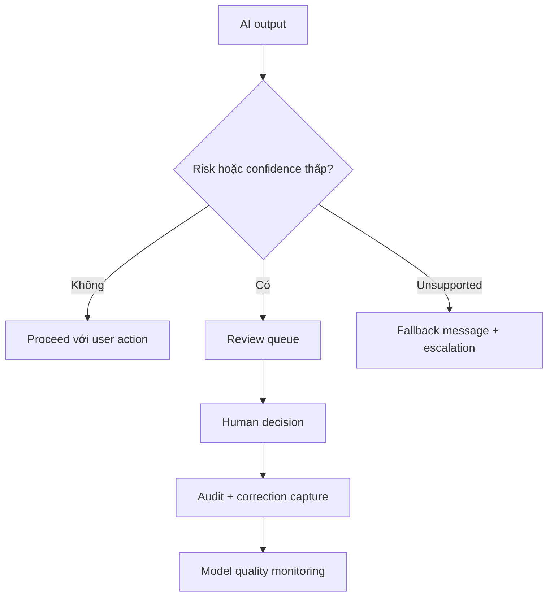

# Human review, monitoring và fallback

<div class="lesson-meta">
  <span>Xây dựng sản phẩm có AI dưới góc nhìn BA</span>
  <span>Software BA</span>
  <span>Advanced</span>
</div>

## Learning outcomes

- Thiết kế human-in-the-loop workflow.
- Đặc tả fallback và escalation requirement.
- Định nghĩa monitoring event cho AI quality và risk.

## Why this matters for BA work

<div class="ba-callout">
Sản phẩm AI có trách nhiệm cần path rõ cho uncertainty, escalation, correction và quality monitoring.
</div>

Business Analyst đứng giữa problem framing, ý nghĩa từ stakeholder, constraint triển khai và product decision. Trong công việc có AI, vị trí này quan trọng hơn vì ngôn ngữ chưa rõ có thể tạo false certainty rất nhanh. Bài này đưa ra một control thực tế để áp dụng trước khi output AI trở thành scope, backlog hoặc delivery commitment.

## Mental model or core concept

Human-in-the-loop không phải lời hứa mơ hồ rằng con người có thể can thiệp. Nó là workflow được thiết kế: trigger condition, reviewer role, queue, SLA, decision option, user messaging, audit, correction capture và monitoring. Fallback phải safe, visible và đo được.

## Practical BA example

AI loan document checker flag missing document. Nếu confidence cao, nó suggest next action; nếu confidence thấp hoặc document type regulated, nó route đến reviewer. BA đặc tả queue priority, reason code, reviewer action, customer message và audit trail.

## Diagram



## BA artifact

### Human-in-the-Loop Flow Requirements

| Flow part | Requirement | Example | Metric |
| --- | --- | --- | --- |
| Trigger | Định nghĩa khi nào human review bắt đầu. | Confidence < 0.8 hoặc regulated document. | Trigger accuracy theo case type. |
| Reviewer action | Liệt kê allowed decision. | Approve, reject, request info, override. | Review completion SLA. |
| Fallback | Định nghĩa safe response khi AI không trả lời được. | Show escalation message và create task. | Fallback resolution time. |
| Monitoring | Capture quality và drift signal. | Track override theo category. | Override rate trend. |

## AI collaboration prompt

```text
Thiết kế requirement human-in-the-loop và fallback. Bao gồm trigger, reviewer role, queue priority, SLA, allowed decision, user messaging, audit record, correction capture, monitoring event và operational metric.
```

## Mistakes to avoid

- Viết 'human can review' mà thiếu workflow detail.
- Không có SLA cho review queue.
- Fallback message che giấu uncertainty.
- Monitoring chỉ uptime, không đo AI quality.

## Apply this tomorrow

1. Định nghĩa một low-confidence trigger.
2. Viết fallback message trung thực và hữu ích.
3. Thêm reason code cho human override.
4. Hỏi operations ai own review queue.

## What a BA should remember

- Human review là workflow requirement.
- Fallback là một phần user experience.
- Monitoring phải gồm quality, không chỉ availability.
