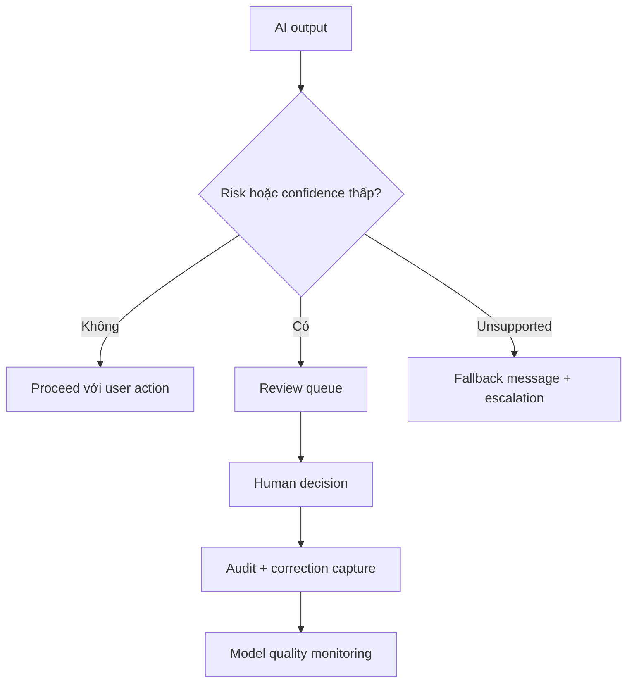

# Human review, monitoring và fallback

<div class="lesson-meta">
  <span>Xây dựng sản phẩm có AI dưới góc nhìn BA</span>
  <span>Software BA</span>
  <span>Advanced</span>
</div>

## Learning outcomes

- Thiết kế human-in-the-loop workflow.
- Đặc tả fallback và escalation requirement.
- Định nghĩa monitoring event cho AI quality và risk.

## Why this matters for BA work

<div class="ba-callout">
Sản phẩm AI có trách nhiệm cần path rõ cho uncertainty, escalation, correction và quality monitoring.
</div>

Bài này quan trọng vì human review thường được viết như safeguard mơ hồ, rồi fail khi operation cần queue, SLA, decision right và audit trail thật. AI product cần fallback và monitoring được thiết kế. BA phải đặc tả điều gì xảy ra khi confidence thấp, risk cao hoặc evidence thiếu.

## Common difficulties for BAs

Trong dự án thật, chủ đề này khó vì BA phải biến evidence lộn xộn thành decision mà không để AI che mất uncertainty. Hãy chú ý các friction point này trước khi xem output là sẵn sàng.

| Khó khăn | Vì sao khó trong công việc BA | BA nên xử lý thế nào |
| --- | --- | --- |
| Viết 'human can review' mà thiếu workflow detail. | Khó vì Human review, monitoring và fallback thường được áp dụng khi deadline gấp, evidence chưa đủ và stakeholder chưa thống nhất. Draft AI nghe trôi chảy có thể làm gap ít visible hơn. | Dùng source label, assumption rõ và review owner cụ thể trước khi chuyển thành backlog, specification hoặc delivery commitment. |
| Không có SLA cho review queue. | Khó vì Human review, monitoring và fallback thường được áp dụng khi deadline gấp, evidence chưa đủ và stakeholder chưa thống nhất. Draft AI nghe trôi chảy có thể làm gap ít visible hơn. | Dùng source label, assumption rõ và review owner cụ thể trước khi chuyển thành backlog, specification hoặc delivery commitment. |
| Fallback message che giấu uncertainty. | Khó vì Human review, monitoring và fallback thường được áp dụng khi deadline gấp, evidence chưa đủ và stakeholder chưa thống nhất. Draft AI nghe trôi chảy có thể làm gap ít visible hơn. | Dùng source label, assumption rõ và review owner cụ thể trước khi chuyển thành backlog, specification hoặc delivery commitment. |

## Where this applies in real projects

Bài này hữu ích khi BA cần chuyển conversation, policy, design hoặc technical input thành artifact chung để team implement và test được.

| Thời điểm trong dự án | Cách áp dụng bài học | Output cụ thể của BA |
| --- | --- | --- |
| Discovery | Định nghĩa một low-confidence trigger. | Human-in-the-Loop Flow Requirements: artifact review được, nối nội dung học với decision, acceptance criteria, risk hoặc stakeholder alignment. |
| Refinement | Viết fallback message trung thực và hữu ích. | Human-in-the-Loop Flow Requirements: artifact review được, nối nội dung học với decision, acceptance criteria, risk hoặc stakeholder alignment. |
| Delivery | Thêm reason code cho human override. | Human-in-the-Loop Flow Requirements: artifact review được, nối nội dung học với decision, acceptance criteria, risk hoặc stakeholder alignment. |

## If this is missing

Nếu thiếu năng lực này, AI vẫn có thể tạo text rất bóng bẩy, nhưng project mất khả năng review. Kết quả thường là rework, assumption ẩn, acceptance criteria yếu hoặc business decision thiếu evidence.

| Nếu thiếu | Ảnh hưởng tới dự án | Cách khôi phục |
| --- | --- | --- |
| Viết rằng human can review AI output | Không có trigger, queue, role, SLA hoặc decision authority. | Khôi phục bằng pattern tốt hơn: Đặc tả review trigger, routing, reviewer action, SLA, audit record và owner. Sau đó check lại artifact theo evidence, testability, ownership và business impact trước khi share. |
| Dùng fallback message nghe quá tự tin | User không hiểu uncertainty hoặc next safe action. | Khôi phục bằng pattern tốt hơn: Giải thích limitation, cung cấp next step an toàn và route sang support hoặc manual process. Sau đó check lại artifact theo evidence, testability, ownership và business impact trước khi share. |
| Chỉ monitor uptime và latency | System có thể available nhưng output vẫn low-quality hoặc risky. | Khôi phục bằng pattern tốt hơn: Track override rate, unsupported query, error category, drift signal và review outcome. Sau đó check lại artifact theo evidence, testability, ownership và business impact trước khi share. |

## Mental model or core concept

Human-in-the-loop không phải lời hứa mơ hồ rằng con người có thể can thiệp. Nó là workflow được thiết kế: trigger condition, reviewer role, queue, SLA, decision option, user messaging, audit, correction capture và monitoring. Fallback phải safe, visible và đo được.

## Practical BA example

AI loan document checker flag missing document. Nếu confidence cao, nó suggest next action; nếu confidence thấp hoặc document type regulated, nó route đến reviewer. BA đặc tả queue priority, reason code, reviewer action, customer message và audit trail.

## Diagram



## BA artifact

### Human-in-the-Loop Flow Requirements

| Flow part | Requirement | Example | Metric |
| --- | --- | --- | --- |
| Trigger | Định nghĩa khi nào human review bắt đầu. | Confidence < 0.8 hoặc regulated document. | Trigger accuracy theo case type. |
| Reviewer action | Liệt kê allowed decision. | Approve, reject, request info, override. | Review completion SLA. |
| Fallback | Định nghĩa safe response khi AI không trả lời được. | Show escalation message và create task. | Fallback resolution time. |
| Monitoring | Capture quality và drift signal. | Track override theo category. | Override rate trend. |

## AI expert note

Human-in-the-loop là operating workflow, không phải slogan. Requirement chuyên gia định nghĩa trigger condition, reviewer role, allowed action, escalation, user messaging, correction capture, quality monitoring và accountability. Fallback thành công khi giữ được user trust và business safety, không phải khi che giấu AI đã fail.

## Bad vs better example

| Cách làm yếu | Vì sao fail | Cách làm BA tốt hơn |
| --- | --- | --- |
| Viết rằng human can review AI output | Không có trigger, queue, role, SLA hoặc decision authority. | Đặc tả review trigger, routing, reviewer action, SLA, audit record và owner. |
| Dùng fallback message nghe quá tự tin | User không hiểu uncertainty hoặc next safe action. | Giải thích limitation, cung cấp next step an toàn và route sang support hoặc manual process. |
| Chỉ monitor uptime và latency | System có thể available nhưng output vẫn low-quality hoặc risky. | Track override rate, unsupported query, error category, drift signal và review outcome. |

## AI collaboration prompt

```text
Thiết kế requirement human-in-the-loop và fallback. Bao gồm trigger, reviewer role, queue priority, SLA, allowed decision, user messaging, audit record, correction capture, monitoring event và operational metric.
```

## Mistakes to avoid

- Viết 'human can review' mà thiếu workflow detail.
- Không có SLA cho review queue.
- Fallback message che giấu uncertainty.
- Monitoring chỉ uptime, không đo AI quality.

## Apply this tomorrow

1. Định nghĩa một low-confidence trigger.
2. Viết fallback message trung thực và hữu ích.
3. Thêm reason code cho human override.
4. Hỏi operations ai own review queue.

## What a BA should remember

- Human review là workflow requirement.
- Fallback là một phần user experience.
- Monitoring phải gồm quality, không chỉ availability.
