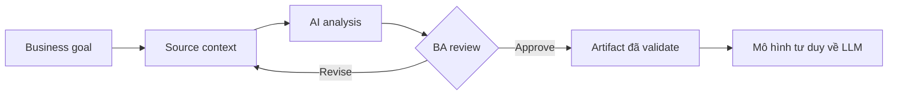

# Mô hình tư duy về LLM

<div class="lesson-meta">
  <span>Nền tảng AI cho Business Analyst</span>
  <span>Software BA</span>
  <span>Core</span>
</div>

## Learning outcomes

- Giải thích mô hình tư duy về llm bằng ngôn ngữ business.
- Áp dụng concept vào workflow BA thực tế.
- Dùng output AI như draft có evidence, không xem là sự thật tự động.
- Xác định câu hỏi review BA phải hỏi trước khi chia sẻ artifact.

## Why this matters for BA work

AI thay đổi cách tạo ra artifact phân tích, nhưng không thay thế trách nhiệm của BA về clarity, evidence và decision.

<div class="ba-callout">
Xây dựng mental model thực dụng về cách language model dự đoán, biến đổi, tóm tắt, phân loại và lập luận trên văn bản.
</div>

## Core concept

Pattern hữu ích cho BA là controlled collaboration: cung cấp business context cho model, yêu cầu structured output, bắt buộc có evidence, rồi review theo goal, rule, risk và decision của stakeholder.

## Practical BA example

Khi nhờ AI viết acceptance criteria, BA không nên giả định model biết business rule ẩn. Model có thể suy luận pattern, nhưng BA phải cung cấp constraint, ví dụ, edge case và tiêu chí review.

## Diagram



## BA workflow

1. Đóng khung business question trước khi mở AI tool.
2. Cung cấp source context và constraint rõ ràng.
3. Yêu cầu structured output có mapping về source.
4. Chạy critique pass để tìm ambiguity, gap, risk và testability.
5. Chuyển kết quả thành artifact mà team có thể inspect và cùng chịu ownership.

## Prompt hoặc template

```text
Trước khi trả lời, hãy liệt kê assumption. Đánh dấu từng assumption là explicit, inferred hoặc missing. Không tự bịa policy hoặc system behavior nếu context không cung cấp.
```

## What a BA should remember

- AI là bộ tăng tốc reasoning, không phải decision owner.
- Mọi claim quan trọng phải grounded vào source context hoặc stakeholder confirmation.
- BA giỏi giữ review loop rõ ràng: draft, critique, revise, validate.
