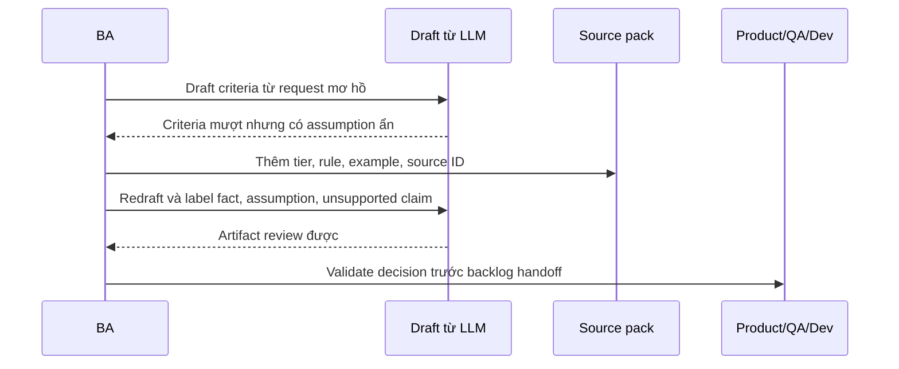
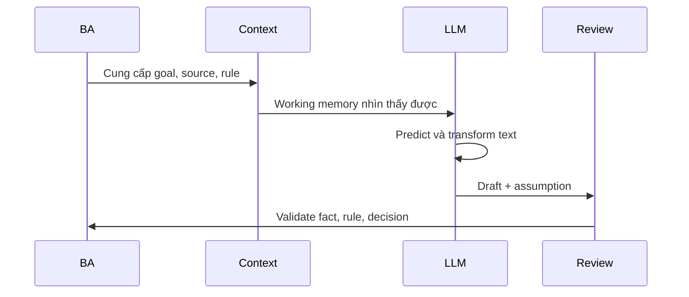

# Mô hình tư duy về LLM

<div class="lesson-meta">
  <span>Nền tảng AI cho Business Analyst</span>
  <span>Software BA</span>
  <span>Core</span>
</div>

## Story mode: walkthrough theo dự án

<div class="story-mode-panel">
  <p class="story-eyebrow">Prototype dạng story</p>
  <h3>Một draft AI rất mượt suýt trở thành requirement sai</h3>
  <p class="story-intro">Maya yêu cầu LLM viết acceptance criteria cho việc premium users export report. Câu trả lời nhìn hữu ích, nhưng âm thầm tự bịa format, limit và permission chưa ai approve.</p>
  <div class="story-scene-grid">
<article class="story-scene">
  <span>Cảnh 1</span>
  <b>01</b>
  <strong>Draft nhìn như đã sẵn sàng</strong>
  <p>LLM viết Given-When-Then rất sạch. Team thấy yên tâm vì wording nghe chuyên nghiệp.</p>
</article>
<article class="story-scene">
  <span>Cảnh 2</span>
  <b>02</b>
  <strong>Assumption ẩn bắt đầu lộ ra</strong>
  <p>Maya highlight export format, file size, subscription tier, audit rule và retention period. Không điều nào có source.</p>
</article>
<article class="story-scene">
  <span>Cảnh 3</span>
  <b>03</b>
  <strong>Prompt được đổi lại</strong>
  <p>Cô cung cấp source rule, example, output schema và instruction yêu cầu label unsupported claim.</p>
</article>
<article class="story-scene">
  <span>Cảnh 4</span>
  <b>04</b>
  <strong>Artifact trở nên review được</strong>
  <p>Draft thứ hai tách fact, assumption và validation question. QA test được, Product approve được decision thật.</p>
</article>
  </div>
  <div class="visual-takeaway-strip">
<span>Plausible không đồng nghĩa approved</span>
<span>Label assumption để bảo vệ scope</span>
<span>Human review là một workflow</span>
  </div>
</div>

## Reality check: số liệu hiện tại cho BA

<div class="fact-card-grid">
<article class="fact-card">
  <strong>46% vs 33%</strong>
  <span>Trust gap rất thật trong software team</span>
  <p>Stack Overflow 2025 ghi nhận số developer không tin độ chính xác của AI cao hơn số người tin. Góc nhìn BA: xem output AI là draft cần evidence, không phải requirement source.</p>
  <a href="https://survey.stackoverflow.co/2025/ai">Nguồn: Stack Overflow Developer Survey 2025</a>
</article>
<article class="fact-card">
  <strong>27%</strong>
  <span>Chỉ một phần nhỏ review mọi output gen AI</span>
  <p>McKinsey ghi nhận 27% tổ chức dùng gen AI review toàn bộ generated content trước khi dùng, trong khi tỷ lệ tương tự chỉ review 20% hoặc ít hơn. Góc nhìn BA: phải đặc tả review gate rõ ràng.</p>
  <a href="https://www.mckinsey.com/~/media/mckinsey/business%20functions/quantumblack/our%20insights/the%20state%20of%20ai/2025/the-state-of-ai-how-organizations-are-rewiring-to-capture-value_final.pdf">Nguồn: McKinsey State of AI 2025 PDF</a>
</article>
<article class="fact-card">
  <strong>63%</strong>
  <span>Governance gap vẫn phổ biến</span>
  <p>IBM 2025 ghi nhận 63% tổ chức thiếu policy governance để quản lý AI hoặc shadow AI. Góc nhìn BA: làm rõ allowed use, data boundary và review ownership.</p>
  <a href="https://www.ibm.com/reports/data-breach">Nguồn: IBM Cost of a Data Breach 2025</a>
</article>
</div>

## Walkthrough trực quan



## Bản đồ quyết định trực quan

<div class="visual-ba-map">
  <h3>BA review gì trước khi chia sẻ output AI</h3>
<div>
  <strong>Fact</strong>
  <span>Statement có source, decision owner hoặc rule được cite.</span>
  <em>Giữ lại nhưng bảo toàn source ID.</em>
</div>
<div>
  <strong>Assumption</strong>
  <span>Model suy luận điều nghe hợp lý.</span>
  <em>Label rõ và gắn câu hỏi cần stakeholder validate.</em>
</div>
<div>
  <strong>Unsupported claim</strong>
  <span>Statement nghe hữu ích nhưng không có evidence.</span>
  <em>Loại khỏi scope cho tới khi được validate.</em>
</div>
</div>

## Learning outcomes

- Giải thích hành vi LLM mà không thổi phồng độ chắc chắn.
- Thiết kế prompt làm lộ assumption và missing context.
- Review output AI như draft có tính xác suất.

## Why this matters for BA work

<div class="ba-callout">
LLM là engine xử lý và reasoning trên text rất mạnh, nhưng nó không tự biết business rule ẩn nếu bạn không cung cấp hoặc retrieve đúng nguồn.
</div>

Bài này quan trọng vì output của LLM thường nghe rất hoàn chỉnh trước khi nó thật sự được governance, có source hoặc test được. BA hiểu mental model sẽ dùng AI như partner để draft và critique có cấu trúc, không nhầm text trôi chảy với business approval. Điều này giữ requirement ở trạng thái reviewable và ngăn assumption ẩn đi vào artifact triển khai.

## Common difficulties for BAs

Trong Nền tảng AI cho Business Analyst, Mô hình tư duy về LLM trở nên khó khi stakeholder muốn câu trả lời AI thật đơn giản trong khi vấn đề thật phụ thuộc vào capability của model, data readiness, boundary của tool và risk của business decision. BA nên kiểm tra các điểm dưới đây trước khi xem artifact có AI hỗ trợ là đủ sẵn sàng cho stakeholder decision hoặc handoff.

| Khó khăn | Vì sao khó trong công việc BA | BA nên xử lý thế nào |
| --- | --- | --- |
| Yêu cầu AI đưa final truth thay vì reviewable draft. | Lỗi "Yêu cầu AI đưa final truth thay vì reviewable draft." xuất hiện khi team bàn về problem fit, model boundary, data dependency và decision risk nhưng chưa thống nhất source nào authoritative. AI có thể làm disagreement nghe mượt hơn, nên BA phải giữ uncertainty visible. | Áp dụng control này: yêu cầu model so sánh option AI và non-AI trước khi draft requirement. Sau đó dùng pattern tốt hơn "Cung cấp rule, actor, constraint, example và bắt model list assumption riêng." và hỏi ai phải approve artifact trước khi nó ảnh hưởng scope, build, test hoặc release. |
| Không tách model confidence khỏi business approval. | Với Mô hình tư duy về LLM, điểm khó là LLM là engine xử lý và reasoning trên text rất mạnh, nhưng nó không tự biết business rule ẩn nếu bạn không cung cấp hoặc retrieve đúng nguồn. Pattern yếu rất dễ xảy ra vì AI có thể tạo câu trả lời trôi chảy trước khi BA check ownership, source freshness hoặc decision right. | Áp dụng control này: yêu cầu model so sánh option AI và non-AI trước khi draft requirement. Sau đó dùng pattern tốt hơn "Đưa material claim qua source review hoặc decision owner trước khi publish." và hỏi ai phải approve artifact trước khi nó ảnh hưởng scope, build, test hoặc release. |
| Giao task mơ hồ mà thiếu source context hoặc example. | Điểm này khó khi LLM Output Review Card được kỳ vọng hỗ trợ solution-shape decision. Nếu BA không challenge draft, unsupported assumption có thể đi vào planning, testing hoặc stakeholder communication. | Áp dụng control này: yêu cầu model so sánh option AI và non-AI trước khi draft requirement. Sau đó dùng pattern tốt hơn "Thêm bảng review cho source-backed fact, assumption, open question và owner decision." và hỏi ai phải approve artifact trước khi nó ảnh hưởng scope, build, test hoặc release. |

## Where this applies in real projects

Dùng bài này khi một AI idea mới đi vào discovery, vendor discussion, roadmap planning hoặc feasibility analysis. Output thực tế không phải document dài hơn; đó là LLM Output Review Card có đủ evidence, ownership và decision clarity cho cuộc trao đổi tiếp theo của dự án.

| Thời điểm trong dự án | Cách áp dụng bài học | Output cụ thể của BA |
| --- | --- | --- |
| Idea intake | Chọn một output AI và đánh dấu fact vs assumption. | LLM Output Review Card thể hiện problem fit, model boundary, data dependency và decision risk, trong đó action "Chọn một output AI và đánh dấu fact vs assumption." được chuyển thành decision, requirement, checklist hoặc question có thể review ở meeting tiếp theo. |
| Feasibility review | Yêu cầu AI rewrite artifact chỉ dựa trên context được cung cấp. | LLM Output Review Card thể hiện source evidence, trong đó action "Yêu cầu AI rewrite artifact chỉ dựa trên context được cung cấp." được chuyển thành decision, requirement, checklist hoặc question có thể review ở meeting tiếp theo. |
| Solution framing | Thêm section 'questions for validation' vào prompt. | LLM Output Review Card thể hiện decision owner, trong đó action "Thêm section 'questions for validation' vào prompt." được chuyển thành decision, requirement, checklist hoặc question có thể review ở meeting tiếp theo. |

## If this is missing

Nếu thiếu Mô hình tư duy về LLM, team có thể chọn tool trước khi hiểu problem shape, tạo automation tốn kém nhưng không khớp business outcome. BA vẫn có thể khôi phục, nhưng phải chuyển draft AI bóng bẩy trở lại thành evidence, assumption, owner và decision test được.

| Nếu thiếu | Ảnh hưởng tới dự án | Cách khôi phục |
| --- | --- | --- |
| Yêu cầu model viết final acceptance criteria từ một idea một dòng | Model sẽ tự điền policy, permission và edge case còn thiếu bằng invention nghe hợp lý. | Khôi phục bằng pattern tốt hơn: Cung cấp rule, actor, constraint, example và bắt model list assumption riêng. Rework LLM Output Review Card cho đến khi nó lộ rõ problem fit, model boundary, data dependency và decision risk, và không share như bản final cho tới khi evidence, ownership và validation path explicit. |
| Xem ngôn ngữ tự tin của model là approval | Model confidence không phải stakeholder confirmation hoặc regulatory evidence. | Khôi phục bằng pattern tốt hơn: Đưa material claim qua source review hoặc decision owner trước khi publish. Rework LLM Output Review Card cho đến khi nó lộ rõ problem fit, model boundary, data dependency và decision risk, và không share như bản final cho tới khi evidence, ownership và validation path explicit. |
| Share draft AI bóng bẩy nhưng không có dấu review | Stakeholder không thấy đâu là fact, inference hay unsupported text. | Khôi phục bằng pattern tốt hơn: Thêm bảng review cho source-backed fact, assumption, open question và owner decision. Rework LLM Output Review Card cho đến khi nó lộ rõ problem fit, model boundary, data dependency và decision risk, và không share như bản final cho tới khi evidence, ownership và validation path explicit. |

## Mental model or core concept

LLM biến context thành chuỗi text có khả năng phù hợp tiếp theo. Nó có thể summarize, classify, compare, draft và suy luận pattern, nhưng chất lượng phụ thuộc vào context, instruction, example và review. Với BA, mental model đúng không phải 'AI biết câu trả lời', mà là 'AI đề xuất structured draft từ context được cung cấp, BA validate lại.'

## Practical BA example

BA yêu cầu LLM viết acceptance criteria cho 'premium users can export reports.' Model có thể tự bịa format export, limit và permission. Nếu BA cung cấp subscription tier, report type, audit rule và example, model sẽ draft tốt hơn và chỉ ra assumption cần validate.

## Diagram



## BA artifact

### LLM Output Review Card

| Lens review | Câu hỏi cần hỏi | Pass signal | Risk signal |
| --- | --- | --- | --- |
| Context | Model đã nhận business rule thật chưa? | Output cite context được cung cấp. | Output tự bịa policy hoặc threshold. |
| Assumption | Statement nào là inferred? | Assumption được label rõ. | Assumption bị viết như fact. |
| Specificity | QA có test được không? | Rule, actor và outcome rõ. | Dùng từ mơ hồ như nhanh, dễ, thông minh. |
| Decision | Ai phải approve? | Decision owner được nêu rõ. | Câu trả lời AI bị xem như approval. |

## AI expert note

LLM là hệ thống xác suất có khả năng pattern language rất mạnh, không phải requirement engine có thẩm quyền. BA phải quản lý context, example, constraint và review criteria. Dùng chuyên nghiệp nghĩa là yêu cầu assumption, evidence label, counterexample và testability check, sau đó xem answer như candidate artifact cần human validation.

## Bad vs better example

| Cách làm yếu | Vì sao fail | Cách làm BA tốt hơn |
| --- | --- | --- |
| Yêu cầu model viết final acceptance criteria từ một idea một dòng | Model sẽ tự điền policy, permission và edge case còn thiếu bằng invention nghe hợp lý. | Cung cấp rule, actor, constraint, example và bắt model list assumption riêng. |
| Xem ngôn ngữ tự tin của model là approval | Model confidence không phải stakeholder confirmation hoặc regulatory evidence. | Đưa material claim qua source review hoặc decision owner trước khi publish. |
| Share draft AI bóng bẩy nhưng không có dấu review | Stakeholder không thấy đâu là fact, inference hay unsupported text. | Thêm bảng review cho source-backed fact, assumption, open question và owner decision. |

## Stakeholder questions to ask

| Stakeholder | Câu hỏi | Vì sao BA hỏi |
| --- | --- | --- |
| Product owner | Mô hình tư duy về LLM cần cải thiện outcome nào, và trade-off nào có thể chấp nhận? | Ngăn output AI tối ưu cho mục tiêu mơ hồ. |
| Engineering lead | Source, system, data hoặc constraint nào khiến LLM Output Review Card khó implement? | Biến technical constraint ẩn thành requirement question visible. |
| QA lead | Rule, exception hoặc user state nào phải test được trước khi tin artifact này? | Chuyển wording trôi chảy của AI thành behavior quan sát được. |
| Operations hoặc support | Failure path nào tạo manual work nếu nguyên tắc "LLM sinh text hợp lý, không đảm bảo sự thật" bị bỏ qua? | Làm rõ support load, exception handling và operating impact. |

## Decision log entries

| Decision item | Option cần capture | Owner | Evidence cần có |
| --- | --- | --- | --- |
| Scope boundary cho LLM Output Review Card | Must-have, later, out of scope | Product owner | Business outcome và release constraint |
| Authority cho problem fit, model boundary, data dependency và decision risk | Documented source, stakeholder decision, assumption cần validate | BA + stakeholder chịu trách nhiệm | Source ID, date và approval status |
| Review gate trước handoff | Peer review, QA review, engineering review, formal approval | BA lead hoặc project lead | Risk level và receiving-team readiness |
| Cách recover nếu Yêu cầu AI đưa final truth thay vì reviewable draft. | Rewrite, defer, escalate hoặc validation workshop | Decision owner | Impact lên scope, testability và release risk |

## Definition of Ready / Done

| Gate | Tín hiệu ready | Tín hiệu done |
| --- | --- | --- |
| Definition of Ready | Source cho problem fit, model boundary, data dependency và decision risk được label và còn hiệu lực. | LLM Output Review Card có thể review mà không phải đoán missing context. |
| Definition of Ready | Open assumption có owner và validation path. | Stakeholder có thể accept, reject hoặc defer từng assumption. |
| Definition of Done | Artifact áp dụng control: yêu cầu model so sánh option AI và non-AI trước khi draft requirement. | Delivery, QA hoặc governance team có thể hành động dựa trên artifact. |
| Definition of Done | Pattern yếu "Yêu cầu AI đưa final truth thay vì reviewable draft." đã được kiểm tra explicit. | Không unsupported AI claim nào bị xem như requirement đã approve. |

## Before and after artifact example

| Before | Risk trong draft AI | Revision của senior BA |
| --- | --- | --- |
| Prompt: "Create LLM Output Review Card cho Mô hình tư duy về LLM." | Model có thể tự bịa source fact, owner, threshold hoặc implementation rule. | Thêm source, scope boundary, source authority, output schema và instruction: Cung cấp rule, actor, constraint, example và bắt model list assumption riêng. |
| Draft statement: "Chọn một output AI và đánh dấu fact vs assumption." | Action hữu ích nhưng chưa gắn decision owner hoặc acceptance signal. | Rewrite thành project step có owner, expected artifact, review gate và evidence cần trước handoff. |
| Paragraph nghe final về solution-shape decision | Tone có thể che uncertainty và approval còn thiếu. | Chuyển thành bảng fact, assumption, decision needed, risk và validation question. |

## Manual verification after AI output

| Lens kiểm tra | Manual check | Pass signal |
| --- | --- | --- |
| Evidence | Trace mọi statement quan trọng trong LLM Output Review Card về source, decision hoặc assumption có label. | Không unsupported claim nào còn bị ẩn. |
| Completeness | Check problem fit, model boundary, data dependency và decision risk theo intended audience và receiving team. | Artifact trả lời được điều product, engineering, QA và operations cần. |
| Testability | Hỏi QA có tạo được positive, negative, boundary và exception scenario không. | Wording mơ hồ được rewrite hoặc log thành question. |
| Accountability | Confirm ai approve, ai review và ai xử lý khi artifact sai. | Owner và escalation path explicit. |

## AI collaboration prompt

```text
Trước khi draft, hãy liệt kê missing context và assumption. Sau đó tạo artifact. Cuối draft, thêm bảng review gồm fact có source, assumption suy luận, unsupported claim và câu hỏi cần stakeholder validate.
```

## Mistakes to avoid

- Yêu cầu AI đưa final truth thay vì reviewable draft.
- Không tách model confidence khỏi business approval.
- Giao task mơ hồ mà thiếu source context hoặc example.
- Không yêu cầu model reveal assumption.

## Apply this tomorrow

1. Chọn một output AI và đánh dấu fact vs assumption.
2. Yêu cầu AI rewrite artifact chỉ dựa trên context được cung cấp.
3. Thêm section 'questions for validation' vào prompt.
4. Review một output bằng góc nhìn QA hoặc developer trước khi share.

## What a BA should remember

- LLM sinh text hợp lý, không đảm bảo sự thật.
- Prompt tốt làm missing context hiện ra.
- BA sở hữu validation, không phải model.
