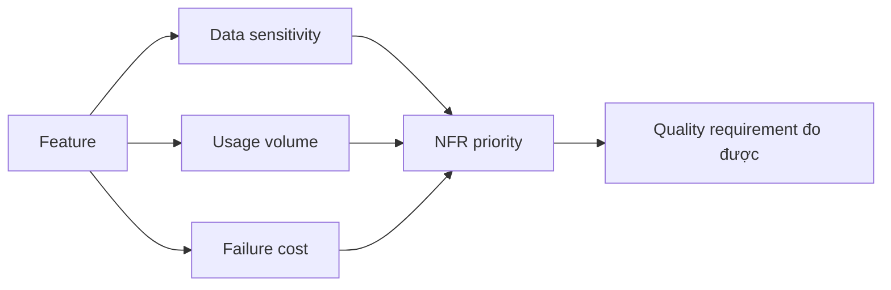

# Non-functional requirement và rủi ro

<div class="lesson-meta">
  <span>Requirements engineering với AI</span>
  <span>Software BA</span>
  <span>Core</span>
</div>

## Learning outcomes

- Dùng AI surface NFR gap theo quality attribute.
- Dịch technical risk thành business impact.
- Ưu tiên NFR theo usage, data sensitivity và failure cost.

## Why this matters for BA work

<div class="ba-callout">
NFR là business risk requirement, không phải phần phụ kỹ thuật.
</div>

Bài này quan trọng vì AI feature thường fail ở quality attribute mà stakeholder không nói rõ: privacy, latency, reliability, explainability, fairness, auditability và fallback. BA phải kéo các concern này lên sớm. Với product có AI, NFR không phải thứ phụ; nó định nghĩa feature có đáng tin trong operation thật hay không.

## Common difficulties for BAs

Trong Requirements engineering với AI, Non-functional requirement và rủi ro trở nên khó khi business rule, edge case, quality attribute và testability constraint phải sống sót khi chuyển từ conversation sang backlog. BA nên kiểm tra các điểm dưới đây trước khi xem artifact có AI hỗ trợ là đủ sẵn sàng cho stakeholder decision hoặc handoff.

| Khó khăn | Vì sao khó trong công việc BA | BA nên xử lý thế nào |
| --- | --- | --- |
| Xem NFR là chuyện riêng của developer. | Lỗi "Xem NFR là chuyện riêng của developer." xuất hiện khi team bàn về ambiguity, NFR risk, traceability, testability và rule ownership nhưng chưa thống nhất source nào authoritative. AI có thể làm disagreement nghe mượt hơn, nên BA phải giữ uncertainty visible. | Áp dụng control này: buộc mọi requirement statement lộ rõ actor, trigger, data, rule, exception và verification signal. Sau đó dùng pattern tốt hơn "Đặc tả evaluation case, target metric, acceptable error và escalation behavior." và hỏi ai phải approve artifact trước khi nó ảnh hưởng scope, build, test hoặc release. |
| Viết NFR không có measurable signal. | Với Non-functional requirement và rủi ro, điểm khó là NFR là business risk requirement, không phải phần phụ kỹ thuật. Pattern yếu rất dễ xảy ra vì AI có thể tạo câu trả lời trôi chảy trước khi BA check ownership, source freshness hoặc decision right. | Áp dụng control này: buộc mọi requirement statement lộ rõ actor, trigger, data, rule, exception và verification signal. Sau đó dùng pattern tốt hơn "Định nghĩa prohibited data, retention, consent, access và redaction requirement." và hỏi ai phải approve artifact trước khi nó ảnh hưởng scope, build, test hoặc release. |
| Bỏ privacy và audit đến late testing. | Điểm này khó khi NFR Risk Matrix được kỳ vọng hỗ trợ delivery-ready requirement. Nếu BA không challenge draft, unsupported assumption có thể đi vào planning, testing hoặc stakeholder communication. | Áp dụng control này: buộc mọi requirement statement lộ rõ actor, trigger, data, rule, exception và verification signal. Sau đó dùng pattern tốt hơn "Elicit NFR đặc thù AI trong discovery và đưa vào acceptance criteria." và hỏi ai phải approve artifact trước khi nó ảnh hưởng scope, build, test hoặc release. |

## Where this applies in real projects

Dùng bài này khi requirement đang được refine, split, clarify, test hoặc bị QA và delivery team challenge. Output thực tế không phải document dài hơn; đó là NFR Risk Matrix có đủ evidence, ownership và decision clarity cho cuộc trao đổi tiếp theo của dự án.

| Thời điểm trong dự án | Cách áp dụng bài học | Output cụ thể của BA |
| --- | --- | --- |
| Backlog refinement | Chọn một feature và nhờ AI tìm NFR gap. | NFR Risk Matrix thể hiện ambiguity, NFR risk, traceability, testability và rule ownership, trong đó action "Chọn một feature và nhờ AI tìm NFR gap." được chuyển thành decision, requirement, checklist hoặc question có thể review ở meeting tiếp theo. |
| QA alignment | Rewrite một NFR với acceptance signal đo được. | NFR Risk Matrix thể hiện source evidence, trong đó action "Rewrite một NFR với acceptance signal đo được." được chuyển thành decision, requirement, checklist hoặc question có thể review ở meeting tiếp theo. |
| Release readiness | Review priority NFR với product và engineering. | NFR Risk Matrix thể hiện decision owner, trong đó action "Review priority NFR với product và engineering." được chuyển thành decision, requirement, checklist hoặc question có thể review ở meeting tiếp theo. |

## If this is missing

Nếu thiếu Non-functional requirement và rủi ro, requirement nhìn có vẻ đầy đủ nhưng vẫn fail khi implement, test, release hoặc support operation. BA vẫn có thể khôi phục, nhưng phải chuyển draft AI bóng bẩy trở lại thành evidence, assumption, owner và decision test được.

| Nếu thiếu | Ảnh hưởng tới dự án | Cách khôi phục |
| --- | --- | --- |
| Viết AI output must be accurate | Accuracy không có nghĩa nếu thiếu task, dataset, threshold và failure cost. | Khôi phục bằng pattern tốt hơn: Đặc tả evaluation case, target metric, acceptable error và escalation behavior. Rework NFR Risk Matrix cho đến khi nó lộ rõ ambiguity, NFR risk, traceability, testability và rule ownership, và không share như bản final cho tới khi evidence, ownership và validation path explicit. |
| Để privacy cho technical team | Decision của BA về data, user và workflow định hình privacy exposure. | Khôi phục bằng pattern tốt hơn: Định nghĩa prohibited data, retention, consent, access và redaction requirement. Rework NFR Risk Matrix cho đến khi nó lộ rõ ambiguity, NFR risk, traceability, testability và rule ownership, và không share như bản final cho tới khi evidence, ownership và validation path explicit. |
| Thêm NFR sau khi design feature xong | Control có thể trở nên đắt hoặc không retrofit được. | Khôi phục bằng pattern tốt hơn: Elicit NFR đặc thù AI trong discovery và đưa vào acceptance criteria. Rework NFR Risk Matrix cho đến khi nó lộ rõ ambiguity, NFR risk, traceability, testability và rule ownership, và không share như bản final cho tới khi evidence, ownership và validation path explicit. |

## Mental model or core concept

NFR mô tả hệ thống phải behave ra sao trong điều kiện thực tế: performance, availability, security, privacy, accessibility, auditability, supportability và compliance. AI có thể đề xuất category NFR, nhưng BA phải gắn mỗi requirement với business impact và measurable acceptance criteria.

## Practical BA example

Refund feature có functional step nhưng thiếu timeout, audit, fraud, data retention và support requirement. AI tạo risk inventory; BA chuyển high-risk gap thành NFR đo được và acceptance test.

## Diagram



## BA artifact

### NFR Risk Matrix

| Quality attribute | Business impact | Requirement example | Acceptance signal |
| --- | --- | --- | --- |
| Availability | Refund bị block khi outage. | Refund submission available 99.9% monthly. | Downtime report dưới threshold. |
| Privacy | PII lộ trong refund note. | Mask customer PII trong support view. | Role-based access test pass. |
| Auditability | Không có trace cho disputed refund. | Log approver, timestamp, reason, old/new status. | Audit export có đủ field. |
| Performance | Agent queue tăng khi peak. | Search refund status dưới 2 giây p95. | Load test đạt p95 target. |

## AI expert note

AI làm NFR phức tạp hơn vì behavior có tính xác suất và phụ thuộc data. Phân tích BA chuyên gia gắn từng NFR với risk scenario, user harm, measurement method, threshold, owner và operational response. Mục tiêu mơ hồ như accurate hoặc fast là không đủ; spec cần evaluation và monitoring đo được.

## Bad vs better example

| Cách làm yếu | Vì sao fail | Cách làm BA tốt hơn |
| --- | --- | --- |
| Viết AI output must be accurate | Accuracy không có nghĩa nếu thiếu task, dataset, threshold và failure cost. | Đặc tả evaluation case, target metric, acceptable error và escalation behavior. |
| Để privacy cho technical team | Decision của BA về data, user và workflow định hình privacy exposure. | Định nghĩa prohibited data, retention, consent, access và redaction requirement. |
| Thêm NFR sau khi design feature xong | Control có thể trở nên đắt hoặc không retrofit được. | Elicit NFR đặc thù AI trong discovery và đưa vào acceptance criteria. |

## Stakeholder questions to ask

| Stakeholder | Câu hỏi | Vì sao BA hỏi |
| --- | --- | --- |
| Product owner | Non-functional requirement và rủi ro cần cải thiện outcome nào, và trade-off nào có thể chấp nhận? | Ngăn output AI tối ưu cho mục tiêu mơ hồ. |
| Engineering lead | Source, system, data hoặc constraint nào khiến NFR Risk Matrix khó implement? | Biến technical constraint ẩn thành requirement question visible. |
| QA lead | Rule, exception hoặc user state nào phải test được trước khi tin artifact này? | Chuyển wording trôi chảy của AI thành behavior quan sát được. |
| Operations hoặc support | Failure path nào tạo manual work nếu nguyên tắc "NFR là risk control" bị bỏ qua? | Làm rõ support load, exception handling và operating impact. |

## Decision log entries

| Decision item | Option cần capture | Owner | Evidence cần có |
| --- | --- | --- | --- |
| Scope boundary cho NFR Risk Matrix | Must-have, later, out of scope | Product owner | Business outcome và release constraint |
| Authority cho ambiguity, NFR risk, traceability, testability và rule ownership | Documented source, stakeholder decision, assumption cần validate | BA + stakeholder chịu trách nhiệm | Source ID, date và approval status |
| Review gate trước handoff | Peer review, QA review, engineering review, formal approval | BA lead hoặc project lead | Risk level và receiving-team readiness |
| Cách recover nếu Xem NFR là chuyện riêng của developer. | Rewrite, defer, escalate hoặc validation workshop | Decision owner | Impact lên scope, testability và release risk |

## Definition of Ready / Done

| Gate | Tín hiệu ready | Tín hiệu done |
| --- | --- | --- |
| Definition of Ready | Source cho ambiguity, NFR risk, traceability, testability và rule ownership được label và còn hiệu lực. | NFR Risk Matrix có thể review mà không phải đoán missing context. |
| Definition of Ready | Open assumption có owner và validation path. | Stakeholder có thể accept, reject hoặc defer từng assumption. |
| Definition of Done | Artifact áp dụng control: buộc mọi requirement statement lộ rõ actor, trigger, data, rule, exception và verification signal. | Delivery, QA hoặc governance team có thể hành động dựa trên artifact. |
| Definition of Done | Pattern yếu "Xem NFR là chuyện riêng của developer." đã được kiểm tra explicit. | Không unsupported AI claim nào bị xem như requirement đã approve. |

## Before and after artifact example

| Before | Risk trong draft AI | Revision của senior BA |
| --- | --- | --- |
| Prompt: "Create NFR Risk Matrix cho Non-functional requirement và rủi ro." | Model có thể tự bịa source fact, owner, threshold hoặc implementation rule. | Thêm source, scope boundary, source authority, output schema và instruction: Đặc tả evaluation case, target metric, acceptable error và escalation behavior. |
| Draft statement: "Chọn một feature và nhờ AI tìm NFR gap." | Action hữu ích nhưng chưa gắn decision owner hoặc acceptance signal. | Rewrite thành project step có owner, expected artifact, review gate và evidence cần trước handoff. |
| Paragraph nghe final về delivery-ready requirement | Tone có thể che uncertainty và approval còn thiếu. | Chuyển thành bảng fact, assumption, decision needed, risk và validation question. |

## Manual verification after AI output

| Lens kiểm tra | Manual check | Pass signal |
| --- | --- | --- |
| Evidence | Trace mọi statement quan trọng trong NFR Risk Matrix về source, decision hoặc assumption có label. | Không unsupported claim nào còn bị ẩn. |
| Completeness | Check ambiguity, NFR risk, traceability, testability và rule ownership theo intended audience và receiving team. | Artifact trả lời được điều product, engineering, QA và operations cần. |
| Testability | Hỏi QA có tạo được positive, negative, boundary và exception scenario không. | Wording mơ hồ được rewrite hoặc log thành question. |
| Accountability | Confirm ai approve, ai review và ai xử lý khi artifact sai. | Owner và escalation path explicit. |

## AI collaboration prompt

```text
Review feature này cho NFR risk. Cover availability, performance, security, privacy, accessibility, auditability, supportability, compliance và data retention. Với mỗi gap, đưa business impact, measurable requirement, acceptance signal và owner.
```

## Mistakes to avoid

- Xem NFR là chuyện riêng của developer.
- Viết NFR không có measurable signal.
- Bỏ privacy và audit đến late testing.
- Không nối priority NFR với business risk.

## Apply this tomorrow

1. Chọn một feature và nhờ AI tìm NFR gap.
2. Rewrite một NFR với acceptance signal đo được.
3. Review priority NFR với product và engineering.
4. Thêm audit và supportability vào checklist.

## What a BA should remember

- NFR là risk control.
- NFR đo được giúp tránh tranh luận quality mơ hồ.
- Ownership của BA bao gồm business impact khi failure.
