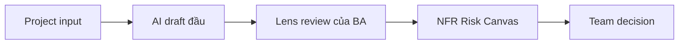
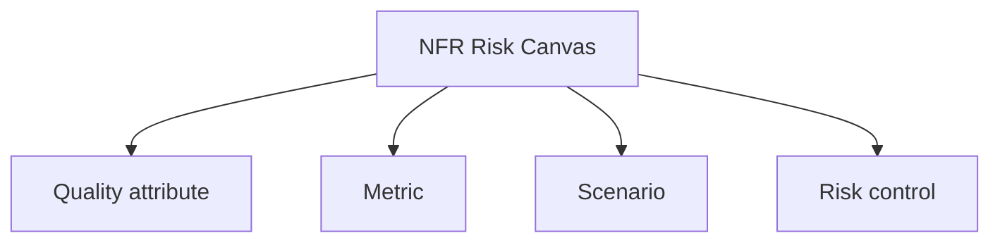

# NFR và risk

<div class="lesson-meta">
  <span>Requirement quality</span>
  <span>Software BA</span>
  <span>Core</span>
</div>

## Story mode: project walkthrough

<div class="story-mode-panel">
  <p class="story-eyebrow">Story prototype</p>
  <h3>Reliable chưa phải requirement nếu chưa có scenario</h3>
  <p class="story-intro">Maya nhận checkout flow được nói là phải reliable nhưng không có target đo được. Thay vì nhờ AI trả lời final, cô dùng pattern của bài này để làm tình huống rõ hơn, review được hơn và hữu ích hơn cho decision tiếp theo.</p>
  <div class="story-scene-grid">
<article class="story-scene">
  <span>Scene 1</span>
  <b>01</b>
  <strong>Yêu cầu còn mơ hồ</strong>
  <p>Team đưa cho Maya checkout flow được nói là phải reliable nhưng không có target đo được và mong có câu trả lời gọn trong ngày.</p>
</article>
<article class="story-scene">
  <span>Scene 2</span>
  <b>02</b>
  <strong>AI tạo draft đầu tiên</strong>
  <p>Draft khá hữu ích, nhưng che uncertainty quanh Metric và Scenario.</p>
</article>
<article class="story-scene">
  <span>Scene 3</span>
  <b>03</b>
  <strong>Maya biến nó thành evidence của BA</strong>
  <p>Cô thêm source note, owner, example và review table tập trung cho NFR Risk Canvas thay vì gửi thẳng raw AI output.</p>
</article>
<article class="story-scene">
  <span>Scene 4</span>
  <b>04</b>
  <strong>Team có thể ra decision</strong>
  <p>NFR Risk Canvas cuối cùng cho thấy phần nào ready, phần nào rủi ro và phần nào cần human decision.</p>
</article>
  </div>
  <div class="visual-takeaway-strip">
<span>NFR cần context</span>
<span>Latency phải review được</span>
<span>Availability trở thành câu hỏi của BA</span>
  </div>
</div>

## AI words in plain English

| Thuật ngữ AI | Hiểu đơn giản | BA dùng để làm gì |
| --- | --- | --- |
| NFR | Non-functional requirement như performance, security hoặc reliability. | Dùng để gọi đúng loại việc trước khi nhờ AI hỗ trợ. |
| Latency | Thời gian system phản hồi. | Dùng như lens review, không dùng như từ trang trí. |
| Availability | Mức độ system được kỳ vọng usable. | Biến nó thành checklist item hoặc câu hỏi stakeholder. |
| Risk control | Requirement hoặc process giảm risk đã biết. | Định nghĩa rule trước khi team xem output là ready. |

## Reality check: tình huống thường gặp trong dự án

<div class="fact-card-grid">
<article class="fact-card">
  <strong>Draft nhanh có thể che tư duy yếu</strong>
  <span>Hỏi draft phụ thuộc evidence, owner và decision nào.</span>
  <p>AI có thể tạo NFR Risk Canvas rất nhanh, nhưng tốc độ không chứng minh quality.</p>
</article>
<article class="fact-card">
  <strong>Stakeholder cần ngôn ngữ đơn giản</strong>
  <span>Giải thích term bằng một câu trước khi đưa vào requirement.</span>
  <p>Term như NFR và Latency dễ làm người ngoài cuộc trao đổi AI bị rối.</p>
</article>
<article class="fact-card">
  <strong>NFR Risk Canvas phải đi qua nhiều team</strong>
  <span>Làm next action visible cho từng receiving team.</span>
  <p>Product, Engineering, QA và Operations đọc NFR Risk Canvas theo góc nhìn khác nhau.</p>
</article>
</div>

## Visual walkthrough



## Visual decision map

<div class="visual-ba-map">
  <h3>NFR Risk Canvas: what the BA should look for</h3>
<div>
  <strong>Quality attribute</strong>
  <span>Điều BA phải làm rõ trước tiên.</span>
  <em>Viết bằng ngôn ngữ dự án.</em>
</div>
<div>
  <strong>Metric</strong>
  <span>Nơi AI có thể giúp nhưng cũng có thể che uncertainty.</span>
  <em>Thêm review criteria.</em>
</div>
<div>
  <strong>Scenario</strong>
  <span>Điều có thể hỏng nếu team bỏ validation.</span>
  <em>Tạo decision question.</em>
</div>
<div>
  <strong>Risk control</strong>
  <span>Điều làm artifact đủ an toàn để handoff.</span>
  <em>Ghi owner, evidence và next step.</em>
</div>
</div>

## Learning outcomes

- Giải thích NFR bằng ngôn ngữ BA đơn giản.
- Dùng AI để draft NFR Risk Canvas tốt hơn.
- Review output trước khi nó trở thành scope, test hoặc delivery work.

## Why this matters for BA work

<div class="ba-callout">
AI có thể gợi ý NFR, nhưng BA phải biến quality word mơ hồ thành constraint đo được.
</div>

NFR quan trọng vì quality word nghe rất đồng thuận cho tới khi Engineering hỏi con số và QA hỏi test thế nào. AI có thể gợi ý NFR category, nhưng BA phải biến chúng thành scenario, threshold, trade-off và risk control.

## Common difficulties for BAs

| Khó khăn | Vì sao khó với BA | BA xử lý thế nào |
| --- | --- | --- |
| Team dùng NFR nhưng không có cùng cách hiểu. | Mọi người gật đầu trong meeting nhưng tưởng tượng outcome khác nhau. | Bắt đầu bằng định nghĩa một câu và cho thấy nó làm thay đổi NFR Risk Canvas thế nào. |
| AI output trông hoàn chỉnh hơn input thực tế. | Draft trôi chảy có thể che missing example, owner hoặc edge case. | Yêu cầu AI liệt kê assumption và missing evidence trước khi draft bản cuối. |
| Reviewer cần detail khác nhau. | Product quan tâm value, Engineering quan tâm constraint, QA quan tâm testability, Ops quan tâm support. | Thêm column hoặc section cho từng receiving team thay vì một paragraph chung. |

## Where this applies in real projects

| Thời điểm dự án | Việc BA làm | Output cụ thể |
| --- | --- | --- |
| Discovery workshop | Dùng AI để gom note thành quality attribute, risk và open question. | NFR Risk Canvas có source note và owner. |
| Backlog refinement | Chuyển AI suggestion thành decision nhỏ và test được. | Story, rule hoặc checklist item có acceptance signal. |
| Handoff review | Nhờ AI critique artifact từ góc Product, Dev, QA và Ops. | Review table có action owner và status. |

## If this is missing

Nếu thiếu NFR và risk, team vẫn có thể tạo document, nhưng document khó trust, khó test và khó maintain hơn.

| Nếu thiếu | Ảnh hưởng dự án | Cách khôi phục |
| --- | --- | --- |
| Không có giải thích chung cho NFR | Stakeholder đồng ý bằng lời nhưng kỳ vọng behavior khác nhau. | Thêm định nghĩa plain-language và example. |
| Không review AI assumption | Ý tưởng chưa có evidence trở thành scope. | Đưa assumption vào validation list có owner. |
| Không có NFR Risk Canvas cụ thể | Bài học vẫn trừu tượng và không giúp delivery. | Tạo artifact bằng table nhỏ, không viết essay dài. |

## Mental model or core concept

NFR và risk dễ hiểu nhất như một control của BA: làm phần lộn xộn visible, để AI hỗ trợ structure, rồi review với con người trước khi thành delivery work.

## Practical BA example

Với checkout, AI gợi ý performance và reliability. Maya biến nó thành response time lúc peak load, payment retry behavior, monitoring alert và decision khi payment provider down.

## Diagram



## BA artifact

### NFR Risk Canvas

| Dòng artifact | BA cần viết gì | Dấu hiệu sẵn sàng | Dấu hiệu rủi ro |
| --- | --- | --- | --- |
| Quality attribute | Viết quality attribute cụ thể bằng ngôn ngữ dự án. | Stakeholder confirm được. | Vẫn chỉ là slogan. |
| Metric | Mô tả AI giúp gì và có thể sai ở đâu. | Review criteria visible. | Draft che uncertainty. |
| Scenario | Capture gap, conflict, edge case hoặc risk. | Owner và next action rõ. | Issue bị chôn trong prose. |
| Risk control | Định nghĩa handoff rule hoặc completion signal. | QA hoặc Engineering hành động được. | Receiving team không biết làm gì. |

## AI expert note

Ở góc nhìn AI reviewer, tôi sẽ kiểm tra NFR và risk có làm artifact của BA thực tế hơn không. AI tốt phải làm lộ missing context, tạo structure và giúp review dễ hơn. Nếu chỉ làm câu chữ đẹp hơn, BA chưa lấy được đủ value.

## Bad vs better example

| Cách làm yếu | Vì sao fail | Cách BA làm tốt hơn |
| --- | --- | --- |
| Yêu cầu AI "làm NFR và risk" mà không có source context. | Model tự lấp khoảng trống bằng wording nghe hợp lý. | Cung cấp source note, example, boundary và review criteria. |
| Gửi answer đầu tiên như final. | Team không thấy assumption hoặc evidence yếu. | Chạy critique pass và gắn nhãn open decision. |
| Dùng thuật ngữ AI mà không giải thích. | Business stakeholder mất tập trung hoặc hiểu sai. | Giải thích mỗi term bằng ngôn ngữ đơn giản trước khi đưa vào scope. |

## Stakeholder questions to ask

| Stakeholder | Câu hỏi | Vì sao BA hỏi |
| --- | --- | --- |
| Product owner | Which outcome should NFR và risk improve first? | Keeps AI work tied to business value. |
| Engineering lead | Which source, system, or constraint could make NFR Risk Canvas hard to implement? | Turns hidden technical constraints into requirement questions. |
| QA lead | Which behavior must be testable before we trust this artifact? | Converts fluent AI text into observable checks. |
| Operations or support | What failure path creates manual work after release? | Surfaces support load and fallback needs. |

## Decision log entries

| Decision item | Option cần capture | Owner | Evidence cần có |
| --- | --- | --- | --- |
| Scope boundary for NFR Risk Canvas | Must-have, later, out of scope | Product owner | Business outcome and release constraint |
| Authority for Quality attribute and Metric | Documented source, stakeholder decision, assumption to validate | BA + accountable stakeholder | Source ID, date, and approval status |
| Review gate before handoff | Peer review, QA review, engineering review, formal approval | BA lead or project lead | Risk level and receiving-team readiness |
| Recovery if Dùng NFR như jargon thay vì project decision. | Rewrite, defer, escalate, or run validation workshop | Decision owner | Impact on scope, testability, and release risk |

## Definition of Ready / Done

| Gate | Ready signal | Done signal |
| --- | --- | --- |
| Definition of Ready | Sources for Quality attribute are named. | NFR Risk Canvas can be reviewed without guessing context. |
| Definition of Ready | Open assumptions have owners and validation paths. | Stakeholders can accept, reject, or defer each assumption. |
| Definition of Done | The artifact applies this principle: AI có thể gợi ý NFR, nhưng BA phải biến quality word mơ hồ thành constraint đo được. | Delivery, QA, or governance teams can act on it. |
| Definition of Done | The weak pattern "Yêu cầu AI "làm NFR và risk" mà không có source context." has been checked. | No unsupported AI claim is treated as approved scope. |

## Before and after artifact example

| Before | Rủi ro từ AI draft | Senior BA revision |
| --- | --- | --- |
| Prompt: "Create NFR Risk Canvas." | The model may invent source facts, owners, or thresholds. | Add sources, scope boundary, output schema, and review criteria. |
| Draft statement: "Dùng AI để gom note thành quality attribute, risk và open question." | Useful, but not tied to owner or acceptance signal. | Rewrite as a project step with owner, expected artifact, and review gate. |
| Final-looking paragraph | Tone may hide uncertainty or missing stakeholder approval. | Convert into fact, assumption, decision needed, risk, and validation question. |

## Manual verification after AI output

| Verification lens | Manual check | Pass signal |
| --- | --- | --- |
| Evidence | Trace important statements in NFR Risk Canvas to a source, decision, or labeled assumption. | No unsupported claim remains hidden. |
| Completeness | Check Quality attribute, Metric, Scenario, Risk control against the intended audience. | Product, Engineering, QA, and Operations have what they need. |
| Testability | Ask whether QA can create positive, negative, boundary, and exception scenarios. | Ambiguous wording is rewritten or logged as a question. |
| Accountability | Confirm who approves, who reviews, and who acts when output is wrong. | Owners and escalation path are explicit. |

## AI collaboration prompt

```text
Dùng project notes được cung cấp để tạo NFR Risk Canvas. Trước hết giải thích key term bằng ngôn ngữ đơn giản. Sau đó tạo table gồm evidence, assumption, risk, owner question và recommended next action. Không invent fact không nằm trong notes.
```

## Mistakes to avoid

- Dùng NFR như jargon thay vì project decision.
- Để AI viết lấp missing evidence.
- Gửi output cho team khác khi chưa có owner, status hoặc next action.

## Apply this tomorrow

1. Lấy một project note hiện tại và nhờ AI tạo NFR Risk Canvas.
2. Thêm định nghĩa plain-language cho NFR.
3. Chạy một critique pass từ góc QA hoặc Engineering.

## What a BA should remember

- NFR phải giúp project đi tiếp, không phải nghe cho hay.
- AI draft; BA validate.
- Artifact nhỏ review được tốt hơn giải thích dài chung chung.
