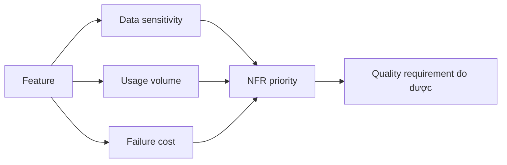

# Non-functional requirement và rủi ro

<div class="lesson-meta">
  <span>Requirements engineering với AI</span>
  <span>Software BA</span>
  <span>Core</span>
</div>

## Learning outcomes

- Dùng AI surface NFR gap theo quality attribute.
- Dịch technical risk thành business impact.
- Ưu tiên NFR theo usage, data sensitivity và failure cost.

## Why this matters for BA work

<div class="ba-callout">
NFR là business risk requirement, không phải phần phụ kỹ thuật.
</div>

Bài này quan trọng vì AI feature thường fail ở quality attribute mà stakeholder không nói rõ: privacy, latency, reliability, explainability, fairness, auditability và fallback. BA phải kéo các concern này lên sớm. Với product có AI, NFR không phải thứ phụ; nó định nghĩa feature có đáng tin trong operation thật hay không.

## Mental model or core concept

NFR mô tả hệ thống phải behave ra sao trong điều kiện thực tế: performance, availability, security, privacy, accessibility, auditability, supportability và compliance. AI có thể đề xuất category NFR, nhưng BA phải gắn mỗi requirement với business impact và measurable acceptance criteria.

## Practical BA example

Refund feature có functional step nhưng thiếu timeout, audit, fraud, data retention và support requirement. AI tạo risk inventory; BA chuyển high-risk gap thành NFR đo được và acceptance test.

## Diagram



## BA artifact

### NFR Risk Matrix

| Quality attribute | Business impact | Requirement example | Acceptance signal |
| --- | --- | --- | --- |
| Availability | Refund bị block khi outage. | Refund submission available 99.9% monthly. | Downtime report dưới threshold. |
| Privacy | PII lộ trong refund note. | Mask customer PII trong support view. | Role-based access test pass. |
| Auditability | Không có trace cho disputed refund. | Log approver, timestamp, reason, old/new status. | Audit export có đủ field. |
| Performance | Agent queue tăng khi peak. | Search refund status dưới 2 giây p95. | Load test đạt p95 target. |

## AI expert note

AI làm NFR phức tạp hơn vì behavior có tính xác suất và phụ thuộc data. Phân tích BA chuyên gia gắn từng NFR với risk scenario, user harm, measurement method, threshold, owner và operational response. Mục tiêu mơ hồ như accurate hoặc fast là không đủ; spec cần evaluation và monitoring đo được.

## Bad vs better example

| Cách làm yếu | Vì sao fail | Cách làm BA tốt hơn |
| --- | --- | --- |
| Viết AI output must be accurate | Accuracy không có nghĩa nếu thiếu task, dataset, threshold và failure cost. | Đặc tả evaluation case, target metric, acceptable error và escalation behavior. |
| Để privacy cho technical team | Decision của BA về data, user và workflow định hình privacy exposure. | Định nghĩa prohibited data, retention, consent, access và redaction requirement. |
| Thêm NFR sau khi design feature xong | Control có thể trở nên đắt hoặc không retrofit được. | Elicit NFR đặc thù AI trong discovery và đưa vào acceptance criteria. |

## AI collaboration prompt

```text
Review feature này cho NFR risk. Cover availability, performance, security, privacy, accessibility, auditability, supportability, compliance và data retention. Với mỗi gap, đưa business impact, measurable requirement, acceptance signal và owner.
```

## Mistakes to avoid

- Xem NFR là chuyện riêng của developer.
- Viết NFR không có measurable signal.
- Bỏ privacy và audit đến late testing.
- Không nối priority NFR với business risk.

## Apply this tomorrow

1. Chọn một feature và nhờ AI tìm NFR gap.
2. Rewrite một NFR với acceptance signal đo được.
3. Review priority NFR với product và engineering.
4. Thêm audit và supportability vào checklist.

## What a BA should remember

- NFR là risk control.
- NFR đo được giúp tránh tranh luận quality mơ hồ.
- Ownership của BA bao gồm business impact khi failure.
