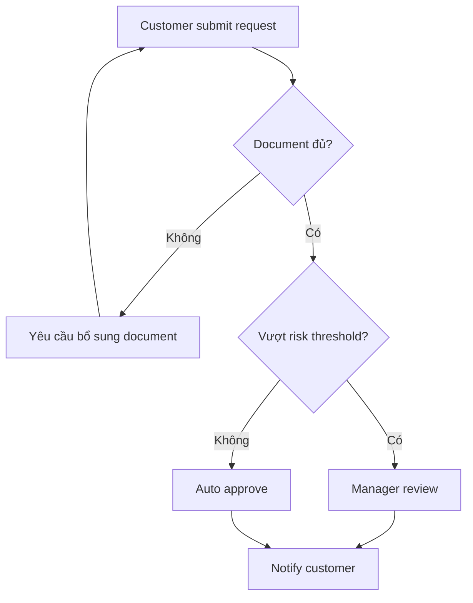

# Mô hình hóa quy trình với AI

<div class="lesson-meta">
  <span>Quy trình BA được tăng cường bởi AI</span>
  <span>Software BA</span>
  <span>Core</span>
</div>

## Learning outcomes

- Dùng AI tạo first-pass process map.
- Bổ sung exception path, role, SLA và control.
- Review process diagram để tìm ownership và policy decision thiếu.

## Why this matters for BA work

<div class="ba-callout">
AI có thể draft process flow, nhưng chất lượng BA nằm ở decision, exception, ownership và operational constraint.
</div>

Bài này quan trọng vì process model là nơi requirement ẩn thường lộ ra: handoff, exception path, timing, ownership và system boundary. AI có thể chuyển text thành diagram, nhưng BA phải kiểm tra diagram có phản ánh operational truth không. Flow đẹp mà miss escalation hoặc manual override sẽ rất nguy hiểm.

## Common difficulties for BAs

Trong Quy trình BA được tăng cường bởi AI, Mô hình hóa quy trình với AI trở nên khó khi notes lộn xộn, decision mới validate một phần và stakeholder context chưa đầy đủ phải nhanh chóng thành artifact chung. BA nên kiểm tra các điểm dưới đây trước khi xem artifact có AI hỗ trợ là đủ sẵn sàng cho stakeholder decision hoặc handoff.

| Khó khăn | Vì sao khó trong công việc BA | BA nên xử lý thế nào |
| --- | --- | --- |
| Chấp nhận diagram AI đầu tiên vì nhìn sạch. | Lỗi "Chấp nhận diagram AI đầu tiên vì nhìn sạch." xuất hiện khi team bàn về source attribution, conflict visibility, workshop decision flow và backlog readiness nhưng chưa thống nhất source nào authoritative. AI có thể làm disagreement nghe mượt hơn, nên BA phải giữ uncertainty visible. | Áp dụng control này: giữ speaker/source attribution visible cho đến khi stakeholder chịu trách nhiệm xác nhận ý nghĩa. Sau đó dùng pattern tốt hơn "Dùng diagram như review object và challenge từng decision, handoff, alternate path." và hỏi ai phải approve artifact trước khi nó ảnh hưởng scope, build, test hoặc release. |
| Bỏ exception và manual work. | Với Mô hình hóa quy trình với AI, điểm khó là AI có thể draft process flow, nhưng chất lượng BA nằm ở decision, exception, ownership và operational constraint. Pattern yếu rất dễ xảy ra vì AI có thể tạo câu trả lời trôi chảy trước khi BA check ownership, source freshness hoặc decision right. | Áp dụng control này: giữ speaker/source attribution visible cho đến khi stakeholder chịu trách nhiệm xác nhận ý nghĩa. Sau đó dùng pattern tốt hơn "Thêm path failure, cancellation, timeout, escalation và override." và hỏi ai phải approve artifact trước khi nó ảnh hưởng scope, build, test hoặc release. |
| Dùng process box không có owner. | Điểm này khó khi Process Review Checklist được kỳ vọng hỗ trợ validated working artifact. Nếu BA không challenge draft, unsupported assumption có thể đi vào planning, testing hoặc stakeholder communication. | Áp dụng control này: giữ speaker/source attribution visible cho đến khi stakeholder chịu trách nhiệm xác nhận ý nghĩa. Sau đó dùng pattern tốt hơn "Tách actor, system, external service và human reviewer thành lane riêng." và hỏi ai phải approve artifact trước khi nó ảnh hưởng scope, build, test hoặc release. |

## Where this applies in real projects

Dùng bài này khi discovery hoặc refinement tạo nhiều raw input hơn mức BA có thể synthesize an toàn bằng tay trong thời gian có sẵn. Output thực tế không phải document dài hơn; đó là Process Review Checklist có đủ evidence, ownership và decision clarity cho cuộc trao đổi tiếp theo của dự án.

| Thời điểm trong dự án | Cách áp dụng bài học | Output cụ thể của BA |
| --- | --- | --- |
| Discovery | Nhờ AI thêm exception path cho một flow hiện có. | Process Review Checklist thể hiện source attribution, conflict visibility, workshop decision flow và backlog readiness, trong đó action "Nhờ AI thêm exception path cho một flow hiện có." được chuyển thành decision, requirement, checklist hoặc question có thể review ở meeting tiếp theo. |
| Synthesis | Gắn business rule cho từng decision diamond. | Process Review Checklist thể hiện source evidence, trong đó action "Gắn business rule cho từng decision diamond." được chuyển thành decision, requirement, checklist hoặc question có thể review ở meeting tiếp theo. |
| Refinement | Thêm owner label vào process step. | Process Review Checklist thể hiện decision owner, trong đó action "Thêm owner label vào process step." được chuyển thành decision, requirement, checklist hoặc question có thể review ở meeting tiếp theo. |

## If this is missing

Nếu thiếu Mô hình hóa quy trình với AI, signal quan trọng từ interview, ticket, process note hoặc decision có thể mất trước khi đi vào backlog. BA vẫn có thể khôi phục, nhưng phải chuyển draft AI bóng bẩy trở lại thành evidence, assumption, owner và decision test được.

| Nếu thiếu | Ảnh hưởng tới dự án | Cách khôi phục |
| --- | --- | --- |
| Yêu cầu AI vẽ process từ một đoạn và accept luôn | Flow sinh ra có thể omit exception, ownership, timing và integration constraint. | Khôi phục bằng pattern tốt hơn: Dùng diagram như review object và challenge từng decision, handoff, alternate path. Rework Process Review Checklist cho đến khi nó lộ rõ source attribution, conflict visibility, workshop decision flow và backlog readiness, và không share như bản final cho tới khi evidence, ownership và validation path explicit. |
| Chỉ model happy path | Delivery team phát hiện queue, retry và manual work quá muộn. | Khôi phục bằng pattern tốt hơn: Thêm path failure, cancellation, timeout, escalation và override. Rework Process Review Checklist cho đến khi nó lộ rõ source attribution, conflict visibility, workshop decision flow và backlog readiness, và không share như bản final cho tới khi evidence, ownership và validation path explicit. |
| Trộn user action và system action trong một lane | Responsibility và automation boundary trở nên mơ hồ. | Khôi phục bằng pattern tốt hơn: Tách actor, system, external service và human reviewer thành lane riêng. Rework Process Review Checklist cho đến khi nó lộ rõ source attribution, conflict visibility, workshop decision flow và backlog readiness, và không share như bản final cho tới khi evidence, ownership và validation path explicit. |

## Mental model or core concept

Process modeling không phải chỉ vẽ box; đó là làm rõ work, decision right, handoff và failure handling. AI có thể chuyển text thành flow, nhưng BA phải challenge draft: ai own từng step, trigger next step là gì, chuyện gì xảy ra khi thiếu data và control nào bắt buộc.

## Practical BA example

AI draft onboarding flow sạch: submit document, verify, approve. BA thêm missing-document loop, duplicate customer check, risk review, SLA timer, manual override và customer notification rule. Diagram trở thành decision tool, không phải decoration.

## Diagram



## BA artifact

### Process Review Checklist

| Flow element | Câu hỏi BA | Evidence cần có | Gap thường gặp |
| --- | --- | --- | --- |
| Actor | Ai perform hoặc own step? | Role matrix hoặc SOP. | System step không có owner. |
| Decision | Rule nào chọn branch? | Policy hoặc business rule. | Diamond có condition mơ hồ. |
| Exception | Khi input invalid thì sao? | Support script và error log. | Chỉ có happy path. |
| SLA/control | Timing hoặc audit control nào áp dụng? | Operational metric hoặc compliance rule. | Không có escalation hoặc audit. |

## AI expert note

Process modeling với AI nên được xem là hypothesis về workflow. BA chuyên gia sẽ hỏi mỗi decision có rule chưa, mỗi exception có owner chưa, mỗi system interaction có boundary chưa và mỗi loop có stopping condition chưa. Diagram phải kích hoạt câu hỏi tốt hơn, không chỉ trang trí requirement.

## Bad vs better example

| Cách làm yếu | Vì sao fail | Cách làm BA tốt hơn |
| --- | --- | --- |
| Yêu cầu AI vẽ process từ một đoạn và accept luôn | Flow sinh ra có thể omit exception, ownership, timing và integration constraint. | Dùng diagram như review object và challenge từng decision, handoff, alternate path. |
| Chỉ model happy path | Delivery team phát hiện queue, retry và manual work quá muộn. | Thêm path failure, cancellation, timeout, escalation và override. |
| Trộn user action và system action trong một lane | Responsibility và automation boundary trở nên mơ hồ. | Tách actor, system, external service và human reviewer thành lane riêng. |

## Stakeholder questions to ask

| Stakeholder | Câu hỏi | Vì sao BA hỏi |
| --- | --- | --- |
| Product owner | Mô hình hóa quy trình với AI cần cải thiện outcome nào, và trade-off nào có thể chấp nhận? | Ngăn output AI tối ưu cho mục tiêu mơ hồ. |
| Engineering lead | Source, system, data hoặc constraint nào khiến Process Review Checklist khó implement? | Biến technical constraint ẩn thành requirement question visible. |
| QA lead | Rule, exception hoặc user state nào phải test được trước khi tin artifact này? | Chuyển wording trôi chảy của AI thành behavior quan sát được. |
| Operations hoặc support | Failure path nào tạo manual work nếu nguyên tắc "Process diagram hữu ích làm lộ decision và handoff" bị bỏ qua? | Làm rõ support load, exception handling và operating impact. |

## Decision log entries

| Decision item | Option cần capture | Owner | Evidence cần có |
| --- | --- | --- | --- |
| Scope boundary cho Process Review Checklist | Must-have, later, out of scope | Product owner | Business outcome và release constraint |
| Authority cho source attribution, conflict visibility, workshop decision flow và backlog readiness | Documented source, stakeholder decision, assumption cần validate | BA + stakeholder chịu trách nhiệm | Source ID, date và approval status |
| Review gate trước handoff | Peer review, QA review, engineering review, formal approval | BA lead hoặc project lead | Risk level và receiving-team readiness |
| Cách recover nếu Chấp nhận diagram AI đầu tiên vì nhìn sạch. | Rewrite, defer, escalate hoặc validation workshop | Decision owner | Impact lên scope, testability và release risk |

## Definition of Ready / Done

| Gate | Tín hiệu ready | Tín hiệu done |
| --- | --- | --- |
| Definition of Ready | Source cho source attribution, conflict visibility, workshop decision flow và backlog readiness được label và còn hiệu lực. | Process Review Checklist có thể review mà không phải đoán missing context. |
| Definition of Ready | Open assumption có owner và validation path. | Stakeholder có thể accept, reject hoặc defer từng assumption. |
| Definition of Done | Artifact áp dụng control: giữ speaker/source attribution visible cho đến khi stakeholder chịu trách nhiệm xác nhận ý nghĩa. | Delivery, QA hoặc governance team có thể hành động dựa trên artifact. |
| Definition of Done | Pattern yếu "Chấp nhận diagram AI đầu tiên vì nhìn sạch." đã được kiểm tra explicit. | Không unsupported AI claim nào bị xem như requirement đã approve. |

## Before and after artifact example

| Before | Risk trong draft AI | Revision của senior BA |
| --- | --- | --- |
| Prompt: "Create Process Review Checklist cho Mô hình hóa quy trình với AI." | Model có thể tự bịa source fact, owner, threshold hoặc implementation rule. | Thêm source, scope boundary, source authority, output schema và instruction: Dùng diagram như review object và challenge từng decision, handoff, alternate path. |
| Draft statement: "Nhờ AI thêm exception path cho một flow hiện có." | Action hữu ích nhưng chưa gắn decision owner hoặc acceptance signal. | Rewrite thành project step có owner, expected artifact, review gate và evidence cần trước handoff. |
| Paragraph nghe final về validated working artifact | Tone có thể che uncertainty và approval còn thiếu. | Chuyển thành bảng fact, assumption, decision needed, risk và validation question. |

## Manual verification after AI output

| Lens kiểm tra | Manual check | Pass signal |
| --- | --- | --- |
| Evidence | Trace mọi statement quan trọng trong Process Review Checklist về source, decision hoặc assumption có label. | Không unsupported claim nào còn bị ẩn. |
| Completeness | Check source attribution, conflict visibility, workshop decision flow và backlog readiness theo intended audience và receiving team. | Artifact trả lời được điều product, engineering, QA và operations cần. |
| Testability | Hỏi QA có tạo được positive, negative, boundary và exception scenario không. | Wording mơ hồ được rewrite hoặc log thành question. |
| Accountability | Confirm ai approve, ai review và ai xử lý khi artifact sai. | Owner và escalation path explicit. |

## AI collaboration prompt

```text
Chuyển process description này thành Mermaid flowchart. Bao gồm actor, decision rule, exception path, SLA, handoff, input, output, control và unresolved policy question. Sau diagram, liệt kê missing ownership hoặc rule gap.
```

## Mistakes to avoid

- Chấp nhận diagram AI đầu tiên vì nhìn sạch.
- Bỏ exception và manual work.
- Dùng process box không có owner.
- Vẽ decision nhưng thiếu decision rule.

## Apply this tomorrow

1. Nhờ AI thêm exception path cho một flow hiện có.
2. Gắn business rule cho từng decision diamond.
3. Thêm owner label vào process step.
4. Review diagram với support hoặc operations, không chỉ product.

## What a BA should remember

- Process diagram hữu ích làm lộ decision và handoff.
- Exception thường chứa requirement thật.
- AI draft flow; BA validate operation.
