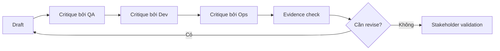

# Review loop và critique

<div class="lesson-meta">
  <span>AI collaboration và context engineering</span>
  <span>Software BA</span>
  <span>Core</span>
</div>

## Learning outcomes

- Dùng AI như drafter, critic, counterparty và gap finder.
- Chạy multi-perspective review cho BA artifact.
- Chuyển critique thành revision ưu tiên.

## Why this matters for BA work

<div class="ba-callout">
Cách dùng AI mạnh nhất cho BA không chỉ là draft nhanh hơn; đó là tạo critique loop có kỷ luật trước khi artifact đến team.
</div>

Bài này quan trọng vì draft AI đầu tiên tối ưu cho fluency, không nhất thiết đúng, ít rủi ro hoặc sẵn sàng delivery. Review loop biến AI từ shortcut draft thành quality system. BA có thể dùng critique pass để lộ ambiguity, missing rule, unsupported claim, test gap và stakeholder decision trước khi artifact đi xuống downstream.

## Common difficulties for BAs

Trong AI collaboration và context engineering, Review loop và critique trở nên khó khi AI có thể draft rất nhanh, nhưng reviewer cần context lặp lại được, structured output và critique rule để tin kết quả. BA nên kiểm tra các điểm dưới đây trước khi xem artifact có AI hỗ trợ là đủ sẵn sàng cho stakeholder decision hoặc handoff.

| Khó khăn | Vì sao khó trong công việc BA | BA nên xử lý thế nào |
| --- | --- | --- |
| Yêu cầu AI improve draft mà không diagnose trước. | Lỗi "Yêu cầu AI improve draft mà không diagnose trước." xuất hiện khi team bàn về context package quality, prompt reuse, critique loop và output contract nhưng chưa thống nhất source nào authoritative. AI có thể làm disagreement nghe mượt hơn, nên BA phải giữ uncertainty visible. | Áp dụng control này: tách context preparation, generation, critique và human approval thành các bước visible. Sau đó dùng pattern tốt hơn "Chạy critique pass cho evidence, specificity, testability và risk trước khi share." và hỏi ai phải approve artifact trước khi nó ảnh hưởng scope, build, test hoặc release. |
| Xem mọi critique finding quan trọng như nhau. | Với Review loop và critique, điểm khó là Cách dùng AI mạnh nhất cho BA không chỉ là draft nhanh hơn; đó là tạo critique loop có kỷ luật trước khi artifact đến team. Pattern yếu rất dễ xảy ra vì AI có thể tạo câu trả lời trôi chảy trước khi BA check ownership, source freshness hoặc decision right. | Áp dụng control này: tách context preparation, generation, critique và human approval thành các bước visible. Sau đó dùng pattern tốt hơn "Dùng rubric có required lens, severity, source reference và recommended fix." và hỏi ai phải approve artifact trước khi nó ảnh hưởng scope, build, test hoặc release. |
| Bỏ evidence cho critique. | Điểm này khó khi Multi-Perspective Critique Grid được kỳ vọng hỗ trợ repeatable collaboration pattern. Nếu BA không challenge draft, unsupported assumption có thể đi vào planning, testing hoặc stakeholder communication. | Áp dụng control này: tách context preparation, generation, critique và human approval thành các bước visible. Sau đó dùng pattern tốt hơn "Chuyển critique finding thành defect register hoặc decision log có owner." và hỏi ai phải approve artifact trước khi nó ảnh hưởng scope, build, test hoặc release. |

## Where this applies in real projects

Dùng bài này khi BA team muốn pattern AI collaboration tái sử dụng thay vì prompt one-off phụ thuộc thói quen từng người. Output thực tế không phải document dài hơn; đó là Multi-Perspective Critique Grid có đủ evidence, ownership và decision clarity cho cuộc trao đổi tiếp theo của dự án.

| Thời điểm trong dự án | Cách áp dụng bài học | Output cụ thể của BA |
| --- | --- | --- |
| Context setup | Chạy một draft qua QA critique prompt. | Multi-Perspective Critique Grid thể hiện context package quality, prompt reuse, critique loop và output contract, trong đó action "Chạy một draft qua QA critique prompt." được chuyển thành decision, requirement, checklist hoặc question có thể review ở meeting tiếp theo. |
| Prompt reuse | Nhờ AI rank finding theo delivery risk. | Multi-Perspective Critique Grid thể hiện source evidence, trong đó action "Nhờ AI rank finding theo delivery risk." được chuyển thành decision, requirement, checklist hoặc question có thể review ở meeting tiếp theo. |
| Peer review | Chuyển critique thành revision backlog. | Multi-Perspective Critique Grid thể hiện decision owner, trong đó action "Chuyển critique thành revision backlog." được chuyển thành decision, requirement, checklist hoặc question có thể review ở meeting tiếp theo. |

## If this is missing

Nếu thiếu Review loop và critique, output thay đổi theo từng người, assumption bị ẩn và chất lượng review phụ thuộc vào ai viết prompt. BA vẫn có thể khôi phục, nhưng phải chuyển draft AI bóng bẩy trở lại thành evidence, assumption, owner và decision test được.

| Nếu thiếu | Ảnh hưởng tới dự án | Cách khôi phục |
| --- | --- | --- |
| Accept draft AI đầu tiên vì đọc rất mượt | Fluency có thể che ambiguity, false claim và wording không test được. | Khôi phục bằng pattern tốt hơn: Chạy critique pass cho evidence, specificity, testability và risk trước khi share. Rework Multi-Perspective Critique Grid cho đến khi nó lộ rõ context package quality, prompt reuse, critique loop và output contract, và không share như bản final cho tới khi evidence, ownership và validation path explicit. |
| Hỏi chung chung what is wrong with this | Critique có thể nông và miss dimension quality của BA. | Khôi phục bằng pattern tốt hơn: Dùng rubric có required lens, severity, source reference và recommended fix. Rework Multi-Perspective Critique Grid cho đến khi nó lộ rõ context package quality, prompt reuse, critique loop và output contract, và không share như bản final cho tới khi evidence, ownership và validation path explicit. |
| Để review comment ở dạng informal | Team không track được risk đã resolve hay chưa. | Khôi phục bằng pattern tốt hơn: Chuyển critique finding thành defect register hoặc decision log có owner. Rework Multi-Perspective Critique Grid cho đến khi nó lộ rõ context package quality, prompt reuse, critique loop và output contract, và không share như bản final cho tới khi evidence, ownership và validation path explicit. |

## Mental model or core concept

Output AI một pass rất rủi ro. Review loop làm AI work an toàn hơn: draft, critique, revise, evidence-check và stakeholder-validate. BA có thể yêu cầu AI review từ góc product, QA, engineering, security, operations và user, rồi quyết định finding nào quan trọng.

## Practical BA example

Một SRS section generated nhìn có vẻ đầy đủ. Critique pass phát hiện thiếu audit logging, error state mơ hồ và support workflow chưa cover. BA chuyển finding thành revision task và validation question thay vì ship first draft.

## Diagram



## BA artifact

### Multi-Perspective Critique Grid

| Perspective | Cần inspect | Finding format | Revision action |
| --- | --- | --- | --- |
| QA | Testability, edge case, expected result. | Defect plus test scenario. | Rewrite AC và thêm negative case. |
| Developer | API, data, integration assumption. | Implementation risk. | Clarify contract hoặc dependency. |
| Operations | Support, monitoring, failure handling. | Runbook gap. | Thêm support flow và alert rule. |
| Compliance | Privacy, audit, policy constraint. | Control gap. | Thêm evidence và approval step. |

## AI expert note

Workflow AI hiệu quả nhất tách creation khỏi critique. BA chuyên gia thiết kế review lens có tên rõ: evidence, testability, risk, stakeholder conflict, operational feasibility và compliance. Yêu cầu cùng model critique draft của nó có ích, nhưng thực hành mạnh hơn là dùng rubric explicit, source check và human review cho decision high-risk.

## Bad vs better example

| Cách làm yếu | Vì sao fail | Cách làm BA tốt hơn |
| --- | --- | --- |
| Accept draft AI đầu tiên vì đọc rất mượt | Fluency có thể che ambiguity, false claim và wording không test được. | Chạy critique pass cho evidence, specificity, testability và risk trước khi share. |
| Hỏi chung chung what is wrong with this | Critique có thể nông và miss dimension quality của BA. | Dùng rubric có required lens, severity, source reference và recommended fix. |
| Để review comment ở dạng informal | Team không track được risk đã resolve hay chưa. | Chuyển critique finding thành defect register hoặc decision log có owner. |

## AI collaboration prompt

```text
Review artifact này từ góc QA, developer, operations, compliance, support và end-user. Trả về finding với severity, evidence, affected section, revision recommendation và validation question. Chưa rewrite; critique trước.
```

## Mistakes to avoid

- Yêu cầu AI improve draft mà không diagnose trước.
- Xem mọi critique finding quan trọng như nhau.
- Bỏ evidence cho critique.
- Không giữ revision decision trail.

## Apply this tomorrow

1. Chạy một draft qua QA critique prompt.
2. Nhờ AI rank finding theo delivery risk.
3. Chuyển critique thành revision backlog.
4. Share top three risks với team trước refinement.

## What a BA should remember

- Critique thường là nơi AI tạo nhiều giá trị BA nhất.
- Review loop làm uncertainty visible.
- BA quyết định finding nào trở thành change.
