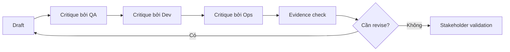

# Review loop và critique

<div class="lesson-meta">
  <span>AI collaboration và context engineering</span>
  <span>Software BA</span>
  <span>Core</span>
</div>

## Learning outcomes

- Dùng AI như drafter, critic, counterparty và gap finder.
- Chạy multi-perspective review cho BA artifact.
- Chuyển critique thành revision ưu tiên.

## Why this matters for BA work

<div class="ba-callout">
Cách dùng AI mạnh nhất cho BA không chỉ là draft nhanh hơn; đó là tạo critique loop có kỷ luật trước khi artifact đến team.
</div>

Bài này quan trọng vì draft AI đầu tiên tối ưu cho fluency, không nhất thiết đúng, ít rủi ro hoặc sẵn sàng delivery. Review loop biến AI từ shortcut draft thành quality system. BA có thể dùng critique pass để lộ ambiguity, missing rule, unsupported claim, test gap và stakeholder decision trước khi artifact đi xuống downstream.

## Mental model or core concept

Output AI một pass rất rủi ro. Review loop làm AI work an toàn hơn: draft, critique, revise, evidence-check và stakeholder-validate. BA có thể yêu cầu AI review từ góc product, QA, engineering, security, operations và user, rồi quyết định finding nào quan trọng.

## Practical BA example

Một SRS section generated nhìn có vẻ đầy đủ. Critique pass phát hiện thiếu audit logging, error state mơ hồ và support workflow chưa cover. BA chuyển finding thành revision task và validation question thay vì ship first draft.

## Diagram



## BA artifact

### Multi-Perspective Critique Grid

| Perspective | Cần inspect | Finding format | Revision action |
| --- | --- | --- | --- |
| QA | Testability, edge case, expected result. | Defect plus test scenario. | Rewrite AC và thêm negative case. |
| Developer | API, data, integration assumption. | Implementation risk. | Clarify contract hoặc dependency. |
| Operations | Support, monitoring, failure handling. | Runbook gap. | Thêm support flow và alert rule. |
| Compliance | Privacy, audit, policy constraint. | Control gap. | Thêm evidence và approval step. |

## AI expert note

Workflow AI hiệu quả nhất tách creation khỏi critique. BA chuyên gia thiết kế review lens có tên rõ: evidence, testability, risk, stakeholder conflict, operational feasibility và compliance. Yêu cầu cùng model critique draft của nó có ích, nhưng thực hành mạnh hơn là dùng rubric explicit, source check và human review cho decision high-risk.

## Bad vs better example

| Cách làm yếu | Vì sao fail | Cách làm BA tốt hơn |
| --- | --- | --- |
| Accept draft AI đầu tiên vì đọc rất mượt | Fluency có thể che ambiguity, false claim và wording không test được. | Chạy critique pass cho evidence, specificity, testability và risk trước khi share. |
| Hỏi chung chung what is wrong with this | Critique có thể nông và miss dimension quality của BA. | Dùng rubric có required lens, severity, source reference và recommended fix. |
| Để review comment ở dạng informal | Team không track được risk đã resolve hay chưa. | Chuyển critique finding thành defect register hoặc decision log có owner. |

## AI collaboration prompt

```text
Review artifact này từ góc QA, developer, operations, compliance, support và end-user. Trả về finding với severity, evidence, affected section, revision recommendation và validation question. Chưa rewrite; critique trước.
```

## Mistakes to avoid

- Yêu cầu AI improve draft mà không diagnose trước.
- Xem mọi critique finding quan trọng như nhau.
- Bỏ evidence cho critique.
- Không giữ revision decision trail.

## Apply this tomorrow

1. Chạy một draft qua QA critique prompt.
2. Nhờ AI rank finding theo delivery risk.
3. Chuyển critique thành revision backlog.
4. Share top three risks với team trước refinement.

## What a BA should remember

- Critique thường là nơi AI tạo nhiều giá trị BA nhất.
- Review loop làm uncertainty visible.
- BA quyết định finding nào trở thành change.
