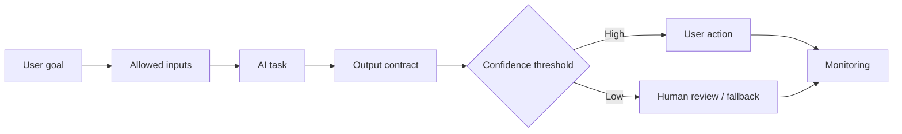

# Đặc tả tính năng có AI

<div class="lesson-meta">
  <span>Xây dựng sản phẩm có AI dưới góc nhìn BA</span>
  <span>Software BA</span>
  <span>Advanced</span>
</div>

## Learning outcomes

- Viết requirement cho behavior AI có tính xác suất.
- Đặc tả input, output, confidence, fallback và evaluation.
- Tránh deterministic acceptance criteria cho system non-deterministic.

## Why this matters for BA work

<div class="ba-callout">
AI-enabled feature cần requirement cho data, output quality, uncertainty, user control và monitoring.
</div>

Bài này quan trọng vì đặc tả AI-enabled feature khác với đặc tả screen hoặc workflow deterministic. BA phải định nghĩa task boundary, allowed input, output contract, confidence behavior, evaluation, human review, fallback, monitoring và user messaging. Thiếu các control này thì feature không test, trust hoặc operate được.

## Mental model or core concept

AI feature không behave như feature deterministic thông thường. BA phải đặc tả model thực hiện task gì, được dùng data nào, output contract ra sao, confidence threshold nào quan trọng, user sửa output thế nào, khi nào human review và quality được monitor sau release ra sao.

## Practical BA example

Support triage assistant phân loại ticket thành billing, technical và policy. BA đặc tả training example, output label, confidence threshold, escalation sang human review, correction capture, audit record và evaluation metric như precision cho high-risk category.

## Diagram



## BA artifact

### AI Feature Specification Canvas

| Area | Requirement question | Example requirement | Acceptance signal |
| --- | --- | --- | --- |
| Model task | AI decide hoặc generate gì? | Classify ticket theo approved category list. | Output category nằm trong defined labels. |
| Input data | Context nào được phép dùng? | Dùng ticket text, account tier và product area. | Không include restricted PII. |
| Uncertainty | Dưới confidence threshold thì sao? | Below 0.75 route to human triage. | Low-confidence case vào review queue. |
| Evaluation | Quality đo thế nào? | Precision for billing category >= 90%. | Evaluation set pass threshold. |

## AI expert note

BA chuyên gia xem model là một component trong product system. Requirement nên cover data flow, prompt hoặc retrieval context, model behavior constraint, evaluation dataset, acceptance threshold, misuse case, audit log và operational ownership. UX phải communicate uncertainty trung thực mà không tạo friction không cần thiết.

## Bad vs better example

| Cách làm yếu | Vì sao fail | Cách làm BA tốt hơn |
| --- | --- | --- |
| Đặc tả AI assistant should answer user questions | Task boundary, allowed source, refusal behavior và quality bar đều chưa rõ. | Định nghĩa supported intent, source rule, output format, confidence threshold và unsupported-question handling. |
| Dùng demo example làm acceptance criteria | Demo case thường optimistic và không chứng minh production readiness. | Tạo curated evaluation case gồm common, edge, adversarial và fallback scenario. |
| Bỏ qua monitoring sau launch | AI behavior có thể drift khi data, prompt, source hoặc user behavior thay đổi. | Đặc tả monitoring event, quality metric, review cadence và owner response. |

## AI collaboration prompt

```text
Đặc tả AI-enabled feature này bằng: user goal, AI task, allowed input, prohibited input, output contract, confidence threshold, human review trigger, fallback behavior, user correction, audit need, safety constraint, evaluation metric và monitoring event.
```

## Mistakes to avoid

- Viết acceptance criteria như thể output AI luôn deterministic.
- Bỏ qua low-confidence behavior.
- Không đặc tả correction và feedback loop.
- Chỉ đo user satisfaction mà thiếu output quality metric.

## Apply this tomorrow

1. Thêm câu hỏi confidence threshold cho một AI feature idea.
2. Định nghĩa output contract trước UI design.
3. Viết một fallback scenario.
4. Hỏi data hoặc engineering evaluation set hiện có.

## What a BA should remember

- AI requirement phải mô tả uncertainty.
- Output quality là một phần functional behavior.
- Human review và fallback là product feature, không phải afterthought.
