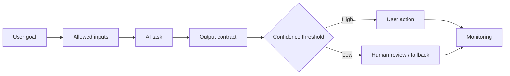

# Đặc tả tính năng có AI

<div class="lesson-meta">
  <span>Xây dựng sản phẩm có AI dưới góc nhìn BA</span>
  <span>Software BA</span>
  <span>Advanced</span>
</div>

## Learning outcomes

- Viết requirement cho behavior AI có tính xác suất.
- Đặc tả input, output, confidence, fallback và evaluation.
- Tránh deterministic acceptance criteria cho system non-deterministic.

## Why this matters for BA work

<div class="ba-callout">
AI-enabled feature cần requirement cho data, output quality, uncertainty, user control và monitoring.
</div>

Bài này quan trọng vì đặc tả AI-enabled feature khác với đặc tả screen hoặc workflow deterministic. BA phải định nghĩa task boundary, allowed input, output contract, confidence behavior, evaluation, human review, fallback, monitoring và user messaging. Thiếu các control này thì feature không test, trust hoặc operate được.

## Common difficulties for BAs

Trong Xây dựng sản phẩm có AI dưới góc nhìn BA, Đặc tả tính năng có AI trở nên khó khi hành vi AI product có uncertainty, safety boundary, evaluation design, fallback, monitoring và user trust concern. BA nên kiểm tra các điểm dưới đây trước khi xem artifact có AI hỗ trợ là đủ sẵn sàng cho stakeholder decision hoặc handoff.

| Khó khăn | Vì sao khó trong công việc BA | BA nên xử lý thế nào |
| --- | --- | --- |
| Viết acceptance criteria như thể output AI luôn deterministic. | Lỗi "Viết acceptance criteria như thể output AI luôn deterministic." xuất hiện khi team bàn về AI task boundary, evaluation set, human review, fallback, telemetry và harm control nhưng chưa thống nhất source nào authoritative. AI có thể làm disagreement nghe mượt hơn, nên BA phải giữ uncertainty visible. | Áp dụng control này: đưa confidence, refusal, escalation, correction capture và monitoring vào requirement. Sau đó dùng pattern tốt hơn "Định nghĩa supported intent, source rule, output format, confidence threshold và unsupported-question handling." và hỏi ai phải approve artifact trước khi nó ảnh hưởng scope, build, test hoặc release. |
| Bỏ qua low-confidence behavior. | Với Đặc tả tính năng có AI, điểm khó là AI-enabled feature cần requirement cho data, output quality, uncertainty, user control và monitoring. Pattern yếu rất dễ xảy ra vì AI có thể tạo câu trả lời trôi chảy trước khi BA check ownership, source freshness hoặc decision right. | Áp dụng control này: đưa confidence, refusal, escalation, correction capture và monitoring vào requirement. Sau đó dùng pattern tốt hơn "Tạo curated evaluation case gồm common, edge, adversarial và fallback scenario." và hỏi ai phải approve artifact trước khi nó ảnh hưởng scope, build, test hoặc release. |
| Không đặc tả correction và feedback loop. | Điểm này khó khi AI Feature Specification Canvas được kỳ vọng hỗ trợ AI feature operating contract. Nếu BA không challenge draft, unsupported assumption có thể đi vào planning, testing hoặc stakeholder communication. | Áp dụng control này: đưa confidence, refusal, escalation, correction capture và monitoring vào requirement. Sau đó dùng pattern tốt hơn "Đặc tả monitoring event, quality metric, review cadence và owner response." và hỏi ai phải approve artifact trước khi nó ảnh hưởng scope, build, test hoặc release. |

## Where this applies in real projects

Dùng bài này khi BA đang đặc tả feature mà output AI làm thay đổi user action, operational workload hoặc customer experience. Output thực tế không phải document dài hơn; đó là AI Feature Specification Canvas có đủ evidence, ownership và decision clarity cho cuộc trao đổi tiếp theo của dự án.

| Thời điểm trong dự án | Cách áp dụng bài học | Output cụ thể của BA |
| --- | --- | --- |
| AI behavior design | Thêm câu hỏi confidence threshold cho một AI feature idea. | AI Feature Specification Canvas thể hiện AI task boundary, evaluation set, human review, fallback, telemetry và harm control, trong đó action "Thêm câu hỏi confidence threshold cho một AI feature idea." được chuyển thành decision, requirement, checklist hoặc question có thể review ở meeting tiếp theo. |
| Evaluation planning | Định nghĩa output contract trước UI design. | AI Feature Specification Canvas thể hiện source evidence, trong đó action "Định nghĩa output contract trước UI design." được chuyển thành decision, requirement, checklist hoặc question có thể review ở meeting tiếp theo. |
| Operations handoff | Viết một fallback scenario. | AI Feature Specification Canvas thể hiện decision owner, trong đó action "Viết một fallback scenario." được chuyển thành decision, requirement, checklist hoặc question có thể review ở meeting tiếp theo. |

## If this is missing

Nếu thiếu Đặc tả tính năng có AI, feature có thể release mà thiếu confidence rule, human review trigger, fallback path hoặc monitoring event rõ ràng. BA vẫn có thể khôi phục, nhưng phải chuyển draft AI bóng bẩy trở lại thành evidence, assumption, owner và decision test được.

| Nếu thiếu | Ảnh hưởng tới dự án | Cách khôi phục |
| --- | --- | --- |
| Đặc tả AI assistant should answer user questions | Task boundary, allowed source, refusal behavior và quality bar đều chưa rõ. | Khôi phục bằng pattern tốt hơn: Định nghĩa supported intent, source rule, output format, confidence threshold và unsupported-question handling. Rework AI Feature Specification Canvas cho đến khi nó lộ rõ AI task boundary, evaluation set, human review, fallback, telemetry và harm control, và không share như bản final cho tới khi evidence, ownership và validation path explicit. |
| Dùng demo example làm acceptance criteria | Demo case thường optimistic và không chứng minh production readiness. | Khôi phục bằng pattern tốt hơn: Tạo curated evaluation case gồm common, edge, adversarial và fallback scenario. Rework AI Feature Specification Canvas cho đến khi nó lộ rõ AI task boundary, evaluation set, human review, fallback, telemetry và harm control, và không share như bản final cho tới khi evidence, ownership và validation path explicit. |
| Bỏ qua monitoring sau launch | AI behavior có thể drift khi data, prompt, source hoặc user behavior thay đổi. | Khôi phục bằng pattern tốt hơn: Đặc tả monitoring event, quality metric, review cadence và owner response. Rework AI Feature Specification Canvas cho đến khi nó lộ rõ AI task boundary, evaluation set, human review, fallback, telemetry và harm control, và không share như bản final cho tới khi evidence, ownership và validation path explicit. |

## Mental model or core concept

AI feature không behave như feature deterministic thông thường. BA phải đặc tả model thực hiện task gì, được dùng data nào, output contract ra sao, confidence threshold nào quan trọng, user sửa output thế nào, khi nào human review và quality được monitor sau release ra sao.

## Practical BA example

Support triage assistant phân loại ticket thành billing, technical và policy. BA đặc tả training example, output label, confidence threshold, escalation sang human review, correction capture, audit record và evaluation metric như precision cho high-risk category.

## Diagram



## BA artifact

### AI Feature Specification Canvas

| Area | Requirement question | Example requirement | Acceptance signal |
| --- | --- | --- | --- |
| Model task | AI decide hoặc generate gì? | Classify ticket theo approved category list. | Output category nằm trong defined labels. |
| Input data | Context nào được phép dùng? | Dùng ticket text, account tier và product area. | Không include restricted PII. |
| Uncertainty | Dưới confidence threshold thì sao? | Below 0.75 route to human triage. | Low-confidence case vào review queue. |
| Evaluation | Quality đo thế nào? | Precision for billing category >= 90%. | Evaluation set pass threshold. |

## AI expert note

BA chuyên gia xem model là một component trong product system. Requirement nên cover data flow, prompt hoặc retrieval context, model behavior constraint, evaluation dataset, acceptance threshold, misuse case, audit log và operational ownership. UX phải communicate uncertainty trung thực mà không tạo friction không cần thiết.

## Bad vs better example

| Cách làm yếu | Vì sao fail | Cách làm BA tốt hơn |
| --- | --- | --- |
| Đặc tả AI assistant should answer user questions | Task boundary, allowed source, refusal behavior và quality bar đều chưa rõ. | Định nghĩa supported intent, source rule, output format, confidence threshold và unsupported-question handling. |
| Dùng demo example làm acceptance criteria | Demo case thường optimistic và không chứng minh production readiness. | Tạo curated evaluation case gồm common, edge, adversarial và fallback scenario. |
| Bỏ qua monitoring sau launch | AI behavior có thể drift khi data, prompt, source hoặc user behavior thay đổi. | Đặc tả monitoring event, quality metric, review cadence và owner response. |

## Stakeholder questions to ask

| Stakeholder | Câu hỏi | Vì sao BA hỏi |
| --- | --- | --- |
| Product owner | Đặc tả tính năng có AI cần cải thiện outcome nào, và trade-off nào có thể chấp nhận? | Ngăn output AI tối ưu cho mục tiêu mơ hồ. |
| Engineering lead | Source, system, data hoặc constraint nào khiến AI Feature Specification Canvas khó implement? | Biến technical constraint ẩn thành requirement question visible. |
| QA lead | Rule, exception hoặc user state nào phải test được trước khi tin artifact này? | Chuyển wording trôi chảy của AI thành behavior quan sát được. |
| Operations hoặc support | Failure path nào tạo manual work nếu nguyên tắc "AI requirement phải mô tả uncertainty" bị bỏ qua? | Làm rõ support load, exception handling và operating impact. |

## Decision log entries

| Decision item | Option cần capture | Owner | Evidence cần có |
| --- | --- | --- | --- |
| Scope boundary cho AI Feature Specification Canvas | Must-have, later, out of scope | Product owner | Business outcome và release constraint |
| Authority cho AI task boundary, evaluation set, human review, fallback, telemetry và harm control | Documented source, stakeholder decision, assumption cần validate | BA + stakeholder chịu trách nhiệm | Source ID, date và approval status |
| Review gate trước handoff | Peer review, QA review, engineering review, formal approval | BA lead hoặc project lead | Risk level và receiving-team readiness |
| Cách recover nếu Viết acceptance criteria như thể output AI luôn deterministic. | Rewrite, defer, escalate hoặc validation workshop | Decision owner | Impact lên scope, testability và release risk |

## Definition of Ready / Done

| Gate | Tín hiệu ready | Tín hiệu done |
| --- | --- | --- |
| Definition of Ready | Source cho AI task boundary, evaluation set, human review, fallback, telemetry và harm control được label và còn hiệu lực. | AI Feature Specification Canvas có thể review mà không phải đoán missing context. |
| Definition of Ready | Open assumption có owner và validation path. | Stakeholder có thể accept, reject hoặc defer từng assumption. |
| Definition of Done | Artifact áp dụng control: đưa confidence, refusal, escalation, correction capture và monitoring vào requirement. | Delivery, QA hoặc governance team có thể hành động dựa trên artifact. |
| Definition of Done | Pattern yếu "Viết acceptance criteria như thể output AI luôn deterministic." đã được kiểm tra explicit. | Không unsupported AI claim nào bị xem như requirement đã approve. |

## Before and after artifact example

| Before | Risk trong draft AI | Revision của senior BA |
| --- | --- | --- |
| Prompt: "Create AI Feature Specification Canvas cho Đặc tả tính năng có AI." | Model có thể tự bịa source fact, owner, threshold hoặc implementation rule. | Thêm source, scope boundary, source authority, output schema và instruction: Định nghĩa supported intent, source rule, output format, confidence threshold và unsupported-question handling. |
| Draft statement: "Thêm câu hỏi confidence threshold cho một AI feature idea." | Action hữu ích nhưng chưa gắn decision owner hoặc acceptance signal. | Rewrite thành project step có owner, expected artifact, review gate và evidence cần trước handoff. |
| Paragraph nghe final về AI feature operating contract | Tone có thể che uncertainty và approval còn thiếu. | Chuyển thành bảng fact, assumption, decision needed, risk và validation question. |

## Manual verification after AI output

| Lens kiểm tra | Manual check | Pass signal |
| --- | --- | --- |
| Evidence | Trace mọi statement quan trọng trong AI Feature Specification Canvas về source, decision hoặc assumption có label. | Không unsupported claim nào còn bị ẩn. |
| Completeness | Check AI task boundary, evaluation set, human review, fallback, telemetry và harm control theo intended audience và receiving team. | Artifact trả lời được điều product, engineering, QA và operations cần. |
| Testability | Hỏi QA có tạo được positive, negative, boundary và exception scenario không. | Wording mơ hồ được rewrite hoặc log thành question. |
| Accountability | Confirm ai approve, ai review và ai xử lý khi artifact sai. | Owner và escalation path explicit. |

## AI collaboration prompt

```text
Đặc tả AI-enabled feature này bằng: user goal, AI task, allowed input, prohibited input, output contract, confidence threshold, human review trigger, fallback behavior, user correction, audit need, safety constraint, evaluation metric và monitoring event.
```

## Mistakes to avoid

- Viết acceptance criteria như thể output AI luôn deterministic.
- Bỏ qua low-confidence behavior.
- Không đặc tả correction và feedback loop.
- Chỉ đo user satisfaction mà thiếu output quality metric.

## Apply this tomorrow

1. Thêm câu hỏi confidence threshold cho một AI feature idea.
2. Định nghĩa output contract trước UI design.
3. Viết một fallback scenario.
4. Hỏi data hoặc engineering evaluation set hiện có.

## What a BA should remember

- AI requirement phải mô tả uncertainty.
- Output quality là một phần functional behavior.
- Human review và fallback là product feature, không phải afterthought.
