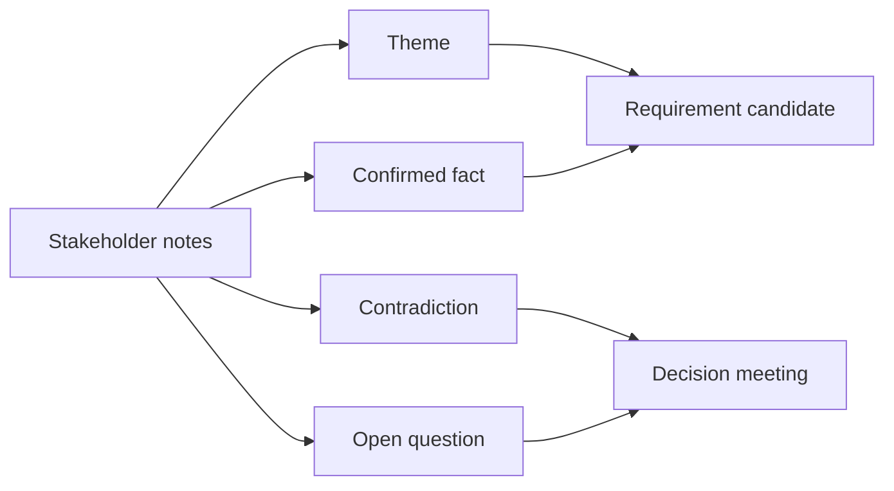

# Phỏng vấn stakeholder và tổng hợp insight

<div class="lesson-meta">
  <span>Quy trình BA được tăng cường bởi AI</span>
  <span>Software BA</span>
  <span>Core</span>
</div>

## Learning outcomes

- Chuyển notes lộn xộn thành theme, fact, contradiction và requirement candidate.
- Giữ stakeholder attribution thay vì làm phẳng nuance.
- Chuẩn bị câu hỏi resolve conflict.

## Why this matters for BA work

<div class="ba-callout">
AI có thể summarize interview rất nhanh, nhưng synthesis thật sự phải giữ contradiction, attribution và decision.
</div>

Bài này quan trọng vì AI summarize interview rất nhanh, nhưng tốc độ có thể làm phẳng disagreement, source attribution và political nuance. Với BA, output quan trọng không phải summary gọn; đó là synthesis đáng tin giữ được ai nói gì, stakeholder conflict ở đâu, decision nào thiếu và evidence nào còn cần validate.

## Common difficulties for BAs

Trong Quy trình BA được tăng cường bởi AI, Phỏng vấn stakeholder và tổng hợp insight trở nên khó khi notes lộn xộn, decision mới validate một phần và stakeholder context chưa đầy đủ phải nhanh chóng thành artifact chung. BA nên kiểm tra các điểm dưới đây trước khi xem artifact có AI hỗ trợ là đủ sẵn sàng cho stakeholder decision hoặc handoff.

| Khó khăn | Vì sao khó trong công việc BA | BA nên xử lý thế nào |
| --- | --- | --- |
| Tạo summary đẹp nhưng che giấu disagreement. | Lỗi "Tạo summary đẹp nhưng che giấu disagreement." xuất hiện khi team bàn về source attribution, conflict visibility, workshop decision flow và backlog readiness nhưng chưa thống nhất source nào authoritative. AI có thể làm disagreement nghe mượt hơn, nên BA phải giữ uncertainty visible. | Áp dụng control này: giữ speaker/source attribution visible cho đến khi stakeholder chịu trách nhiệm xác nhận ý nghĩa. Sau đó dùng pattern tốt hơn "Yêu cầu theme có speaker attribution, conflict point, evidence strength và follow-up question." và hỏi ai phải approve artifact trước khi nó ảnh hưởng scope, build, test hoặc release. |
| Xóa stakeholder attribution. | Với Phỏng vấn stakeholder và tổng hợp insight, điểm khó là AI có thể summarize interview rất nhanh, nhưng synthesis thật sự phải giữ contradiction, attribution và decision. Pattern yếu rất dễ xảy ra vì AI có thể tạo câu trả lời trôi chảy trước khi BA check ownership, source freshness hoặc decision right. | Áp dụng control này: giữ speaker/source attribution visible cho đến khi stakeholder chịu trách nhiệm xác nhận ý nghĩa. Sau đó dùng pattern tốt hơn "Giữ role, context, scenario và decision impact gắn với từng synthesized need." và hỏi ai phải approve artifact trước khi nó ảnh hưởng scope, build, test hoặc release. |
| Chuyển mọi interview statement thành requirement. | Điểm này khó khi Interview Synthesis Board được kỳ vọng hỗ trợ validated working artifact. Nếu BA không challenge draft, unsupported assumption có thể đi vào planning, testing hoặc stakeholder communication. | Áp dụng control này: giữ speaker/source attribution visible cho đến khi stakeholder chịu trách nhiệm xác nhận ý nghĩa. Sau đó dùng pattern tốt hơn "Kết hợp sentiment với frequency, risk, revenue, compliance và decision ownership." và hỏi ai phải approve artifact trước khi nó ảnh hưởng scope, build, test hoặc release. |

## Where this applies in real projects

Dùng bài này khi discovery hoặc refinement tạo nhiều raw input hơn mức BA có thể synthesize an toàn bằng tay trong thời gian có sẵn. Output thực tế không phải document dài hơn; đó là Interview Synthesis Board có đủ evidence, ownership và decision clarity cho cuộc trao đổi tiếp theo của dự án.

| Thời điểm trong dự án | Cách áp dụng bài học | Output cụ thể của BA |
| --- | --- | --- |
| Discovery | Thêm cột contradiction vào interview summary. | Interview Synthesis Board thể hiện source attribution, conflict visibility, workshop decision flow và backlog readiness, trong đó action "Thêm cột contradiction vào interview summary." được chuyển thành decision, requirement, checklist hoặc question có thể review ở meeting tiếp theo. |
| Synthesis | Yêu cầu AI identify false consensus trong notes. | Interview Synthesis Board thể hiện source evidence, trong đó action "Yêu cầu AI identify false consensus trong notes." được chuyển thành decision, requirement, checklist hoặc question có thể review ở meeting tiếp theo. |
| Refinement | Tag mỗi requirement candidate với speaker/source. | Interview Synthesis Board thể hiện decision owner, trong đó action "Tag mỗi requirement candidate với speaker/source." được chuyển thành decision, requirement, checklist hoặc question có thể review ở meeting tiếp theo. |

## If this is missing

Nếu thiếu Phỏng vấn stakeholder và tổng hợp insight, signal quan trọng từ interview, ticket, process note hoặc decision có thể mất trước khi đi vào backlog. BA vẫn có thể khôi phục, nhưng phải chuyển draft AI bóng bẩy trở lại thành evidence, assumption, owner và decision test được.

| Nếu thiếu | Ảnh hưởng tới dự án | Cách khôi phục |
| --- | --- | --- |
| Yêu cầu AI tạo clean summary của mọi interview | Summary quá gọn có thể xóa contradiction và concern ít người nói nhưng rất critical. | Khôi phục bằng pattern tốt hơn: Yêu cầu theme có speaker attribution, conflict point, evidence strength và follow-up question. Rework Interview Synthesis Board cho đến khi nó lộ rõ source attribution, conflict visibility, workshop decision flow và backlog readiness, và không share như bản final cho tới khi evidence, ownership và validation path explicit. |
| Gộp statement giống nhau thành một need | Role khác nhau có thể dùng cùng từ nhưng nói về operational problem khác. | Khôi phục bằng pattern tốt hơn: Giữ role, context, scenario và decision impact gắn với từng synthesized need. Rework Interview Synthesis Board cho đến khi nó lộ rõ source attribution, conflict visibility, workshop decision flow và backlog readiness, và không share như bản final cho tới khi evidence, ownership và validation path explicit. |
| Xem sentiment trong transcript là priority | Emotion báo hiệu importance nhưng không chứng minh business value hoặc feasibility. | Khôi phục bằng pattern tốt hơn: Kết hợp sentiment với frequency, risk, revenue, compliance và decision ownership. Rework Interview Synthesis Board cho đến khi nó lộ rõ source attribution, conflict visibility, workshop decision flow và backlog readiness, và không share như bản final cho tới khi evidence, ownership và validation path explicit. |

## Mental model or core concept

Interview synthesis không giống summarization. Summary nén thông tin; synthesis so sánh thông tin. BA synthesis cần giữ ai nói gì, statement nào đồng thuận, statement nào conflict, decision nào bị implied và câu hỏi nào phải resolve trước khi viết requirement.

## Practical BA example

Sales nói discount approval mất một ngày; finance nói exception có thể mất năm ngày; operations nói VIP request bypass queue. AI có thể cluster notes, nhưng BA phải làm rõ policy conflict và yêu cầu leader chốt priority cùng audit rule.

## Diagram



## BA artifact

### Interview Synthesis Board

| Theme | Confirmed fact | Contradiction | Follow-up question |
| --- | --- | --- | --- |
| Approval time | Standard request thường một ngày. | Finance exception mất tới năm ngày. | SLA nào được promise với customer? |
| VIP handling | VIP request được xử lý khác. | Không có bypass rule documented. | Ai được approve VIP bypass? |
| Audit | Finance cần trace exception. | Sales dùng email approval. | Audit record nào bắt buộc? |
| Ownership | Manager approve discount. | Không có backup owner khi vắng mặt. | Ai owns approval khi manager unavailable? |

## AI expert note

Synthesis interview nên xem transcript là evidence, không phải objective truth. AI có thể cluster theme và detect contradiction, nhưng BA phải giữ attribution, role context, emotion và decision authority. Thực hành chuyên gia là tách quote-backed fact, interpreted need, conflict và follow-up question trước khi draft requirement.

## Bad vs better example

| Cách làm yếu | Vì sao fail | Cách làm BA tốt hơn |
| --- | --- | --- |
| Yêu cầu AI tạo clean summary của mọi interview | Summary quá gọn có thể xóa contradiction và concern ít người nói nhưng rất critical. | Yêu cầu theme có speaker attribution, conflict point, evidence strength và follow-up question. |
| Gộp statement giống nhau thành một need | Role khác nhau có thể dùng cùng từ nhưng nói về operational problem khác. | Giữ role, context, scenario và decision impact gắn với từng synthesized need. |
| Xem sentiment trong transcript là priority | Emotion báo hiệu importance nhưng không chứng minh business value hoặc feasibility. | Kết hợp sentiment với frequency, risk, revenue, compliance và decision ownership. |

## Stakeholder questions to ask

| Stakeholder | Câu hỏi | Vì sao BA hỏi |
| --- | --- | --- |
| Product owner | Phỏng vấn stakeholder và tổng hợp insight cần cải thiện outcome nào, và trade-off nào có thể chấp nhận? | Ngăn output AI tối ưu cho mục tiêu mơ hồ. |
| Engineering lead | Source, system, data hoặc constraint nào khiến Interview Synthesis Board khó implement? | Biến technical constraint ẩn thành requirement question visible. |
| QA lead | Rule, exception hoặc user state nào phải test được trước khi tin artifact này? | Chuyển wording trôi chảy của AI thành behavior quan sát được. |
| Operations hoặc support | Failure path nào tạo manual work nếu nguyên tắc "Synthesis bảo vệ nuance" bị bỏ qua? | Làm rõ support load, exception handling và operating impact. |

## Decision log entries

| Decision item | Option cần capture | Owner | Evidence cần có |
| --- | --- | --- | --- |
| Scope boundary cho Interview Synthesis Board | Must-have, later, out of scope | Product owner | Business outcome và release constraint |
| Authority cho source attribution, conflict visibility, workshop decision flow và backlog readiness | Documented source, stakeholder decision, assumption cần validate | BA + stakeholder chịu trách nhiệm | Source ID, date và approval status |
| Review gate trước handoff | Peer review, QA review, engineering review, formal approval | BA lead hoặc project lead | Risk level và receiving-team readiness |
| Cách recover nếu Tạo summary đẹp nhưng che giấu disagreement. | Rewrite, defer, escalate hoặc validation workshop | Decision owner | Impact lên scope, testability và release risk |

## Definition of Ready / Done

| Gate | Tín hiệu ready | Tín hiệu done |
| --- | --- | --- |
| Definition of Ready | Source cho source attribution, conflict visibility, workshop decision flow và backlog readiness được label và còn hiệu lực. | Interview Synthesis Board có thể review mà không phải đoán missing context. |
| Definition of Ready | Open assumption có owner và validation path. | Stakeholder có thể accept, reject hoặc defer từng assumption. |
| Definition of Done | Artifact áp dụng control: giữ speaker/source attribution visible cho đến khi stakeholder chịu trách nhiệm xác nhận ý nghĩa. | Delivery, QA hoặc governance team có thể hành động dựa trên artifact. |
| Definition of Done | Pattern yếu "Tạo summary đẹp nhưng che giấu disagreement." đã được kiểm tra explicit. | Không unsupported AI claim nào bị xem như requirement đã approve. |

## Before and after artifact example

| Before | Risk trong draft AI | Revision của senior BA |
| --- | --- | --- |
| Prompt: "Create Interview Synthesis Board cho Phỏng vấn stakeholder và tổng hợp insight." | Model có thể tự bịa source fact, owner, threshold hoặc implementation rule. | Thêm source, scope boundary, source authority, output schema và instruction: Yêu cầu theme có speaker attribution, conflict point, evidence strength và follow-up question. |
| Draft statement: "Thêm cột contradiction vào interview summary." | Action hữu ích nhưng chưa gắn decision owner hoặc acceptance signal. | Rewrite thành project step có owner, expected artifact, review gate và evidence cần trước handoff. |
| Paragraph nghe final về validated working artifact | Tone có thể che uncertainty và approval còn thiếu. | Chuyển thành bảng fact, assumption, decision needed, risk và validation question. |

## Manual verification after AI output

| Lens kiểm tra | Manual check | Pass signal |
| --- | --- | --- |
| Evidence | Trace mọi statement quan trọng trong Interview Synthesis Board về source, decision hoặc assumption có label. | Không unsupported claim nào còn bị ẩn. |
| Completeness | Check source attribution, conflict visibility, workshop decision flow và backlog readiness theo intended audience và receiving team. | Artifact trả lời được điều product, engineering, QA và operations cần. |
| Testability | Hỏi QA có tạo được positive, negative, boundary và exception scenario không. | Wording mơ hồ được rewrite hoặc log thành question. |
| Accountability | Confirm ai approve, ai review và ai xử lý khi artifact sai. | Owner và escalation path explicit. |

## AI collaboration prompt

```text
Synthesize interview notes này thành theme, confirmed fact, contradiction, implied requirement, open question và decision owner. Giữ stakeholder attribution và không merge statement conflict thành false consensus.
```

## Mistakes to avoid

- Tạo summary đẹp nhưng che giấu disagreement.
- Xóa stakeholder attribution.
- Chuyển mọi interview statement thành requirement.
- Không tách current-state fact khỏi future-state decision.

## Apply this tomorrow

1. Thêm cột contradiction vào interview summary.
2. Yêu cầu AI identify false consensus trong notes.
3. Tag mỗi requirement candidate với speaker/source.
4. Lên lịch follow-up decision cho conflict chưa resolve.

## What a BA should remember

- Synthesis bảo vệ nuance.
- Contradiction là discovery data có giá trị.
- Attribution làm requirement defensible.
