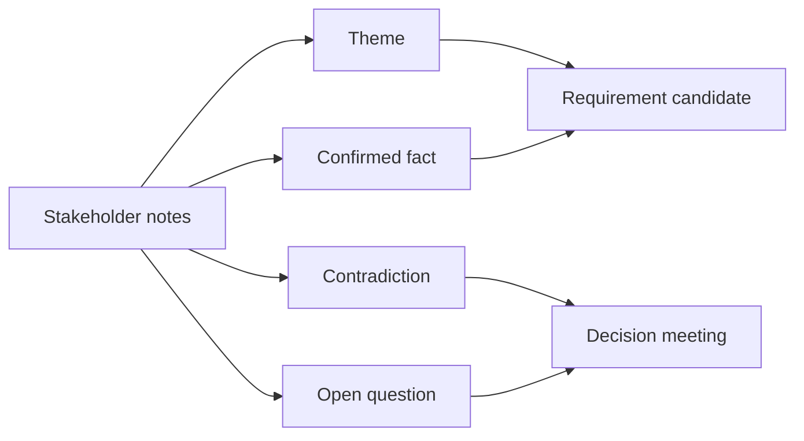

# Phỏng vấn stakeholder và tổng hợp insight

<div class="lesson-meta">
  <span>Quy trình BA được tăng cường bởi AI</span>
  <span>Software BA</span>
  <span>Core</span>
</div>

## Learning outcomes

- Chuyển notes lộn xộn thành theme, fact, contradiction và requirement candidate.
- Giữ stakeholder attribution thay vì làm phẳng nuance.
- Chuẩn bị câu hỏi resolve conflict.

## Why this matters for BA work

<div class="ba-callout">
AI có thể summarize interview rất nhanh, nhưng synthesis thật sự phải giữ contradiction, attribution và decision.
</div>

Business Analyst đứng giữa problem framing, ý nghĩa từ stakeholder, constraint triển khai và product decision. Trong công việc có AI, vị trí này quan trọng hơn vì ngôn ngữ chưa rõ có thể tạo false certainty rất nhanh. Bài này đưa ra một control thực tế để áp dụng trước khi output AI trở thành scope, backlog hoặc delivery commitment.

## Mental model or core concept

Interview synthesis không giống summarization. Summary nén thông tin; synthesis so sánh thông tin. BA synthesis cần giữ ai nói gì, statement nào đồng thuận, statement nào conflict, decision nào bị implied và câu hỏi nào phải resolve trước khi viết requirement.

## Practical BA example

Sales nói discount approval mất một ngày; finance nói exception có thể mất năm ngày; operations nói VIP request bypass queue. AI có thể cluster notes, nhưng BA phải làm rõ policy conflict và yêu cầu leader chốt priority cùng audit rule.

## Diagram



## BA artifact

### Interview Synthesis Board

| Theme | Confirmed fact | Contradiction | Follow-up question |
| --- | --- | --- | --- |
| Approval time | Standard request thường một ngày. | Finance exception mất tới năm ngày. | SLA nào được promise với customer? |
| VIP handling | VIP request được xử lý khác. | Không có bypass rule documented. | Ai được approve VIP bypass? |
| Audit | Finance cần trace exception. | Sales dùng email approval. | Audit record nào bắt buộc? |
| Ownership | Manager approve discount. | Không có backup owner khi vắng mặt. | Ai owns approval khi manager unavailable? |

## AI collaboration prompt

```text
Synthesize interview notes này thành theme, confirmed fact, contradiction, implied requirement, open question và decision owner. Giữ stakeholder attribution và không merge statement conflict thành false consensus.
```

## Mistakes to avoid

- Tạo summary đẹp nhưng che giấu disagreement.
- Xóa stakeholder attribution.
- Chuyển mọi interview statement thành requirement.
- Không tách current-state fact khỏi future-state decision.

## Apply this tomorrow

1. Thêm cột contradiction vào interview summary.
2. Yêu cầu AI identify false consensus trong notes.
3. Tag mỗi requirement candidate với speaker/source.
4. Lên lịch follow-up decision cho conflict chưa resolve.

## What a BA should remember

- Synthesis bảo vệ nuance.
- Contradiction là discovery data có giá trị.
- Attribution làm requirement defensible.
