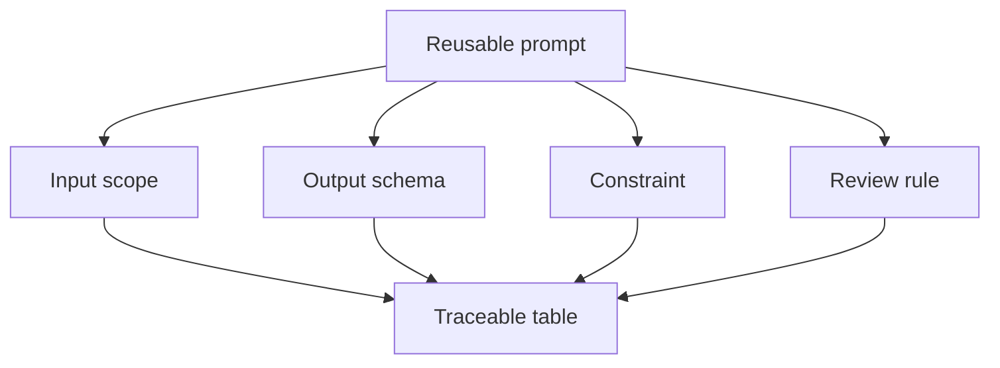

# Structured output và prompt tái sử dụng

<div class="lesson-meta">
  <span>AI collaboration và context engineering</span>
  <span>Software BA</span>
  <span>Core</span>
</div>

## Learning outcomes

- Thiết kế output table và schema cho task BA.
- Tạo reusable prompt cho work phân tích lặp lại.
- Làm output AI dễ review, compare và trace hơn.

## Why this matters for BA work

<div class="ba-callout">
Structured output biến AI từ chat response thành BA artifact có thể review.
</div>

Bài này quan trọng vì artifact BA cần được compare, review, trace và handoff. Prose tự do của AI rất khó validate ở scale. Structured output làm missing field visible, enforce evidence discipline và giúp team reuse prompt cho story, risk, requirement, decision và review finding mà không phải bắt đầu lại.

## Common difficulties for BAs

Trong dự án thật, chủ đề này khó vì BA phải biến evidence lộn xộn thành decision mà không để AI che mất uncertainty. Hãy chú ý các friction point này trước khi xem output là sẵn sàng.

| Khó khăn | Vì sao khó trong công việc BA | BA nên xử lý thế nào |
| --- | --- | --- |
| Dùng free-form output cho task cần comparison. | Khó vì Structured output và prompt tái sử dụng thường được áp dụng khi deadline gấp, evidence chưa đủ và stakeholder chưa thống nhất. Draft AI nghe trôi chảy có thể làm gap ít visible hơn. | Dùng source label, assumption rõ và review owner cụ thể trước khi chuyển thành backlog, specification hoặc delivery commitment. |
| Quên ID và source reference. | Khó vì Structured output và prompt tái sử dụng thường được áp dụng khi deadline gấp, evidence chưa đủ và stakeholder chưa thống nhất. Draft AI nghe trôi chảy có thể làm gap ít visible hơn. | Dùng source label, assumption rõ và review owner cụ thể trước khi chuyển thành backlog, specification hoặc delivery commitment. |
| Tạo prompt mà BA khác không reuse được. | Khó vì Structured output và prompt tái sử dụng thường được áp dụng khi deadline gấp, evidence chưa đủ và stakeholder chưa thống nhất. Draft AI nghe trôi chảy có thể làm gap ít visible hơn. | Dùng source label, assumption rõ và review owner cụ thể trước khi chuyển thành backlog, specification hoặc delivery commitment. |

## Where this applies in real projects

Bài này hữu ích khi BA cần chuyển conversation, policy, design hoặc technical input thành artifact chung để team implement và test được.

| Thời điểm trong dự án | Cách áp dụng bài học | Output cụ thể của BA |
| --- | --- | --- |
| Discovery | Chuyển một prompt thường dùng thành reusable prompt contract. | Reusable Prompt Contract: artifact review được, nối nội dung học với decision, acceptance criteria, risk hoặc stakeholder alignment. |
| Refinement | Thêm output column source, severity và owner. | Reusable Prompt Contract: artifact review được, nối nội dung học với decision, acceptance criteria, risk hoặc stakeholder alignment. |
| Delivery | Yêu cầu AI self-check theo output schema. | Reusable Prompt Contract: artifact review được, nối nội dung học với decision, acceptance criteria, risk hoặc stakeholder alignment. |

## If this is missing

Nếu thiếu năng lực này, AI vẫn có thể tạo text rất bóng bẩy, nhưng project mất khả năng review. Kết quả thường là rework, assumption ẩn, acceptance criteria yếu hoặc business decision thiếu evidence.

| Nếu thiếu | Ảnh hưởng tới dự án | Cách khôi phục |
| --- | --- | --- |
| Yêu cầu AI phân tích chi tiết bằng paragraph | Field quan trọng như owner, evidence, risk và action có thể biến mất. | Khôi phục bằng pattern tốt hơn: Dùng table hoặc JSON-like structure với column bắt buộc và cách xử lý missing value rõ. Sau đó check lại artifact theo evidence, testability, ownership và business impact trước khi share. |
| Reuse prompt nhưng không có quality contract | Cùng prompt có thể tạo artifact inconsistent giữa project. | Khôi phục bằng pattern tốt hơn: Định nghĩa output schema, acceptance criteria, review rubric và revision instruction. Sau đó check lại artifact theo evidence, testability, ownership và business impact trước khi share. |
| Xem structured output là tự động đúng | Bảng nhìn precise nhưng vẫn có thể chứa data unsupported. | Khôi phục bằng pattern tốt hơn: Validate từng row theo source support, decision status và testability. Sau đó check lại artifact theo evidence, testability, ownership và business impact trước khi share. |

## Mental model or core concept

Answer không cấu trúc rất khó verify. Structured output cho BA column, ID, severity level, source reference và owner. Nhờ vậy product, dev, QA và stakeholder có thể inspect. Reusable prompt nên định nghĩa input, output contract, constraint và review rule.

## Practical BA example

Thay vì hỏi 'summarize meeting này', BA yêu cầu bảng gồm decision, evidence, owner, impacted requirement, risk và open question. Output có thể chuyển thành Jira task, decision log và follow-up action.

## Diagram



## BA artifact

### Reusable Prompt Contract

| Contract part | Content bắt buộc | Vì sao hữu ích | Ví dụ |
| --- | --- | --- | --- |
| Input scope | Source nào included và excluded. | Tránh context drift ẩn. | Chỉ dùng transcript T1 và policy P2. |
| Output columns | Field artifact phải có. | Làm review systematic. | ID, issue, severity, evidence, question. |
| Constraints | Rule AI phải tuân thủ. | Ngăn unsupported content. | Không tự bịa policy. |
| Review rule | Cách đánh giá output. | Align với BA quality. | Mỗi row cần source hoặc assumption. |

## AI expert note

Structured output là một control surface. Schema nói cho model biết dimension nào quan trọng và nói cho reviewer biết phải check gì. BA chuyên gia thêm source ID, assumption flag, confidence, decision owner, testability, risk level và next action để output hỗ trợ governance, không chỉ readability.

## Bad vs better example

| Cách làm yếu | Vì sao fail | Cách làm BA tốt hơn |
| --- | --- | --- |
| Yêu cầu AI phân tích chi tiết bằng paragraph | Field quan trọng như owner, evidence, risk và action có thể biến mất. | Dùng table hoặc JSON-like structure với column bắt buộc và cách xử lý missing value rõ. |
| Reuse prompt nhưng không có quality contract | Cùng prompt có thể tạo artifact inconsistent giữa project. | Định nghĩa output schema, acceptance criteria, review rubric và revision instruction. |
| Xem structured output là tự động đúng | Bảng nhìn precise nhưng vẫn có thể chứa data unsupported. | Validate từng row theo source support, decision status và testability. |

## AI collaboration prompt

```text
Tạo reusable prompt cho BA task này. Bao gồm purpose, input assumption, required context, output schema, constraint, quality rubric và self-check section. Giữ đủ generic để reuse nhưng đủ specific để output review được.
```

## Mistakes to avoid

- Dùng free-form output cho task cần comparison.
- Quên ID và source reference.
- Tạo prompt mà BA khác không reuse được.
- Không định nghĩa cách rank severity.

## Apply this tomorrow

1. Chuyển một prompt thường dùng thành reusable prompt contract.
2. Thêm output column source, severity và owner.
3. Yêu cầu AI self-check theo output schema.
4. Lưu prompt vào team library.

## What a BA should remember

- Structure là quality control.
- Prompt tốt định nghĩa output, không chỉ task.
- Reusable prompt biến kỹ năng cá nhân thành capability của team.
