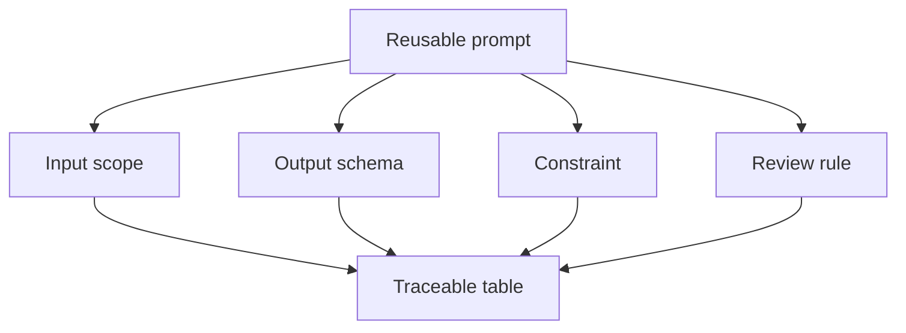

# Structured output và prompt tái sử dụng

<div class="lesson-meta">
  <span>AI collaboration và context engineering</span>
  <span>Software BA</span>
  <span>Core</span>
</div>

## Learning outcomes

- Thiết kế output table và schema cho task BA.
- Tạo reusable prompt cho work phân tích lặp lại.
- Làm output AI dễ review, compare và trace hơn.

## Why this matters for BA work

<div class="ba-callout">
Structured output biến AI từ chat response thành BA artifact có thể review.
</div>

Bài này quan trọng vì artifact BA cần được compare, review, trace và handoff. Prose tự do của AI rất khó validate ở scale. Structured output làm missing field visible, enforce evidence discipline và giúp team reuse prompt cho story, risk, requirement, decision và review finding mà không phải bắt đầu lại.

## Common difficulties for BAs

Trong AI collaboration và context engineering, Structured output và prompt tái sử dụng trở nên khó khi AI có thể draft rất nhanh, nhưng reviewer cần context lặp lại được, structured output và critique rule để tin kết quả. BA nên kiểm tra các điểm dưới đây trước khi xem artifact có AI hỗ trợ là đủ sẵn sàng cho stakeholder decision hoặc handoff.

| Khó khăn | Vì sao khó trong công việc BA | BA nên xử lý thế nào |
| --- | --- | --- |
| Dùng free-form output cho task cần comparison. | Lỗi "Dùng free-form output cho task cần comparison." xuất hiện khi team bàn về context package quality, prompt reuse, critique loop và output contract nhưng chưa thống nhất source nào authoritative. AI có thể làm disagreement nghe mượt hơn, nên BA phải giữ uncertainty visible. | Áp dụng control này: tách context preparation, generation, critique và human approval thành các bước visible. Sau đó dùng pattern tốt hơn "Dùng table hoặc JSON-like structure với column bắt buộc và cách xử lý missing value rõ." và hỏi ai phải approve artifact trước khi nó ảnh hưởng scope, build, test hoặc release. |
| Quên ID và source reference. | Với Structured output và prompt tái sử dụng, điểm khó là Structured output biến AI từ chat response thành BA artifact có thể review. Pattern yếu rất dễ xảy ra vì AI có thể tạo câu trả lời trôi chảy trước khi BA check ownership, source freshness hoặc decision right. | Áp dụng control này: tách context preparation, generation, critique và human approval thành các bước visible. Sau đó dùng pattern tốt hơn "Định nghĩa output schema, acceptance criteria, review rubric và revision instruction." và hỏi ai phải approve artifact trước khi nó ảnh hưởng scope, build, test hoặc release. |
| Tạo prompt mà BA khác không reuse được. | Điểm này khó khi Reusable Prompt Contract được kỳ vọng hỗ trợ repeatable collaboration pattern. Nếu BA không challenge draft, unsupported assumption có thể đi vào planning, testing hoặc stakeholder communication. | Áp dụng control này: tách context preparation, generation, critique và human approval thành các bước visible. Sau đó dùng pattern tốt hơn "Validate từng row theo source support, decision status và testability." và hỏi ai phải approve artifact trước khi nó ảnh hưởng scope, build, test hoặc release. |

## Where this applies in real projects

Dùng bài này khi BA team muốn pattern AI collaboration tái sử dụng thay vì prompt one-off phụ thuộc thói quen từng người. Output thực tế không phải document dài hơn; đó là Reusable Prompt Contract có đủ evidence, ownership và decision clarity cho cuộc trao đổi tiếp theo của dự án.

| Thời điểm trong dự án | Cách áp dụng bài học | Output cụ thể của BA |
| --- | --- | --- |
| Context setup | Chuyển một prompt thường dùng thành reusable prompt contract. | Reusable Prompt Contract thể hiện context package quality, prompt reuse, critique loop và output contract, trong đó action "Chuyển một prompt thường dùng thành reusable prompt contract." được chuyển thành decision, requirement, checklist hoặc question có thể review ở meeting tiếp theo. |
| Prompt reuse | Thêm output column source, severity và owner. | Reusable Prompt Contract thể hiện source evidence, trong đó action "Thêm output column source, severity và owner." được chuyển thành decision, requirement, checklist hoặc question có thể review ở meeting tiếp theo. |
| Peer review | Yêu cầu AI self-check theo output schema. | Reusable Prompt Contract thể hiện decision owner, trong đó action "Yêu cầu AI self-check theo output schema." được chuyển thành decision, requirement, checklist hoặc question có thể review ở meeting tiếp theo. |

## If this is missing

Nếu thiếu Structured output và prompt tái sử dụng, output thay đổi theo từng người, assumption bị ẩn và chất lượng review phụ thuộc vào ai viết prompt. BA vẫn có thể khôi phục, nhưng phải chuyển draft AI bóng bẩy trở lại thành evidence, assumption, owner và decision test được.

| Nếu thiếu | Ảnh hưởng tới dự án | Cách khôi phục |
| --- | --- | --- |
| Yêu cầu AI phân tích chi tiết bằng paragraph | Field quan trọng như owner, evidence, risk và action có thể biến mất. | Khôi phục bằng pattern tốt hơn: Dùng table hoặc JSON-like structure với column bắt buộc và cách xử lý missing value rõ. Rework Reusable Prompt Contract cho đến khi nó lộ rõ context package quality, prompt reuse, critique loop và output contract, và không share như bản final cho tới khi evidence, ownership và validation path explicit. |
| Reuse prompt nhưng không có quality contract | Cùng prompt có thể tạo artifact inconsistent giữa project. | Khôi phục bằng pattern tốt hơn: Định nghĩa output schema, acceptance criteria, review rubric và revision instruction. Rework Reusable Prompt Contract cho đến khi nó lộ rõ context package quality, prompt reuse, critique loop và output contract, và không share như bản final cho tới khi evidence, ownership và validation path explicit. |
| Xem structured output là tự động đúng | Bảng nhìn precise nhưng vẫn có thể chứa data unsupported. | Khôi phục bằng pattern tốt hơn: Validate từng row theo source support, decision status và testability. Rework Reusable Prompt Contract cho đến khi nó lộ rõ context package quality, prompt reuse, critique loop và output contract, và không share như bản final cho tới khi evidence, ownership và validation path explicit. |

## Mental model or core concept

Answer không cấu trúc rất khó verify. Structured output cho BA column, ID, severity level, source reference và owner. Nhờ vậy product, dev, QA và stakeholder có thể inspect. Reusable prompt nên định nghĩa input, output contract, constraint và review rule.

## Practical BA example

Thay vì hỏi 'summarize meeting này', BA yêu cầu bảng gồm decision, evidence, owner, impacted requirement, risk và open question. Output có thể chuyển thành Jira task, decision log và follow-up action.

## Diagram



## BA artifact

### Reusable Prompt Contract

| Contract part | Content bắt buộc | Vì sao hữu ích | Ví dụ |
| --- | --- | --- | --- |
| Input scope | Source nào included và excluded. | Tránh context drift ẩn. | Chỉ dùng transcript T1 và policy P2. |
| Output columns | Field artifact phải có. | Làm review systematic. | ID, issue, severity, evidence, question. |
| Constraints | Rule AI phải tuân thủ. | Ngăn unsupported content. | Không tự bịa policy. |
| Review rule | Cách đánh giá output. | Align với BA quality. | Mỗi row cần source hoặc assumption. |

## AI expert note

Structured output là một control surface. Schema nói cho model biết dimension nào quan trọng và nói cho reviewer biết phải check gì. BA chuyên gia thêm source ID, assumption flag, confidence, decision owner, testability, risk level và next action để output hỗ trợ governance, không chỉ readability.

## Bad vs better example

| Cách làm yếu | Vì sao fail | Cách làm BA tốt hơn |
| --- | --- | --- |
| Yêu cầu AI phân tích chi tiết bằng paragraph | Field quan trọng như owner, evidence, risk và action có thể biến mất. | Dùng table hoặc JSON-like structure với column bắt buộc và cách xử lý missing value rõ. |
| Reuse prompt nhưng không có quality contract | Cùng prompt có thể tạo artifact inconsistent giữa project. | Định nghĩa output schema, acceptance criteria, review rubric và revision instruction. |
| Xem structured output là tự động đúng | Bảng nhìn precise nhưng vẫn có thể chứa data unsupported. | Validate từng row theo source support, decision status và testability. |

## AI collaboration prompt

```text
Tạo reusable prompt cho BA task này. Bao gồm purpose, input assumption, required context, output schema, constraint, quality rubric và self-check section. Giữ đủ generic để reuse nhưng đủ specific để output review được.
```

## Mistakes to avoid

- Dùng free-form output cho task cần comparison.
- Quên ID và source reference.
- Tạo prompt mà BA khác không reuse được.
- Không định nghĩa cách rank severity.

## Apply this tomorrow

1. Chuyển một prompt thường dùng thành reusable prompt contract.
2. Thêm output column source, severity và owner.
3. Yêu cầu AI self-check theo output schema.
4. Lưu prompt vào team library.

## What a BA should remember

- Structure là quality control.
- Prompt tốt định nghĩa output, không chỉ task.
- Reusable prompt biến kỹ năng cá nhân thành capability của team.
