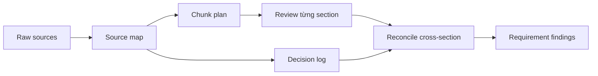

# Token, context và trí nhớ

<div class="lesson-meta">
  <span>Nền tảng AI cho Business Analyst</span>
  <span>Software BA</span>
  <span>Core</span>
</div>

## Learning outcomes

- Giải thích token và context limit bằng ngôn ngữ BA.
- Chuẩn bị requirement dài hoặc transcript dài cho staged AI review.
- Dùng source map để giảm nguy cơ miss requirement.

## Why this matters for BA work

<div class="ba-callout">
Context là bề mặt làm việc của AI analysis; context design kém tạo ra artifact nhìn tự tin nhưng thiếu.
</div>

Bài này quan trọng vì hầu hết artifact BA phụ thuộc vào lịch sử dài: transcript, policy, decision, exception và commitment trước đó. AI chỉ reason được trên context nó nhìn thấy và giữ được. BA kiểm soát source map và chunking plan sẽ giảm miss requirement, dùng nhầm policy cũ và summary nông nhưng nhìn có vẻ gọn.

## Mental model or core concept

Model chỉ làm việc với context nó nhìn thấy. Tài liệu dài, notes rời rạc và lịch sử nhiều meeting cần được cấu trúc thành chunk, source ID, summary và review pass. Context engineering của BA giống chuẩn bị workshop pack: chọn evidence quan trọng, label rõ và review theo thứ tự có kiểm soát.

## Practical BA example

Một SRS 70 trang được đưa vào AI với yêu cầu 'find all gaps.' Model trả về list rất trôi chảy nhưng bỏ sót integration requirement ở các trang sau. BA tốt hơn tạo source map, review theo module, rồi yêu cầu AI reconcile conflict giữa module.

## Diagram



## BA artifact

### Context Pack Checklist

| Pack item | Vì sao quan trọng | Hành động BA | Rủi ro nếu thiếu |
| --- | --- | --- | --- |
| Source map | Tránh gap vô hình | Liệt kê section, owner và ID. | AI chỉ review phần nổi bật nhất. |
| Chunk plan | Giữ phân tích focused | Review từng module. | Context dài biến thành summary nông. |
| Decision log | Giữ commitment của stakeholder | Đưa vào decision có ngày và owner. | AI mở lại scope đã chốt. |
| Open questions | Tách unknown khỏi fact | Track unresolved item rõ ràng. | Model tự điền chỗ trống bằng guess. |

## AI expert note

Dùng AI ở mức chuyên gia xem context như một analysis asset. Model long-context vẫn có attention dilution, source conflict và recency ambiguity. BA nên thiết kế review pass, source ID, mục đích chunk, decision log và bước reconciliation để output AI traceable thay vì chỉ là summary đẹp của evidence thiếu.

## Bad vs better example

| Cách làm yếu | Vì sao fail | Cách làm BA tốt hơn |
| --- | --- | --- |
| Upload toàn bộ tài liệu rồi hỏi tất cả gap | Model có thể summarize rộng và bỏ sót constraint ở phần sau, hiếm gặp hoặc nằm giữa nhiều document. | Review theo source ID và module, sau đó chạy pass reconcile conflict và omission. |
| Trộn policy cũ, draft note và decision đã approve không label | Model không thể chắc đâu là current hoặc authoritative. | Label source status, effective date, owner và confidence trước khi analysis. |
| Dùng chat history như project memory | Decision quan trọng có thể bị ẩn, đổi thứ tự hoặc người khác không truy cập được. | Tạo context pack explicit gồm source map, decision log và open question. |

## AI collaboration prompt

```text
Tạo context pack từ các source này. Trả về source ID, summary từng section, decision log, known constraint, unresolved question và thứ tự review đề xuất. Không phân tích requirement cho đến khi context pack hoàn tất.
```

## Mistakes to avoid

- Upload mọi thứ rồi hỏi một câu quá rộng.
- Trộn policy cũ và mới mà không label freshness.
- Để model summarize mất edge case.
- Quên đưa vào decision stakeholder đã chốt.

## Apply this tomorrow

1. Tạo source ID cho một tài liệu trước khi dùng AI.
2. Yêu cầu AI summarize từng section, không summarize cả document một lần.
3. Label source old, current và draft riêng.
4. Chạy pass thứ hai để tìm conflict giữa section.

## What a BA should remember

- Chất lượng AI bị giới hạn bởi context nó thấy.
- Source map là control của BA, không phải việc hành chính.
- Staged review tốt hơn một prompt khổng lồ.
