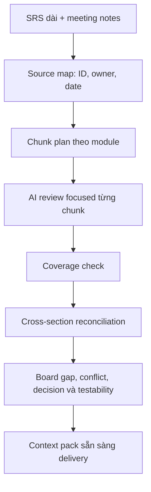
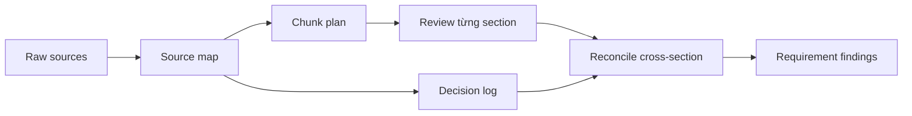

# Token, context và trí nhớ

<div class="lesson-meta">
  <span>Nền tảng AI cho Business Analyst</span>
  <span>Software BA</span>
  <span>Core</span>
</div>

## Story mode: walkthrough theo dự án

<div class="story-mode-panel">
  <p class="story-eyebrow">Prototype dạng story</p>
  <h3>Bản SRS 70 trang đánh lừa một lần review AI</h3>
  <p class="story-intro">Team upload SRS dài và yêu cầu AI tìm tất cả gap. Câu trả lời tự tin và có cấu trúc, nhưng rule integration bị miss vẫn nằm yên ở trang 54.</p>
  <div class="story-scene-grid">
<article class="story-scene">
  <span>Cảnh 1</span>
  <b>01</b>
  <strong>One-shot review nhìn rất hiệu quả</strong>
  <p>Model trả về gap list gọn gàng chỉ sau vài phút. Team gần như gửi nó đi như discovery output.</p>
</article>
<article class="story-scene">
  <span>Cảnh 2</span>
  <b>02</b>
  <strong>Rule ở phần cuối bị bỏ sót</strong>
  <p>Maya check source coverage và thấy API exception section bị nén thành summary chung chung.</p>
</article>
<article class="story-scene">
  <span>Cảnh 3</span>
  <b>03</b>
  <strong>Context trở thành artifact</strong>
  <p>Cô tạo source ID, module chunk, freshness label và decision log trước khi yêu cầu analysis.</p>
</article>
<article class="story-scene">
  <span>Cảnh 4</span>
  <b>04</b>
  <strong>Pass thứ hai tìm ra vấn đề thật</strong>
  <p>Cross-section reconciliation làm lộ conflict giữa report export rule và integration retry behavior.</p>
</article>
  </div>
  <div class="visual-takeaway-strip">
<span>Context là artifact</span>
<span>Coverage quan trọng hơn one-shot speed</span>
<span>Memory cần source ID</span>
  </div>
</div>

## Reality check: số liệu hiện tại cho BA

<div class="fact-card-grid">
<article class="fact-card">
  <strong>25%</strong>
  <span>Team mất thời gian để tìm câu trả lời</span>
  <p>Atlassian State of Teams 2025 ghi nhận leader và team lãng phí 25% thời gian chỉ để tìm answer. Góc nhìn BA: source map và decision log là productivity control.</p>
  <a href="https://www.atlassian.com/blog/state-of-teams-2025">Nguồn: Atlassian State of Teams 2025</a>
</article>
<article class="fact-card">
  <strong>13% hiện tại, 34% sắp tới</strong>
  <span>Tỷ trọng công việc dùng gen AI đang tăng</span>
  <p>McKinsey workplace report cho biết 13% employee đã dùng gen AI cho hơn 30% daily task, và 34% kỳ vọng sẽ làm vậy trong chưa tới một năm. Góc nhìn BA: context pack tái sử dụng sẽ quan trọng hơn khi usage scale.</p>
  <a href="https://www.mckinsey.com/capabilities/tech-and-ai/our-insights/superagency-in-the-workplace-empowering-people-to-unlock-ais-full-potential-at-work">Nguồn: McKinsey AI in the Workplace 2025</a>
</article>
<article class="fact-card">
  <strong>9.1 vs 6.3</strong>
  <span>Expert delivery theo dõi nhiều performance signal hơn</span>
  <p>PMI ghi nhận nhóm có business acumen cao dùng nhiều yếu tố đo project performance hơn peers. Góc nhìn BA: context pack nên nối requirement với business measure, không chỉ summary text.</p>
  <a href="https://www.pmi.org/-/media/pmi/documents/public/pdf/learning/thought-leadership/pulse/pulse_of_the_profession_2025-1.pdf">Nguồn: PMI Pulse of the Profession 2025</a>
</article>
</div>

## Walkthrough trực quan



## Bản đồ quyết định trực quan

<div class="visual-ba-map">
  <h3>BA biến long context thành working memory như thế nào</h3>
<div>
  <strong>Source map</strong>
  <span>Mỗi document section có ID, owner, date và authority.</span>
  <em>Model không thể âm thầm bỏ qua phần ít nổi bật.</em>
</div>
<div>
  <strong>Chunk plan</strong>
  <span>Mỗi module được review bằng câu hỏi focused.</span>
  <em>Context dài trở thành work inspect được, không phải summary nông.</em>
</div>
<div>
  <strong>Reconciliation pass</strong>
  <span>Finding được so sánh giữa module và decision.</span>
  <em>Conflict lộ ra trước delivery handoff.</em>
</div>
</div>

## Learning outcomes

- Giải thích token và context limit bằng ngôn ngữ BA.
- Chuẩn bị requirement dài hoặc transcript dài cho staged AI review.
- Dùng source map để giảm nguy cơ miss requirement.

## Why this matters for BA work

<div class="ba-callout">
Context là bề mặt làm việc của AI analysis; context design kém tạo ra artifact nhìn tự tin nhưng thiếu.
</div>

Bài này quan trọng vì hầu hết artifact BA phụ thuộc vào lịch sử dài: transcript, policy, decision, exception và commitment trước đó. AI chỉ reason được trên context nó nhìn thấy và giữ được. BA kiểm soát source map và chunking plan sẽ giảm miss requirement, dùng nhầm policy cũ và summary nông nhưng nhìn có vẻ gọn.

## Common difficulties for BAs

Trong Nền tảng AI cho Business Analyst, Token, context và trí nhớ trở nên khó khi stakeholder muốn câu trả lời AI thật đơn giản trong khi vấn đề thật phụ thuộc vào capability của model, data readiness, boundary của tool và risk của business decision. BA nên kiểm tra các điểm dưới đây trước khi xem artifact có AI hỗ trợ là đủ sẵn sàng cho stakeholder decision hoặc handoff.

| Khó khăn | Vì sao khó trong công việc BA | BA nên xử lý thế nào |
| --- | --- | --- |
| Upload mọi thứ rồi hỏi một câu quá rộng. | Lỗi "Upload mọi thứ rồi hỏi một câu quá rộng." xuất hiện khi team bàn về problem fit, model boundary, data dependency và decision risk nhưng chưa thống nhất source nào authoritative. AI có thể làm disagreement nghe mượt hơn, nên BA phải giữ uncertainty visible. | Áp dụng control này: yêu cầu model so sánh option AI và non-AI trước khi draft requirement. Sau đó dùng pattern tốt hơn "Review theo source ID và module, sau đó chạy pass reconcile conflict và omission." và hỏi ai phải approve artifact trước khi nó ảnh hưởng scope, build, test hoặc release. |
| Trộn policy cũ và mới mà không label freshness. | Với Token, context và trí nhớ, điểm khó là Context là bề mặt làm việc của AI analysis; context design kém tạo ra artifact nhìn tự tin nhưng thiếu. Pattern yếu rất dễ xảy ra vì AI có thể tạo câu trả lời trôi chảy trước khi BA check ownership, source freshness hoặc decision right. | Áp dụng control này: yêu cầu model so sánh option AI và non-AI trước khi draft requirement. Sau đó dùng pattern tốt hơn "Label source status, effective date, owner và confidence trước khi analysis." và hỏi ai phải approve artifact trước khi nó ảnh hưởng scope, build, test hoặc release. |
| Để model summarize mất edge case. | Điểm này khó khi Context Pack Checklist được kỳ vọng hỗ trợ solution-shape decision. Nếu BA không challenge draft, unsupported assumption có thể đi vào planning, testing hoặc stakeholder communication. | Áp dụng control này: yêu cầu model so sánh option AI và non-AI trước khi draft requirement. Sau đó dùng pattern tốt hơn "Tạo context pack explicit gồm source map, decision log và open question." và hỏi ai phải approve artifact trước khi nó ảnh hưởng scope, build, test hoặc release. |

## Where this applies in real projects

Dùng bài này khi một AI idea mới đi vào discovery, vendor discussion, roadmap planning hoặc feasibility analysis. Output thực tế không phải document dài hơn; đó là Context Pack Checklist có đủ evidence, ownership và decision clarity cho cuộc trao đổi tiếp theo của dự án.

| Thời điểm trong dự án | Cách áp dụng bài học | Output cụ thể của BA |
| --- | --- | --- |
| Idea intake | Tạo source ID cho một tài liệu trước khi dùng AI. | Context Pack Checklist thể hiện problem fit, model boundary, data dependency và decision risk, trong đó action "Tạo source ID cho một tài liệu trước khi dùng AI." được chuyển thành decision, requirement, checklist hoặc question có thể review ở meeting tiếp theo. |
| Feasibility review | Yêu cầu AI summarize từng section, không summarize cả document một lần. | Context Pack Checklist thể hiện source evidence, trong đó action "Yêu cầu AI summarize từng section, không summarize cả document một lần." được chuyển thành decision, requirement, checklist hoặc question có thể review ở meeting tiếp theo. |
| Solution framing | Label source old, current và draft riêng. | Context Pack Checklist thể hiện decision owner, trong đó action "Label source old, current và draft riêng." được chuyển thành decision, requirement, checklist hoặc question có thể review ở meeting tiếp theo. |

## If this is missing

Nếu thiếu Token, context và trí nhớ, team có thể chọn tool trước khi hiểu problem shape, tạo automation tốn kém nhưng không khớp business outcome. BA vẫn có thể khôi phục, nhưng phải chuyển draft AI bóng bẩy trở lại thành evidence, assumption, owner và decision test được.

| Nếu thiếu | Ảnh hưởng tới dự án | Cách khôi phục |
| --- | --- | --- |
| Upload toàn bộ tài liệu rồi hỏi tất cả gap | Model có thể summarize rộng và bỏ sót constraint ở phần sau, hiếm gặp hoặc nằm giữa nhiều document. | Khôi phục bằng pattern tốt hơn: Review theo source ID và module, sau đó chạy pass reconcile conflict và omission. Rework Context Pack Checklist cho đến khi nó lộ rõ problem fit, model boundary, data dependency và decision risk, và không share như bản final cho tới khi evidence, ownership và validation path explicit. |
| Trộn policy cũ, draft note và decision đã approve không label | Model không thể chắc đâu là current hoặc authoritative. | Khôi phục bằng pattern tốt hơn: Label source status, effective date, owner và confidence trước khi analysis. Rework Context Pack Checklist cho đến khi nó lộ rõ problem fit, model boundary, data dependency và decision risk, và không share như bản final cho tới khi evidence, ownership và validation path explicit. |
| Dùng chat history như project memory | Decision quan trọng có thể bị ẩn, đổi thứ tự hoặc người khác không truy cập được. | Khôi phục bằng pattern tốt hơn: Tạo context pack explicit gồm source map, decision log và open question. Rework Context Pack Checklist cho đến khi nó lộ rõ problem fit, model boundary, data dependency và decision risk, và không share như bản final cho tới khi evidence, ownership và validation path explicit. |

## Mental model or core concept

Model chỉ làm việc với context nó nhìn thấy. Tài liệu dài, notes rời rạc và lịch sử nhiều meeting cần được cấu trúc thành chunk, source ID, summary và review pass. Context engineering của BA giống chuẩn bị workshop pack: chọn evidence quan trọng, label rõ và review theo thứ tự có kiểm soát.

## Practical BA example

Một SRS 70 trang được đưa vào AI với yêu cầu 'find all gaps.' Model trả về list rất trôi chảy nhưng bỏ sót integration requirement ở các trang sau. BA tốt hơn tạo source map, review theo module, rồi yêu cầu AI reconcile conflict giữa module.

## Diagram



## BA artifact

### Context Pack Checklist

| Pack item | Vì sao quan trọng | Hành động BA | Rủi ro nếu thiếu |
| --- | --- | --- | --- |
| Source map | Tránh gap vô hình | Liệt kê section, owner và ID. | AI chỉ review phần nổi bật nhất. |
| Chunk plan | Giữ phân tích focused | Review từng module. | Context dài biến thành summary nông. |
| Decision log | Giữ commitment của stakeholder | Đưa vào decision có ngày và owner. | AI mở lại scope đã chốt. |
| Open questions | Tách unknown khỏi fact | Track unresolved item rõ ràng. | Model tự điền chỗ trống bằng guess. |

## AI expert note

Dùng AI ở mức chuyên gia xem context như một analysis asset. Model long-context vẫn có attention dilution, source conflict và recency ambiguity. BA nên thiết kế review pass, source ID, mục đích chunk, decision log và bước reconciliation để output AI traceable thay vì chỉ là summary đẹp của evidence thiếu.

## Bad vs better example

| Cách làm yếu | Vì sao fail | Cách làm BA tốt hơn |
| --- | --- | --- |
| Upload toàn bộ tài liệu rồi hỏi tất cả gap | Model có thể summarize rộng và bỏ sót constraint ở phần sau, hiếm gặp hoặc nằm giữa nhiều document. | Review theo source ID và module, sau đó chạy pass reconcile conflict và omission. |
| Trộn policy cũ, draft note và decision đã approve không label | Model không thể chắc đâu là current hoặc authoritative. | Label source status, effective date, owner và confidence trước khi analysis. |
| Dùng chat history như project memory | Decision quan trọng có thể bị ẩn, đổi thứ tự hoặc người khác không truy cập được. | Tạo context pack explicit gồm source map, decision log và open question. |

## Stakeholder questions to ask

| Stakeholder | Câu hỏi | Vì sao BA hỏi |
| --- | --- | --- |
| Product owner | Token, context và trí nhớ cần cải thiện outcome nào, và trade-off nào có thể chấp nhận? | Ngăn output AI tối ưu cho mục tiêu mơ hồ. |
| Engineering lead | Source, system, data hoặc constraint nào khiến Context Pack Checklist khó implement? | Biến technical constraint ẩn thành requirement question visible. |
| QA lead | Rule, exception hoặc user state nào phải test được trước khi tin artifact này? | Chuyển wording trôi chảy của AI thành behavior quan sát được. |
| Operations hoặc support | Failure path nào tạo manual work nếu nguyên tắc "Chất lượng AI bị giới hạn bởi context nó thấy" bị bỏ qua? | Làm rõ support load, exception handling và operating impact. |

## Decision log entries

| Decision item | Option cần capture | Owner | Evidence cần có |
| --- | --- | --- | --- |
| Scope boundary cho Context Pack Checklist | Must-have, later, out of scope | Product owner | Business outcome và release constraint |
| Authority cho problem fit, model boundary, data dependency và decision risk | Documented source, stakeholder decision, assumption cần validate | BA + stakeholder chịu trách nhiệm | Source ID, date và approval status |
| Review gate trước handoff | Peer review, QA review, engineering review, formal approval | BA lead hoặc project lead | Risk level và receiving-team readiness |
| Cách recover nếu Upload mọi thứ rồi hỏi một câu quá rộng. | Rewrite, defer, escalate hoặc validation workshop | Decision owner | Impact lên scope, testability và release risk |

## Definition of Ready / Done

| Gate | Tín hiệu ready | Tín hiệu done |
| --- | --- | --- |
| Definition of Ready | Source cho problem fit, model boundary, data dependency và decision risk được label và còn hiệu lực. | Context Pack Checklist có thể review mà không phải đoán missing context. |
| Definition of Ready | Open assumption có owner và validation path. | Stakeholder có thể accept, reject hoặc defer từng assumption. |
| Definition of Done | Artifact áp dụng control: yêu cầu model so sánh option AI và non-AI trước khi draft requirement. | Delivery, QA hoặc governance team có thể hành động dựa trên artifact. |
| Definition of Done | Pattern yếu "Upload mọi thứ rồi hỏi một câu quá rộng." đã được kiểm tra explicit. | Không unsupported AI claim nào bị xem như requirement đã approve. |

## Before and after artifact example

| Before | Risk trong draft AI | Revision của senior BA |
| --- | --- | --- |
| Prompt: "Create Context Pack Checklist cho Token, context và trí nhớ." | Model có thể tự bịa source fact, owner, threshold hoặc implementation rule. | Thêm source, scope boundary, source authority, output schema và instruction: Review theo source ID và module, sau đó chạy pass reconcile conflict và omission. |
| Draft statement: "Tạo source ID cho một tài liệu trước khi dùng AI." | Action hữu ích nhưng chưa gắn decision owner hoặc acceptance signal. | Rewrite thành project step có owner, expected artifact, review gate và evidence cần trước handoff. |
| Paragraph nghe final về solution-shape decision | Tone có thể che uncertainty và approval còn thiếu. | Chuyển thành bảng fact, assumption, decision needed, risk và validation question. |

## Manual verification after AI output

| Lens kiểm tra | Manual check | Pass signal |
| --- | --- | --- |
| Evidence | Trace mọi statement quan trọng trong Context Pack Checklist về source, decision hoặc assumption có label. | Không unsupported claim nào còn bị ẩn. |
| Completeness | Check problem fit, model boundary, data dependency và decision risk theo intended audience và receiving team. | Artifact trả lời được điều product, engineering, QA và operations cần. |
| Testability | Hỏi QA có tạo được positive, negative, boundary và exception scenario không. | Wording mơ hồ được rewrite hoặc log thành question. |
| Accountability | Confirm ai approve, ai review và ai xử lý khi artifact sai. | Owner và escalation path explicit. |

## AI collaboration prompt

```text
Tạo context pack từ các source này. Trả về source ID, summary từng section, decision log, known constraint, unresolved question và thứ tự review đề xuất. Không phân tích requirement cho đến khi context pack hoàn tất.
```

## Mistakes to avoid

- Upload mọi thứ rồi hỏi một câu quá rộng.
- Trộn policy cũ và mới mà không label freshness.
- Để model summarize mất edge case.
- Quên đưa vào decision stakeholder đã chốt.

## Apply this tomorrow

1. Tạo source ID cho một tài liệu trước khi dùng AI.
2. Yêu cầu AI summarize từng section, không summarize cả document một lần.
3. Label source old, current và draft riêng.
4. Chạy pass thứ hai để tìm conflict giữa section.

## What a BA should remember

- Chất lượng AI bị giới hạn bởi context nó thấy.
- Source map là control của BA, không phải việc hành chính.
- Staged review tốt hơn một prompt khổng lồ.
