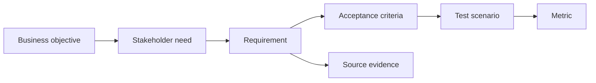

# Traceability và testability

<div class="lesson-meta">
  <span>Requirements engineering với AI</span>
  <span>Software BA</span>
  <span>Core</span>
</div>

## Learning outcomes

- Xây traceability chain giữa goal, requirement, criteria và test.
- Dùng AI tìm orphan requirement và weak test link.
- Cải thiện release decision bằng evidence.

## Why this matters for BA work

<div class="ba-callout">
Traceability làm requirement có accountability từ business goal đến test evidence.
</div>

Bài này quan trọng vì artifact có AI hỗ trợ có thể nhân lên rất nhanh, khiến team dễ mất chain từ business goal tới requirement, source, decision, test và release evidence. Traceability bảo vệ team khỏi requirement đẹp nhưng chưa chứng minh. Testability biến suggestion AI thành behavior mà delivery team verify được.

## Common difficulties for BAs

Trong Requirements engineering với AI, Traceability và testability trở nên khó khi business rule, edge case, quality attribute và testability constraint phải sống sót khi chuyển từ conversation sang backlog. BA nên kiểm tra các điểm dưới đây trước khi xem artifact có AI hỗ trợ là đủ sẵn sàng cho stakeholder decision hoặc handoff.

| Khó khăn | Vì sao khó trong công việc BA | BA nên xử lý thế nào |
| --- | --- | --- |
| Xem traceability là documentation overhead. | Lỗi "Xem traceability là documentation overhead." xuất hiện khi team bàn về ambiguity, NFR risk, traceability, testability và rule ownership nhưng chưa thống nhất source nào authoritative. AI có thể làm disagreement nghe mượt hơn, nên BA phải giữ uncertainty visible. | Áp dụng control này: buộc mọi requirement statement lộ rõ actor, trigger, data, rule, exception và verification signal. Sau đó dùng pattern tốt hơn "Ghi source ID, prompt context, reviewer, decision owner và artifact version." và hỏi ai phải approve artifact trước khi nó ảnh hưởng scope, build, test hoặc release. |
| Link item máy móc mà không check meaning. | Với Traceability và testability, điểm khó là Traceability làm requirement có accountability từ business goal đến test evidence. Pattern yếu rất dễ xảy ra vì AI có thể tạo câu trả lời trôi chảy trước khi BA check ownership, source freshness hoặc decision right. | Áp dụng control này: buộc mọi requirement statement lộ rõ actor, trigger, data, rule, exception và verification signal. Sau đó dùng pattern tốt hơn "Trace từng requirement tới positive, negative, fallback và monitoring test." và hỏi ai phải approve artifact trước khi nó ảnh hưởng scope, build, test hoặc release. |
| Thiếu test scenario cho high-risk requirement. | Điểm này khó khi Traceability Chain được kỳ vọng hỗ trợ delivery-ready requirement. Nếu BA không challenge draft, unsupported assumption có thể đi vào planning, testing hoặc stakeholder communication. | Áp dụng control này: buộc mọi requirement statement lộ rõ actor, trigger, data, rule, exception và verification signal. Sau đó dùng pattern tốt hơn "Dùng trace link trong refinement, QA planning, change impact và release decision." và hỏi ai phải approve artifact trước khi nó ảnh hưởng scope, build, test hoặc release. |

## Where this applies in real projects

Dùng bài này khi requirement đang được refine, split, clarify, test hoặc bị QA và delivery team challenge. Output thực tế không phải document dài hơn; đó là Traceability Chain có đủ evidence, ownership và decision clarity cho cuộc trao đổi tiếp theo của dự án.

| Thời điểm trong dự án | Cách áp dụng bài học | Output cụ thể của BA |
| --- | --- | --- |
| Backlog refinement | Xây traceability chain cho một epic. | Traceability Chain thể hiện ambiguity, NFR risk, traceability, testability và rule ownership, trong đó action "Xây traceability chain cho một epic." được chuyển thành decision, requirement, checklist hoặc question có thể review ở meeting tiếp theo. |
| QA alignment | Nhờ AI identify orphan story. | Traceability Chain thể hiện source evidence, trong đó action "Nhờ AI identify orphan story." được chuyển thành decision, requirement, checklist hoặc question có thể review ở meeting tiếp theo. |
| Release readiness | Thêm source evidence cho high-risk requirement. | Traceability Chain thể hiện decision owner, trong đó action "Thêm source evidence cho high-risk requirement." được chuyển thành decision, requirement, checklist hoặc question có thể review ở meeting tiếp theo. |

## If this is missing

Nếu thiếu Traceability và testability, requirement nhìn có vẻ đầy đủ nhưng vẫn fail khi implement, test, release hoặc support operation. BA vẫn có thể khôi phục, nhưng phải chuyển draft AI bóng bẩy trở lại thành evidence, assumption, owner và decision test được.

| Nếu thiếu | Ảnh hưởng tới dự án | Cách khôi phục |
| --- | --- | --- |
| Giữ draft AI trong chat và copy phần hay vào ticket | Source, assumption và review trail biến mất. | Khôi phục bằng pattern tốt hơn: Ghi source ID, prompt context, reviewer, decision owner và artifact version. Rework Traceability Chain cho đến khi nó lộ rõ ambiguity, NFR risk, traceability, testability và rule ownership, và không share như bản final cho tới khi evidence, ownership và validation path explicit. |
| Chỉ viết test cho happy path generated behavior | AI feature fail ở edge case, low confidence và unsupported input. | Khôi phục bằng pattern tốt hơn: Trace từng requirement tới positive, negative, fallback và monitoring test. Rework Traceability Chain cho đến khi nó lộ rõ ambiguity, NFR risk, traceability, testability và rule ownership, và không share như bản final cho tới khi evidence, ownership và validation path explicit. |
| Xem traceability là spreadsheet compliance | Team điền field nhưng không dùng để manage risk. | Khôi phục bằng pattern tốt hơn: Dùng trace link trong refinement, QA planning, change impact và release decision. Rework Traceability Chain cho đến khi nó lộ rõ ambiguity, NFR risk, traceability, testability và rule ownership, và không share như bản final cho tới khi evidence, ownership và validation path explicit. |

## Mental model or core concept

Traceability nối lý do requirement tồn tại với cách verify nó. AI có thể hỗ trợ tạo matrix và tìm gap, nhưng BA phải quyết định link nào thật. Traceability chain mạnh map business objective, stakeholder need, requirement, acceptance criteria, test scenario, metric và source evidence.

## Practical BA example

Một release có 80 story. AI tìm 12 story không link business objective và 8 high-priority objective không có test scenario. BA dùng matrix để clean scope và giảm release risk.

## Diagram



## BA artifact

### Traceability Chain

| Link | Question | Example | Gap signal |
| --- | --- | --- | --- |
| Objective to need | Giải quyết problem của ai? | Reduce onboarding drop-off for new customers. | Không có stakeholder named. |
| Need to requirement | System behavior nào support? | Send missing-doc reminder within 24 hours. | Behavior không observable. |
| Requirement to AC | Done được verify bằng gì? | Given missing doc, then reminder is sent. | Không có failure case. |
| AC to metric | Impact đo thế nào? | Drop-off rate decreases by 10%. | Không có success metric. |

## AI expert note

Với AI work, traceability nên gồm evidence source, prompt hoặc context package, assumption có model hỗ trợ, reviewer, decision owner và evaluation case. BA chuyên gia xem traceability là risk control, không phải documentation overhead. Requirement không trace hoặc test được thì không nên thành delivery commitment.

## Bad vs better example

| Cách làm yếu | Vì sao fail | Cách làm BA tốt hơn |
| --- | --- | --- |
| Giữ draft AI trong chat và copy phần hay vào ticket | Source, assumption và review trail biến mất. | Ghi source ID, prompt context, reviewer, decision owner và artifact version. |
| Chỉ viết test cho happy path generated behavior | AI feature fail ở edge case, low confidence và unsupported input. | Trace từng requirement tới positive, negative, fallback và monitoring test. |
| Xem traceability là spreadsheet compliance | Team điền field nhưng không dùng để manage risk. | Dùng trace link trong refinement, QA planning, change impact và release decision. |

## AI collaboration prompt

```text
Tạo traceability matrix từ các artifact này. Bao gồm business objective, stakeholder need, requirement ID, acceptance criteria, test scenario, metric, source evidence và gap. Flag orphan requirement và objective không có test.
```

## Mistakes to avoid

- Xem traceability là documentation overhead.
- Link item máy móc mà không check meaning.
- Thiếu test scenario cho high-risk requirement.
- Dùng AI-generated link mà không human review.

## Apply this tomorrow

1. Xây traceability chain cho một epic.
2. Nhờ AI identify orphan story.
3. Thêm source evidence cho high-risk requirement.
4. Review metric alignment với product owner.

## What a BA should remember

- Traceability là accountability.
- Testability bắt đầu trước khi QA nhận story.
- AI draft matrix; BA verify link.
