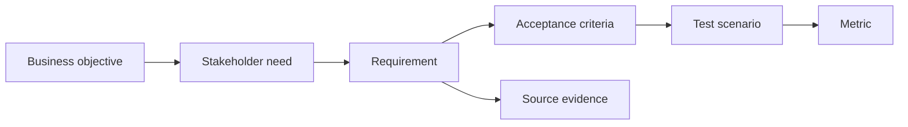

# Traceability và testability

<div class="lesson-meta">
  <span>Requirements engineering với AI</span>
  <span>Software BA</span>
  <span>Core</span>
</div>

## Learning outcomes

- Xây traceability chain giữa goal, requirement, criteria và test.
- Dùng AI tìm orphan requirement và weak test link.
- Cải thiện release decision bằng evidence.

## Why this matters for BA work

<div class="ba-callout">
Traceability làm requirement có accountability từ business goal đến test evidence.
</div>

Bài này quan trọng vì artifact có AI hỗ trợ có thể nhân lên rất nhanh, khiến team dễ mất chain từ business goal tới requirement, source, decision, test và release evidence. Traceability bảo vệ team khỏi requirement đẹp nhưng chưa chứng minh. Testability biến suggestion AI thành behavior mà delivery team verify được.

## Common difficulties for BAs

Trong dự án thật, chủ đề này khó vì BA phải biến evidence lộn xộn thành decision mà không để AI che mất uncertainty. Hãy chú ý các friction point này trước khi xem output là sẵn sàng.

| Khó khăn | Vì sao khó trong công việc BA | BA nên xử lý thế nào |
| --- | --- | --- |
| Xem traceability là documentation overhead. | Khó vì Traceability và testability thường được áp dụng khi deadline gấp, evidence chưa đủ và stakeholder chưa thống nhất. Draft AI nghe trôi chảy có thể làm gap ít visible hơn. | Dùng source label, assumption rõ và review owner cụ thể trước khi chuyển thành backlog, specification hoặc delivery commitment. |
| Link item máy móc mà không check meaning. | Khó vì Traceability và testability thường được áp dụng khi deadline gấp, evidence chưa đủ và stakeholder chưa thống nhất. Draft AI nghe trôi chảy có thể làm gap ít visible hơn. | Dùng source label, assumption rõ và review owner cụ thể trước khi chuyển thành backlog, specification hoặc delivery commitment. |
| Thiếu test scenario cho high-risk requirement. | Khó vì Traceability và testability thường được áp dụng khi deadline gấp, evidence chưa đủ và stakeholder chưa thống nhất. Draft AI nghe trôi chảy có thể làm gap ít visible hơn. | Dùng source label, assumption rõ và review owner cụ thể trước khi chuyển thành backlog, specification hoặc delivery commitment. |

## Where this applies in real projects

Bài này hữu ích khi BA cần chuyển conversation, policy, design hoặc technical input thành artifact chung để team implement và test được.

| Thời điểm trong dự án | Cách áp dụng bài học | Output cụ thể của BA |
| --- | --- | --- |
| Discovery | Xây traceability chain cho một epic. | Traceability Chain: artifact review được, nối nội dung học với decision, acceptance criteria, risk hoặc stakeholder alignment. |
| Refinement | Nhờ AI identify orphan story. | Traceability Chain: artifact review được, nối nội dung học với decision, acceptance criteria, risk hoặc stakeholder alignment. |
| Delivery | Thêm source evidence cho high-risk requirement. | Traceability Chain: artifact review được, nối nội dung học với decision, acceptance criteria, risk hoặc stakeholder alignment. |

## If this is missing

Nếu thiếu năng lực này, AI vẫn có thể tạo text rất bóng bẩy, nhưng project mất khả năng review. Kết quả thường là rework, assumption ẩn, acceptance criteria yếu hoặc business decision thiếu evidence.

| Nếu thiếu | Ảnh hưởng tới dự án | Cách khôi phục |
| --- | --- | --- |
| Giữ draft AI trong chat và copy phần hay vào ticket | Source, assumption và review trail biến mất. | Khôi phục bằng pattern tốt hơn: Ghi source ID, prompt context, reviewer, decision owner và artifact version. Sau đó check lại artifact theo evidence, testability, ownership và business impact trước khi share. |
| Chỉ viết test cho happy path generated behavior | AI feature fail ở edge case, low confidence và unsupported input. | Khôi phục bằng pattern tốt hơn: Trace từng requirement tới positive, negative, fallback và monitoring test. Sau đó check lại artifact theo evidence, testability, ownership và business impact trước khi share. |
| Xem traceability là spreadsheet compliance | Team điền field nhưng không dùng để manage risk. | Khôi phục bằng pattern tốt hơn: Dùng trace link trong refinement, QA planning, change impact và release decision. Sau đó check lại artifact theo evidence, testability, ownership và business impact trước khi share. |

## Mental model or core concept

Traceability nối lý do requirement tồn tại với cách verify nó. AI có thể hỗ trợ tạo matrix và tìm gap, nhưng BA phải quyết định link nào thật. Traceability chain mạnh map business objective, stakeholder need, requirement, acceptance criteria, test scenario, metric và source evidence.

## Practical BA example

Một release có 80 story. AI tìm 12 story không link business objective và 8 high-priority objective không có test scenario. BA dùng matrix để clean scope và giảm release risk.

## Diagram



## BA artifact

### Traceability Chain

| Link | Question | Example | Gap signal |
| --- | --- | --- | --- |
| Objective to need | Giải quyết problem của ai? | Reduce onboarding drop-off for new customers. | Không có stakeholder named. |
| Need to requirement | System behavior nào support? | Send missing-doc reminder within 24 hours. | Behavior không observable. |
| Requirement to AC | Done được verify bằng gì? | Given missing doc, then reminder is sent. | Không có failure case. |
| AC to metric | Impact đo thế nào? | Drop-off rate decreases by 10%. | Không có success metric. |

## AI expert note

Với AI work, traceability nên gồm evidence source, prompt hoặc context package, assumption có model hỗ trợ, reviewer, decision owner và evaluation case. BA chuyên gia xem traceability là risk control, không phải documentation overhead. Requirement không trace hoặc test được thì không nên thành delivery commitment.

## Bad vs better example

| Cách làm yếu | Vì sao fail | Cách làm BA tốt hơn |
| --- | --- | --- |
| Giữ draft AI trong chat và copy phần hay vào ticket | Source, assumption và review trail biến mất. | Ghi source ID, prompt context, reviewer, decision owner và artifact version. |
| Chỉ viết test cho happy path generated behavior | AI feature fail ở edge case, low confidence và unsupported input. | Trace từng requirement tới positive, negative, fallback và monitoring test. |
| Xem traceability là spreadsheet compliance | Team điền field nhưng không dùng để manage risk. | Dùng trace link trong refinement, QA planning, change impact và release decision. |

## AI collaboration prompt

```text
Tạo traceability matrix từ các artifact này. Bao gồm business objective, stakeholder need, requirement ID, acceptance criteria, test scenario, metric, source evidence và gap. Flag orphan requirement và objective không có test.
```

## Mistakes to avoid

- Xem traceability là documentation overhead.
- Link item máy móc mà không check meaning.
- Thiếu test scenario cho high-risk requirement.
- Dùng AI-generated link mà không human review.

## Apply this tomorrow

1. Xây traceability chain cho một epic.
2. Nhờ AI identify orphan story.
3. Thêm source evidence cho high-risk requirement.
4. Review metric alignment với product owner.

## What a BA should remember

- Traceability là accountability.
- Testability bắt đầu trước khi QA nhận story.
- AI draft matrix; BA verify link.
