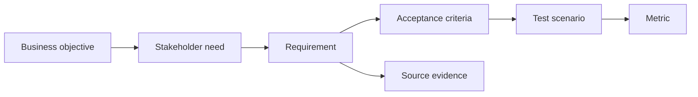

# Traceability và testability

<div class="lesson-meta">
  <span>Requirements engineering với AI</span>
  <span>Software BA</span>
  <span>Core</span>
</div>

## Learning outcomes

- Xây traceability chain giữa goal, requirement, criteria và test.
- Dùng AI tìm orphan requirement và weak test link.
- Cải thiện release decision bằng evidence.

## Why this matters for BA work

<div class="ba-callout">
Traceability làm requirement có accountability từ business goal đến test evidence.
</div>

Business Analyst đứng giữa problem framing, ý nghĩa từ stakeholder, constraint triển khai và product decision. Trong công việc có AI, vị trí này quan trọng hơn vì ngôn ngữ chưa rõ có thể tạo false certainty rất nhanh. Bài này đưa ra một control thực tế để áp dụng trước khi output AI trở thành scope, backlog hoặc delivery commitment.

## Mental model or core concept

Traceability nối lý do requirement tồn tại với cách verify nó. AI có thể hỗ trợ tạo matrix và tìm gap, nhưng BA phải quyết định link nào thật. Traceability chain mạnh map business objective, stakeholder need, requirement, acceptance criteria, test scenario, metric và source evidence.

## Practical BA example

Một release có 80 story. AI tìm 12 story không link business objective và 8 high-priority objective không có test scenario. BA dùng matrix để clean scope và giảm release risk.

## Diagram



## BA artifact

### Traceability Chain

| Link | Question | Example | Gap signal |
| --- | --- | --- | --- |
| Objective to need | Giải quyết problem của ai? | Reduce onboarding drop-off for new customers. | Không có stakeholder named. |
| Need to requirement | System behavior nào support? | Send missing-doc reminder within 24 hours. | Behavior không observable. |
| Requirement to AC | Done được verify bằng gì? | Given missing doc, then reminder is sent. | Không có failure case. |
| AC to metric | Impact đo thế nào? | Drop-off rate decreases by 10%. | Không có success metric. |

## AI collaboration prompt

```text
Tạo traceability matrix từ các artifact này. Bao gồm business objective, stakeholder need, requirement ID, acceptance criteria, test scenario, metric, source evidence và gap. Flag orphan requirement và objective không có test.
```

## Mistakes to avoid

- Xem traceability là documentation overhead.
- Link item máy móc mà không check meaning.
- Thiếu test scenario cho high-risk requirement.
- Dùng AI-generated link mà không human review.

## Apply this tomorrow

1. Xây traceability chain cho một epic.
2. Nhờ AI identify orphan story.
3. Thêm source evidence cho high-risk requirement.
4. Review metric alignment với product owner.

## What a BA should remember

- Traceability là accountability.
- Testability bắt đầu trước khi QA nhận story.
- AI draft matrix; BA verify link.
