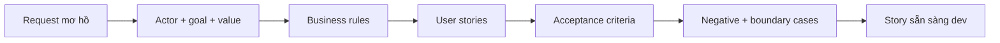

# User story và acceptance criteria

<div class="lesson-meta">
  <span>Quy trình BA được tăng cường bởi AI</span>
  <span>Software BA</span>
  <span>Core</span>
</div>

## Learning outcomes

- Chuyển request mơ hồ thành user story test được.
- Dùng AI generate edge case mà không mất business intent.
- Viết acceptance criteria để dev và QA inspect được.

## Why this matters for BA work

<div class="ba-callout">
AI có thể draft story nhanh, nhưng BA phải giữ business rule, negative path, permission và testability.
</div>

Business Analyst đứng giữa problem framing, ý nghĩa từ stakeholder, constraint triển khai và product decision. Trong công việc có AI, vị trí này quan trọng hơn vì ngôn ngữ chưa rõ có thể tạo false certainty rất nhanh. Bài này đưa ra một control thực tế để áp dụng trước khi output AI trở thành scope, backlog hoặc delivery commitment.

## Mental model or core concept

User story thể hiện actor, goal và value; acceptance criteria định nghĩa điều kiện observable của done. AI hữu ích khi expand alternative path, validation rule, permission và negative case. BA phải tránh criteria chung chung bằng cách cung cấp business rule và yêu cầu scenario test được.

## Practical BA example

Request 'users can update profiles' được tách thành nhiều story: sửa contact info, verify email change, restrict sensitive field, audit admin change và handle failed validation. AI giúp draft scenario, nhưng BA validate rule với product, security và support.

## Diagram



## BA artifact

### Story Quality Rubric

| Criterion | Good signal | Weak signal | Hành động BA |
| --- | --- | --- | --- |
| Actor và value | Actor và business value rõ. | Story chỉ ghi system shall. | Rewrite từ user goal. |
| Business rule | Rule và threshold có tên. | Rule ẩn trong wording mơ hồ. | Thêm source rule hoặc open question. |
| Acceptance criteria | Given-When-Then cover success và failure. | Chỉ có happy path. | Thêm negative và boundary case. |
| Testability | QA verify được expected result. | Dùng từ chủ quan. | Thay vague term bằng outcome observable. |

## AI collaboration prompt

```text
Chuyển request này thành user story và acceptance criteria dạng Given-When-Then. Bao gồm actor, goal, business value, business rule, permission, negative case, boundary case, audit need và unresolved question. Flag criteria nào không test được.
```

## Mistakes to avoid

- Generate nhiều story nhưng thiếu business value.
- Acceptance criteria chỉ lặp lại story.
- Thiếu permission và audit.
- Bỏ negative path vì happy path nhìn đơn giản.

## Apply this tomorrow

1. Chọn một story mơ hồ và nhờ AI tìm missing business rule.
2. Thêm hai negative acceptance criteria.
3. Nhờ QA review testability trước refinement.
4. Tag mỗi criterion với source hoặc assumption.

## What a BA should remember

- AI giúp expand scenario, nhưng BA sở hữu business intent.
- Acceptance criteria là contract về behavior.
- Negative path làm lộ hidden requirement.
