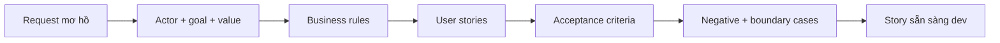

# User story và acceptance criteria

<div class="lesson-meta">
  <span>Quy trình BA được tăng cường bởi AI</span>
  <span>Software BA</span>
  <span>Core</span>
</div>

## Learning outcomes

- Chuyển request mơ hồ thành user story test được.
- Dùng AI generate edge case mà không mất business intent.
- Viết acceptance criteria để dev và QA inspect được.

## Why this matters for BA work

<div class="ba-callout">
AI có thể draft story nhanh, nhưng BA phải giữ business rule, negative path, permission và testability.
</div>

Bài này quan trọng vì AI có thể tạo rất nhiều story nhanh, nhưng số lượng không phải readiness. BA artifact sẵn sàng cho development cần rõ actor, business value, observable behavior, boundary, negative case, permission và release decision. Nếu BA không kiểm soát structure, story do AI sinh sẽ trở thành backlog noise nhìn hấp dẫn.

## Common difficulties for BAs

Trong dự án thật, chủ đề này khó vì BA phải biến evidence lộn xộn thành decision mà không để AI che mất uncertainty. Hãy chú ý các friction point này trước khi xem output là sẵn sàng.

| Khó khăn | Vì sao khó trong công việc BA | BA nên xử lý thế nào |
| --- | --- | --- |
| Generate nhiều story nhưng thiếu business value. | Khó vì User story và acceptance criteria thường được áp dụng khi deadline gấp, evidence chưa đủ và stakeholder chưa thống nhất. Draft AI nghe trôi chảy có thể làm gap ít visible hơn. | Dùng source label, assumption rõ và review owner cụ thể trước khi chuyển thành backlog, specification hoặc delivery commitment. |
| Acceptance criteria chỉ lặp lại story. | Khó vì User story và acceptance criteria thường được áp dụng khi deadline gấp, evidence chưa đủ và stakeholder chưa thống nhất. Draft AI nghe trôi chảy có thể làm gap ít visible hơn. | Dùng source label, assumption rõ và review owner cụ thể trước khi chuyển thành backlog, specification hoặc delivery commitment. |
| Thiếu permission và audit. | Khó vì User story và acceptance criteria thường được áp dụng khi deadline gấp, evidence chưa đủ và stakeholder chưa thống nhất. Draft AI nghe trôi chảy có thể làm gap ít visible hơn. | Dùng source label, assumption rõ và review owner cụ thể trước khi chuyển thành backlog, specification hoặc delivery commitment. |

## Where this applies in real projects

Bài này hữu ích khi BA cần chuyển conversation, policy, design hoặc technical input thành artifact chung để team implement và test được.

| Thời điểm trong dự án | Cách áp dụng bài học | Output cụ thể của BA |
| --- | --- | --- |
| Discovery | Chọn một story mơ hồ và nhờ AI tìm missing business rule. | Story Quality Rubric: artifact review được, nối nội dung học với decision, acceptance criteria, risk hoặc stakeholder alignment. |
| Refinement | Thêm hai negative acceptance criteria. | Story Quality Rubric: artifact review được, nối nội dung học với decision, acceptance criteria, risk hoặc stakeholder alignment. |
| Delivery | Nhờ QA review testability trước refinement. | Story Quality Rubric: artifact review được, nối nội dung học với decision, acceptance criteria, risk hoặc stakeholder alignment. |

## If this is missing

Nếu thiếu năng lực này, AI vẫn có thể tạo text rất bóng bẩy, nhưng project mất khả năng review. Kết quả thường là rework, assumption ẩn, acceptance criteria yếu hoặc business decision thiếu evidence.

| Nếu thiếu | Ảnh hưởng tới dự án | Cách khôi phục |
| --- | --- | --- |
| Generate mười user story cho feature | Backlog phình to nhưng chưa chứng minh story nào có value hoặc releasable. | Khôi phục bằng pattern tốt hơn: Bắt đầu từ user goal, split theo permission, workflow step, exception và business value. Sau đó check lại artifact theo evidence, testability, ownership và business impact trước khi share. |
| Acceptance criteria ghi system works correctly | QA và developer không quan sát hoặc automate được success mơ hồ. | Khôi phục bằng pattern tốt hơn: Viết Given-When-Then có data, state, actor, boundary và expected result. Sau đó check lại artifact theo evidence, testability, ownership và business impact trước khi share. |
| Bỏ qua negative và permission case | Happy path che giấu production defect và security issue. | Khôi phục bằng pattern tốt hơn: Yêu cầu negative, boundary, audit và role-based criteria trước refinement. Sau đó check lại artifact theo evidence, testability, ownership và business impact trước khi share. |

## Mental model or core concept

User story thể hiện actor, goal và value; acceptance criteria định nghĩa điều kiện observable của done. AI hữu ích khi expand alternative path, validation rule, permission và negative case. BA phải tránh criteria chung chung bằng cách cung cấp business rule và yêu cầu scenario test được.

## Practical BA example

Request 'users can update profiles' được tách thành nhiều story: sửa contact info, verify email change, restrict sensitive field, audit admin change và handle failed validation. AI giúp draft scenario, nhưng BA validate rule với product, security và support.

## Diagram



## BA artifact

### Story Quality Rubric

| Criterion | Good signal | Weak signal | Hành động BA |
| --- | --- | --- | --- |
| Actor và value | Actor và business value rõ. | Story chỉ ghi system shall. | Rewrite từ user goal. |
| Business rule | Rule và threshold có tên. | Rule ẩn trong wording mơ hồ. | Thêm source rule hoặc open question. |
| Acceptance criteria | Given-When-Then cover success và failure. | Chỉ có happy path. | Thêm negative và boundary case. |
| Testability | QA verify được expected result. | Dùng từ chủ quan. | Thay vague term bằng outcome observable. |

## AI expert note

User story là decision container, không chỉ là sentence template. AI hữu ích để tạo variation, edge case và draft Given-When-Then, nhưng nó thường overgeneralize. BA cần evaluate từng story theo một user goal, outcome test được, rule source explicit và ranh giới rõ với behavior lân cận.

## Bad vs better example

| Cách làm yếu | Vì sao fail | Cách làm BA tốt hơn |
| --- | --- | --- |
| Generate mười user story cho feature | Backlog phình to nhưng chưa chứng minh story nào có value hoặc releasable. | Bắt đầu từ user goal, split theo permission, workflow step, exception và business value. |
| Acceptance criteria ghi system works correctly | QA và developer không quan sát hoặc automate được success mơ hồ. | Viết Given-When-Then có data, state, actor, boundary và expected result. |
| Bỏ qua negative và permission case | Happy path che giấu production defect và security issue. | Yêu cầu negative, boundary, audit và role-based criteria trước refinement. |

## AI collaboration prompt

```text
Chuyển request này thành user story và acceptance criteria dạng Given-When-Then. Bao gồm actor, goal, business value, business rule, permission, negative case, boundary case, audit need và unresolved question. Flag criteria nào không test được.
```

## Mistakes to avoid

- Generate nhiều story nhưng thiếu business value.
- Acceptance criteria chỉ lặp lại story.
- Thiếu permission và audit.
- Bỏ negative path vì happy path nhìn đơn giản.

## Apply this tomorrow

1. Chọn một story mơ hồ và nhờ AI tìm missing business rule.
2. Thêm hai negative acceptance criteria.
3. Nhờ QA review testability trước refinement.
4. Tag mỗi criterion với source hoặc assumption.

## What a BA should remember

- AI giúp expand scenario, nhưng BA sở hữu business intent.
- Acceptance criteria là contract về behavior.
- Negative path làm lộ hidden requirement.
