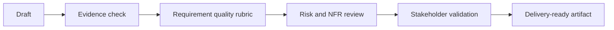

# Checklist và rubric

| Checklist | What to verify |
| --- | --- |
| Requirement quality | Actor, behavior, business rule, data, edge case, NFR, testability, source evidence |
| AI output review | Fact, assumption, unsupported claim, missing context, severity, owner |
| AI feature spec | Task, input, output, confidence, fallback, human review, evaluation, monitoring |
| RAG governance | Source authority, freshness, access control, citation, conflict handling, fallback |
| Prompt injection | User-controlled input, retrieved content, tool action, instruction hierarchy, refusal, escalation, logging |
| Bias and fairness | Affected group, proxy variable, historical bias, explainability, appeal path, fairness metric |
| Observability | Evaluation set, output log, correction capture, drift signal, alert threshold, dashboard owner |
| Model selection | Task fit, context need, latency, quality bar, privacy, access control, cost guardrail, fallback model |
| BA team adoption | Use-case tier, approved tool, data policy, quality gate, metric, escalation |

## Review flow

## Scoring guide

- 1 means the artifact is risky or unclear.
- 2 means the artifact is usable with known gaps.
- 3 means the artifact is delivery-ready and evidence-backed.

## AI risk control BA nên yêu cầu

- Prompt injection: định nghĩa user input, retrieved document và tool output được phép ảnh hưởng điều gì.
- Bias: yêu cầu evaluation case đại diện và cách để user hoặc operator challenge harmful outcome.
- Observability: log đủ model input, output, confidence, fallback và correction data để học sau release.
- Access control: verify AI không retrieve hoặc reveal thông tin vượt quá permission của user.
- Cost guardrail: định nghĩa token budget, volume assumption, escalation rule và fallback rẻ hơn cho routine task.
