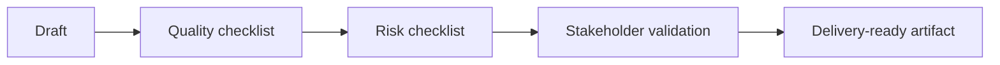

# Checklist

| Area | BA checks |
| --- | --- |
| Context | Goal, user, source material, constraint, output format |
| Quality | Ambiguity, conflict, rule thiếu, testability, NFR |
| AI product | Data, confidence, fallback, human review, monitoring |
| Governance | PII, policy, approved tool, audit trail, risk tier |

## Review flow

