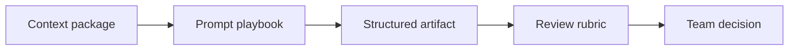

# Thư viện tài nguyên

Playbook tái sử dụng cho công việc BA với AI.

## Resources

- [Prompt playbook](./prompt-library)
- [Checklist và rubric](./checklists)
- [Glossary](./glossary)

## Template dùng trong dự án

<a class="template-card" href="./ai-feature-requirement-template"><strong>Template requirement cho AI feature</strong>Dùng khi feature có model output, recommendation, classification, summarization, retrieval hoặc AI-assisted decision.</a>
<a class="template-card" href="./acceptance-criteria-quality-rubric"><strong>Rubric chất lượng acceptance criteria</strong>Dùng để review acceptance criteria do AI hoặc con người viết trước sprint refinement.</a>
<a class="template-card" href="./ui-state-requirement-template"><strong>Template requirement cho UI state</strong>Dùng khi chuyển Figma, wireframe hoặc screen idea thành frontend requirement implement được.</a>
<a class="template-card" href="./api-contract-checklist"><strong>Checklist API contract</strong>Dùng khi BA cần align frontend need, backend constraint, QA expectation và business rule quanh API.</a>
<a class="template-card" href="./rag-knowledge-contract-canvas"><strong>Canvas RAG knowledge contract</strong>Dùng trước khi đặc tả knowledge assistant, policy assistant, support assistant hoặc document Q&A feature.</a>
<a class="template-card" href="./prompt-review-checklist"><strong>Checklist review prompt</strong>Dùng trước khi biến prompt one-off thành reusable team prompt hoặc workflow.</a>
<a class="template-card" href="./ai-risk-human-review-matrix"><strong>Matrix AI risk và human review</strong>Dùng để quyết định khi nào output AI được đi tiếp, cần review, hoặc phải fallback/escalate.</a>
<a class="template-card" href="./decision-log-template"><strong>Template decision log</strong>Dùng khi AI-assisted analysis tạo option, trade-off hoặc open question cần human accountability.</a>
<a class="template-card" href="./definition-of-ready-done-ai-ba"><strong>Definition of Ready và Done cho AI-augmented BA work</strong>Dùng để định nghĩa quality gate trước khi AI-assisted BA artifact đi vào refinement, build, test hoặc release decision.</a>

## Resource map

## How to use the library

1. Start from the checklist for your task.
2. Use a prompt pattern only after source context is ready.
3. Require AI to label assumptions and unsupported claims.
4. Convert output into a BA-owned artifact before sharing it.
