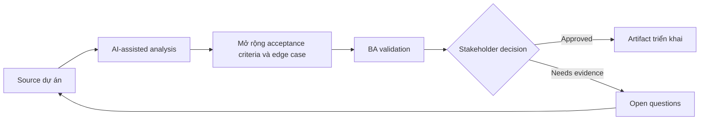

# Mở rộng acceptance criteria và edge case

<div class="case-meta">
  <span>Requirements and backlog</span>
  <span>Requirements quality</span>
  <span>Use case dự án</span>
</div>

## Project context

Team chuẩn bị feature thay đổi account limit. Requirement ban đầu nói admin có thể update limit, nhưng chưa định nghĩa threshold, approval rule, notification behavior, audit hoặc điều gì xảy ra khi request fail. Trong Requirements quality, công việc này thường bắt đầu khi story phải test được mà không mất business rule, exception, data need hoặc NFR. BA nên xem Requirement draft và Policy threshold là evidence cần organize, không phải raw material để AI trả lời không kiểm soát. Mục tiêu là làm decision tiếp theo rõ hơn cho người own outcome.

## BA challenge

BA phải biến requirement đơn giản thành acceptance criteria test được với positive, negative, boundary, permission, audit và recovery scenario. AI có thể expand edge case, nhưng BA chỉ giữ phần được policy và stakeholder decision support. Với Mở rộng acceptance criteria và edge case, khó khăn thực tế là criteria mơ hồ và assumption không owner. AI có thể tăng tốc gap finding, rewrite critique, edge-case expansion và acceptance-criteria drafting, nhưng BA vẫn phải làm rõ assumption, approval còn thiếu và điểm cần stakeholder judgment.

## Where AI fits

<div class="ba-workbench-panel">
AI phù hợp với use case Requirements và backlog khi được giới hạn vào gap finding, rewrite critique, edge-case expansion và acceptance-criteria drafting. AI task hữu ích đầu tiên là: Generate edge-case category từ requirement draft. AI không được approve scope, invent policy, bỏ qua rule đã approve, example, edge case và expectation của QA, hoặc biến draft thành final decision.
</div>

- Generate edge-case category từ requirement draft.
- Draft Given-When-Then criteria qua positive và negative path.
- Identify missing business rule và policy dependency.
- Tạo QA review question và traceability link.

## Inputs to prepare

- Requirement draft
- Policy threshold
- Admin role matrix
- Audit requirement
- System error behavior notes

Trước khi prompt cho Mở rộng acceptance criteria và edge case, hãy label từng input theo owner, date, approval status, sensitivity và vai trò trong decision. Evidence lens quan trọng nhất là rule đã approve, example, edge case và expectation của QA; nếu thiếu, AI có thể xem old note, draft design và approved rule có authority như nhau.

## BA workflow

1. Yêu cầu AI list observable behavior và missing rule.
2. Generate criteria theo scenario type: positive, negative, boundary, permission, audit và failure recovery.
3. Remove criteria tự invent policy value hoặc threshold unsupported.
4. Thêm source ID và decision owner cho mọi rule.
5. Review với QA về testability và product về business intent.
6. Publish criteria có trace link tới requirement và source evidence.

Chạy workflow như clarify requirement trước khi commit sprint: bắt đầu với "Yêu cầu AI list observable behavior và missing rule.", sau đó giữ decision log visible khi artifact tiến tới Acceptance criteria matrix. Cách này ngăn suggestion của AI âm thầm trở thành backlog, design, release hoặc operational commitment.

## Diagram



## Deliverables

| Deliverable | Nội dung | Owner | Done signal |
| --- | --- | --- | --- |
| Acceptance criteria matrix | Scenario, Given-When-Then, source, owner và test type | BA | Mọi material rule observable |
| Edge case register | Boundary, permission, error, audit và concurrency case | QA | Critical edge case có test coverage |
| Clarification questions | Threshold, role và exception rule còn thiếu | Product owner | Question có owner và due date |
| Trace links | Requirement tới source tới criteria tới test | BA | Criteria trace được tới evidence |

Hãy xem Acceptance criteria matrix là delivery-ready backlog artifact do BA own. AI có thể draft structure, nhưng BA phải validate "Mọi material rule observable" có thật sự đúng không, artifact có trace được về evidence không và receiving team có hành động được không.

## Prompt to try

```text
Hãy đóng vai senior Business Analyst hiểu AI. Hỗ trợ tôi áp dụng use case "Mở rộng acceptance criteria và edge case" vào dự án. Trước hết hỏi source evidence và constraint. Sau đó tạo structured analysis gồm project context, assumption, AI-fit boundary, workflow step, deliverable, risk, control, open question và stakeholder decision. Không tự bịa policy, threshold hoặc approval.
```

## Review checklist

- Requirement draft được label owner, date, approval status và sensitivity.
- Acceptance criteria matrix trace được về source evidence và có human owner rõ.
- AI task nằm trong boundary gap finding, rewrite critique, edge-case expansion và acceptance-criteria drafting và không approve scope hoặc policy.
- Risk "Invented thresholds" có control thực tế: Bắt buộc source ID cho mọi numeric rule.
- Open assumption được chuyển thành validation question hoặc stakeholder decision.
- Success metric: QA có thể chuyển acceptance criteria thành test case mà không phải hỏi hidden business rule.

## Risks and controls

| Rủi ro | Vì sao quan trọng | Control của BA |
| --- | --- | --- |
| Invented thresholds | AI có thể tạo limit policy chưa approve | Bắt buộc source ID cho mọi numeric rule |
| Criteria overload | Quá nhiều low-value case làm chậm refinement | Prioritize theo risk, frequency và failure cost |
| Untestable wording | Criteria vẫn có thể dùng từ mơ hồ | Dùng observable state, actor, input và expected result |
| Missing audit | Admin change có thể thiếu compliance evidence | Thêm audit và permission criteria explicit |

Control chính cho risk "Invented thresholds" là human accountability explicit: Bắt buộc source ID cho mọi numeric rule. Nếu evidence yếu, output nên tạo validation question hoặc decision item, không phải final requirement.
