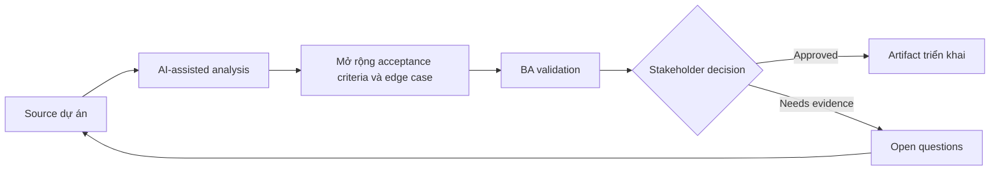

# Mở rộng acceptance criteria và edge case

<div class="case-meta">
  <span>Requirements and backlog</span>
  <span>Requirements quality</span>
  <span>Use case dự án</span>
</div>

## Project context

Team chuẩn bị feature thay đổi account limit. Requirement ban đầu nói admin có thể update limit, nhưng chưa định nghĩa threshold, approval rule, notification behavior, audit hoặc điều gì xảy ra khi request fail. Trong môi trường delivery thật, tình huống này thường xuất hiện dưới áp lực thời gian: stakeholder cần clarity, delivery cần backlog, QA cần behavior test được, operations cần process chịu được exception. BA dùng AI để tăng tốc analysis và synthesis, nhưng BA vẫn chịu trách nhiệm về evidence, business meaning, stakeholder decisioning và artifact quality.

## BA challenge

BA phải biến requirement đơn giản thành acceptance criteria test được với positive, negative, boundary, permission, audit và recovery scenario. AI có thể expand edge case, nhưng BA chỉ giữ phần được policy và stakeholder decision support. Khó khăn thực tế là AI có thể làm material ban đầu trông hoàn chỉnh hơn mức thật sự. BA giỏi giữ output ở trạng thái reviewable bằng cách tách source-backed fact, assumption, unsupported claim, decision gap và recommended next action. Mục tiêu không phải làm document dài hơn; mục tiêu là làm project decision rõ hơn và an toàn hơn.

## Where AI fits

<div class="ba-workbench-panel">
AI hữu ích trong use case này khi được giới hạn vào analysis support, pattern detection, structured drafting và critique. AI không được approve scope, invent policy, quyết định business trade-off hoặc thay thế judgment của stakeholder chịu trách nhiệm.
</div>

- Generate edge-case category từ requirement draft.
- Draft Given-When-Then criteria qua positive và negative path.
- Identify missing business rule và policy dependency.
- Tạo QA review question và traceability link.

## Inputs to prepare

- Requirement draft
- Policy threshold
- Admin role matrix
- Audit requirement
- System error behavior notes

BA nên label các input này trước khi dùng AI: source owner, source date, approval status, sensitivity level, và source đó là fact, opinion, policy, draft hay historical evidence. Việc chuẩn bị này ngăn model xem mọi input đều current và authoritative như nhau.

## BA workflow

1. Yêu cầu AI list observable behavior và missing rule.
2. Generate criteria theo scenario type: positive, negative, boundary, permission, audit và failure recovery.
3. Remove criteria tự invent policy value hoặc threshold unsupported.
4. Thêm source ID và decision owner cho mọi rule.
5. Review với QA về testability và product về business intent.
6. Publish criteria có trace link tới requirement và source evidence.

Workflow hiệu quả nhất khi dùng AI theo từng stage: trước hết organize evidence, sau đó yêu cầu analysis, tiếp theo tạo artifact, rồi chạy critique pass. BA nên giữ decision log visible xuyên suốt để suggestion do AI sinh ra không âm thầm trở thành approved scope.

## Diagram



## Deliverables

| Deliverable | Nội dung | Owner | Done signal |
| --- | --- | --- | --- |
| Acceptance criteria matrix | Scenario, Given-When-Then, source, owner và test type | BA | Mọi material rule observable |
| Edge case register | Boundary, permission, error, audit và concurrency case | QA | Critical edge case có test coverage |
| Clarification questions | Threshold, role và exception rule còn thiếu | Product owner | Question có owner và due date |
| Trace links | Requirement tới source tới criteria tới test | BA | Criteria trace được tới evidence |

Các deliverable này nên được xem là artifact do BA own. AI có thể draft, nhưng BA phải validate source support, stakeholder meaning, traceability và artifact đã sẵn sàng handoff hay chưa.

## Prompt to try

```text
Hãy đóng vai senior Business Analyst hiểu AI. Hỗ trợ tôi áp dụng use case "Mở rộng acceptance criteria và edge case" vào dự án. Trước hết hỏi source evidence và constraint. Sau đó tạo structured analysis gồm project context, assumption, AI-fit boundary, workflow step, deliverable, risk, control, open question và stakeholder decision. Không tự bịa policy, threshold hoặc approval.
```

## Review checklist

- Mọi statement do AI hỗ trợ đều gắn với source, assumption hoặc validation question.
- BA đã tách drafting assistance khỏi business approval.
- Workflow step có human owner cho decision, review và exception.
- Deliverable trace được về project input và review được bởi QA, product hoặc operations.
- Risk control đủ thực tế để dùng trong meeting dự án thật.
- Success metric: QA có thể chuyển acceptance criteria thành test case mà không phải hỏi hidden business rule.

## Risks and controls

| Rủi ro | Vì sao quan trọng | Control của BA |
| --- | --- | --- |
| Invented thresholds | AI có thể tạo limit policy chưa approve | Bắt buộc source ID cho mọi numeric rule |
| Criteria overload | Quá nhiều low-value case làm chậm refinement | Prioritize theo risk, frequency và failure cost |
| Untestable wording | Criteria vẫn có thể dùng từ mơ hồ | Dùng observable state, actor, input và expected result |
| Missing audit | Admin change có thể thiếu compliance evidence | Thêm audit và permission criteria explicit |

Control quan trọng nhất là làm uncertainty visible. Nếu evidence yếu, output nên tạo validation question hoặc decision item, không phải final requirement. Nếu artifact ảnh hưởng delivery, release, compliance, customer experience hoặc operational workload, BA nên yêu cầu human review explicit trước khi handoff.
