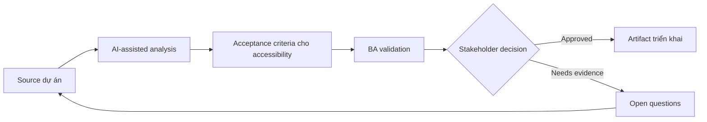

# Acceptance criteria cho accessibility

<div class="case-meta">
  <span>Frontend, UI, and UX</span>
  <span>Accessibility</span>
  <span>Use case dự án</span>
</div>

## Project context

Public portal phải đáp ứng accessibility expectation, nhưng story ban đầu chỉ nói visual layout và happy-path interaction. Keyboard navigation, screen reader label, focus behavior và contrast chưa được specify. Trong Accessibility, công việc này thường bắt đầu khi screen behavior, accessibility, design state, analytics và user feedback phải thành requirement implement được. BA nên xem UI design và Component list là evidence cần organize, không phải raw material để AI trả lời không kiểm soát. Mục tiêu là làm decision tiếp theo rõ hơn cho người own outcome.

## BA challenge

BA phải chuyển accessibility expectation thành acceptance criteria để frontend và QA implement/test được. Accessibility không thể là checklist cuối dự án; nó phải là một phần của behavior requirement. Với Acceptance criteria cho accessibility, khó khăn thực tế là missing state và UX không đo được. AI có thể tăng tốc UI-state analysis, content critique, accessibility review, event taxonomy và edge-case discovery, nhưng BA vẫn phải làm rõ assumption, approval còn thiếu và điểm cần stakeholder judgment.

## Where AI fits

<div class="ba-workbench-panel">
AI phù hợp với use case Frontend, UI và UX khi được giới hạn vào UI-state analysis, content critique, accessibility review, event taxonomy và edge-case discovery. AI task hữu ích đầu tiên là: Generate accessibility review question theo component và interaction. AI không được approve scope, invent policy, bỏ qua wireframe, design token, user journey, analytics question và accessibility expectation, hoặc biến draft thành final decision.
</div>

- Generate accessibility review question theo component và interaction.
- Draft acceptance criteria cho keyboard, focus, label, contrast và error behavior.
- Identify accessibility risk trong form, modal, table và dynamic update.
- Tạo QA checklist cho assistive technology scenario.

## Inputs to prepare

- UI design
- Component list
- Accessibility policy
- Form và modal behavior
- Target user groups

Trước khi prompt cho Acceptance criteria cho accessibility, hãy label từng input theo owner, date, approval status, sensitivity và vai trò trong decision. Evidence lens quan trọng nhất là wireframe, design token, user journey, analytics question và accessibility expectation; nếu thiếu, AI có thể xem old note, draft design và approved rule có authority như nhau.

## BA workflow

1. List component và interaction cần accessibility behavior.
2. Yêu cầu AI generate criteria theo accessibility lens.
3. Review label, focus order, keyboard navigation, status announcement và error message.
4. Agree test responsibility với frontend và QA.
5. Thêm acceptance criteria vào story trước refinement.
6. Track unresolved accessibility risk trong backlog.

Chạy workflow như screen-state review trước frontend build: bắt đầu với "List component và interaction cần accessibility behavior.", sau đó giữ decision log visible khi artifact tiến tới Accessibility criteria set. Cách này ngăn suggestion của AI âm thầm trở thành backlog, design, release hoặc operational commitment.

## Diagram



## Deliverables

| Deliverable | Nội dung | Owner | Done signal |
| --- | --- | --- | --- |
| Accessibility criteria set | Component, behavior, criterion và test method | BA | Criteria story-ready |
| Keyboard flow map | Tab order, focus trap, escape behavior và shortcut rule | Frontend | Keyboard user complete được task |
| Screen reader label list | Element, label, announcement và dynamic update | UX và frontend | Assistive tech behavior được define |
| Accessibility QA checklist | Manual check, automated check và assistive scenario | QA | Testing beyond visual layout |

Hãy xem Accessibility criteria set là frontend requirement specification do BA own. AI có thể draft structure, nhưng BA phải validate "Criteria story-ready" có thật sự đúng không, artifact có trace được về evidence không và receiving team có hành động được không.

## Prompt to try

```text
Hãy đóng vai senior Business Analyst hiểu AI. Hỗ trợ tôi áp dụng use case "Acceptance criteria cho accessibility" vào dự án. Trước hết hỏi source evidence và constraint. Sau đó tạo structured analysis gồm project context, assumption, AI-fit boundary, workflow step, deliverable, risk, control, open question và stakeholder decision. Không tự bịa policy, threshold hoặc approval.
```

## Review checklist

- UI design được label owner, date, approval status và sensitivity.
- Accessibility criteria set trace được về source evidence và có human owner rõ.
- AI task nằm trong boundary UI-state analysis, content critique, accessibility review, event taxonomy và edge-case discovery và không approve scope hoặc policy.
- Risk "Late accessibility" có control thực tế: Thêm accessibility criteria trong refinement.
- Open assumption được chuyển thành validation question hoặc stakeholder decision.
- Success metric: Accessibility được thể hiện như behavior test được trong user story trước khi frontend implementation bắt đầu.

## Risks and controls

| Rủi ro | Vì sao quan trọng | Control của BA |
| --- | --- | --- |
| Late accessibility | Fix issue sau build rất tốn | Thêm accessibility criteria trong refinement |
| Visual-only design | Screen reader user có thể không hiểu context | Specify label và announcement |
| Keyboard trap | User có thể bị kẹt trong modal/menu | Define focus management và escape behavior |
| Error invisibility | Validation error có thể không được announce | Specify accessible error behavior |

Control chính cho risk "Late accessibility" là human accountability explicit: Thêm accessibility criteria trong refinement. Nếu evidence yếu, output nên tạo validation question hoặc decision item, không phải final requirement.
