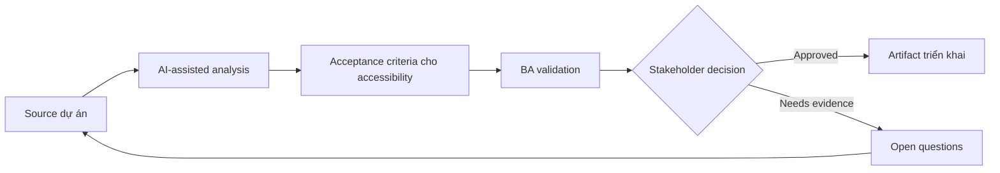

# Acceptance criteria cho accessibility

<div class="case-meta">
  <span>Frontend, UI, and UX</span>
  <span>Accessibility</span>
  <span>Use case dự án</span>
</div>

## Project context

Public portal phải đáp ứng accessibility expectation, nhưng story ban đầu chỉ nói visual layout và happy-path interaction. Keyboard navigation, screen reader label, focus behavior và contrast chưa được specify. Trong môi trường delivery thật, tình huống này thường xuất hiện dưới áp lực thời gian: stakeholder cần clarity, delivery cần backlog, QA cần behavior test được, operations cần process chịu được exception. BA dùng AI để tăng tốc analysis và synthesis, nhưng BA vẫn chịu trách nhiệm về evidence, business meaning, stakeholder decisioning và artifact quality.

## BA challenge

BA phải chuyển accessibility expectation thành acceptance criteria để frontend và QA implement/test được. Accessibility không thể là checklist cuối dự án; nó phải là một phần của behavior requirement. Khó khăn thực tế là AI có thể làm material ban đầu trông hoàn chỉnh hơn mức thật sự. BA giỏi giữ output ở trạng thái reviewable bằng cách tách source-backed fact, assumption, unsupported claim, decision gap và recommended next action. Mục tiêu không phải làm document dài hơn; mục tiêu là làm project decision rõ hơn và an toàn hơn.

## Where AI fits

<div class="ba-workbench-panel">
AI hữu ích trong use case này khi được giới hạn vào analysis support, pattern detection, structured drafting và critique. AI không được approve scope, invent policy, quyết định business trade-off hoặc thay thế judgment của stakeholder chịu trách nhiệm.
</div>

- Generate accessibility review question theo component và interaction.
- Draft acceptance criteria cho keyboard, focus, label, contrast và error behavior.
- Identify accessibility risk trong form, modal, table và dynamic update.
- Tạo QA checklist cho assistive technology scenario.

## Inputs to prepare

- UI design
- Component list
- Accessibility policy
- Form và modal behavior
- Target user groups

BA nên label các input này trước khi dùng AI: source owner, source date, approval status, sensitivity level, và source đó là fact, opinion, policy, draft hay historical evidence. Việc chuẩn bị này ngăn model xem mọi input đều current và authoritative như nhau.

## BA workflow

1. List component và interaction cần accessibility behavior.
2. Yêu cầu AI generate criteria theo accessibility lens.
3. Review label, focus order, keyboard navigation, status announcement và error message.
4. Agree test responsibility với frontend và QA.
5. Thêm acceptance criteria vào story trước refinement.
6. Track unresolved accessibility risk trong backlog.

Workflow hiệu quả nhất khi dùng AI theo từng stage: trước hết organize evidence, sau đó yêu cầu analysis, tiếp theo tạo artifact, rồi chạy critique pass. BA nên giữ decision log visible xuyên suốt để suggestion do AI sinh ra không âm thầm trở thành approved scope.

## Diagram



## Deliverables

| Deliverable | Nội dung | Owner | Done signal |
| --- | --- | --- | --- |
| Accessibility criteria set | Component, behavior, criterion và test method | BA | Criteria story-ready |
| Keyboard flow map | Tab order, focus trap, escape behavior và shortcut rule | Frontend | Keyboard user complete được task |
| Screen reader label list | Element, label, announcement và dynamic update | UX và frontend | Assistive tech behavior được define |
| Accessibility QA checklist | Manual check, automated check và assistive scenario | QA | Testing beyond visual layout |

Các deliverable này nên được xem là artifact do BA own. AI có thể draft, nhưng BA phải validate source support, stakeholder meaning, traceability và artifact đã sẵn sàng handoff hay chưa.

## Prompt to try

```text
Hãy đóng vai senior Business Analyst hiểu AI. Hỗ trợ tôi áp dụng use case "Acceptance criteria cho accessibility" vào dự án. Trước hết hỏi source evidence và constraint. Sau đó tạo structured analysis gồm project context, assumption, AI-fit boundary, workflow step, deliverable, risk, control, open question và stakeholder decision. Không tự bịa policy, threshold hoặc approval.
```

## Review checklist

- Mọi statement do AI hỗ trợ đều gắn với source, assumption hoặc validation question.
- BA đã tách drafting assistance khỏi business approval.
- Workflow step có human owner cho decision, review và exception.
- Deliverable trace được về project input và review được bởi QA, product hoặc operations.
- Risk control đủ thực tế để dùng trong meeting dự án thật.
- Success metric: Accessibility được thể hiện như behavior test được trong user story trước khi frontend implementation bắt đầu.

## Risks and controls

| Rủi ro | Vì sao quan trọng | Control của BA |
| --- | --- | --- |
| Late accessibility | Fix issue sau build rất tốn | Thêm accessibility criteria trong refinement |
| Visual-only design | Screen reader user có thể không hiểu context | Specify label và announcement |
| Keyboard trap | User có thể bị kẹt trong modal/menu | Define focus management và escape behavior |
| Error invisibility | Validation error có thể không được announce | Specify accessible error behavior |

Control quan trọng nhất là làm uncertainty visible. Nếu evidence yếu, output nên tạo validation question hoặc decision item, không phải final requirement. Nếu artifact ảnh hưởng delivery, release, compliance, customer experience hoặc operational workload, BA nên yêu cầu human review explicit trước khi handoff.
