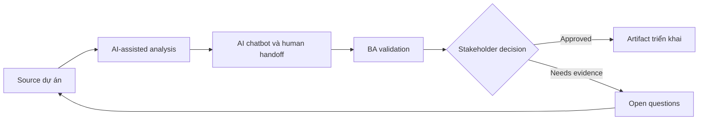

# AI chatbot và human handoff

<div class="case-meta">
  <span>AI-enabled product use cases</span>
  <span>Customer support</span>
  <span>Use case dự án</span>
</div>

## Project context

Customer support team muốn chatbot trả lời câu hỏi phổ biến và hand off case phức tạp cho agent. Business muốn giảm ticket, nhưng customer experience không được giảm khi bot uncertain. Trong môi trường delivery thật, tình huống này thường xuất hiện dưới áp lực thời gian: stakeholder cần clarity, delivery cần backlog, QA cần behavior test được, operations cần process chịu được exception. BA dùng AI để tăng tốc analysis và synthesis, nhưng BA vẫn chịu trách nhiệm về evidence, business meaning, stakeholder decisioning và artifact quality.

## BA challenge

BA phải đặc tả supported intent, knowledge source, refusal behavior, handoff trigger, transcript transfer, agent context, SLA và monitoring. Handoff là workflow requirement, không phải fallback note. Khó khăn thực tế là AI có thể làm material ban đầu trông hoàn chỉnh hơn mức thật sự. BA giỏi giữ output ở trạng thái reviewable bằng cách tách source-backed fact, assumption, unsupported claim, decision gap và recommended next action. Mục tiêu không phải làm document dài hơn; mục tiêu là làm project decision rõ hơn và an toàn hơn.

## Where AI fits

<div class="ba-workbench-panel">
AI hữu ích trong use case này khi được giới hạn vào analysis support, pattern detection, structured drafting và critique. AI không được approve scope, invent policy, quyết định business trade-off hoặc thay thế judgment của stakeholder chịu trách nhiệm.
</div>

- Draft intent catalog và unsupported intent behavior.
- Generate handoff trigger scenario.
- Tạo agent context và transcript requirement.
- Design quality monitoring metric cho containment và customer harm.

## Inputs to prepare

- Support intent list
- FAQ và policy sources
- Escalation process
- Agent workflow
- Customer satisfaction data

BA nên label các input này trước khi dùng AI: source owner, source date, approval status, sensitivity level, và source đó là fact, opinion, policy, draft hay historical evidence. Việc chuẩn bị này ngăn model xem mọi input đều current và authoritative như nhau.

## BA workflow

1. Define supported và unsupported intent có source evidence.
2. Yêu cầu AI generate handoff trigger như low confidence, repeated failure, sentiment, risk hoặc regulated topic.
3. Specify context nào transfer cho human agent.
4. Design user messaging trung thực và hữu ích.
5. Tạo monitoring metric cho containment, handoff quality và repeat contact.
6. Review failure scenario với support agent trước launch.

Workflow hiệu quả nhất khi dùng AI theo từng stage: trước hết organize evidence, sau đó yêu cầu analysis, tiếp theo tạo artifact, rồi chạy critique pass. BA nên giữ decision log visible xuyên suốt để suggestion do AI sinh ra không âm thầm trở thành approved scope.

## Diagram



## Deliverables

| Deliverable | Nội dung | Owner | Done signal |
| --- | --- | --- | --- |
| Intent catalog | Intent, source, answer behavior, unsupported behavior và owner | BA và support | Intent boundary rõ |
| Handoff rule matrix | Trigger, user message, agent queue, SLA và context transfer | Support lead | Mọi trigger có workflow path |
| Agent context package | Conversation summary, user goal, attempted answer và source reference | BA | Agent nhận context hữu ích |
| Monitoring dashboard spec | Containment, fallback, repeat contact, CSAT và escalation pattern | Operations | Quality được monitor beyond volume reduction |

Các deliverable này nên được xem là artifact do BA own. AI có thể draft, nhưng BA phải validate source support, stakeholder meaning, traceability và artifact đã sẵn sàng handoff hay chưa.

## Prompt to try

```text
Hãy đóng vai senior Business Analyst hiểu AI. Hỗ trợ tôi áp dụng use case "AI chatbot và human handoff" vào dự án. Trước hết hỏi source evidence và constraint. Sau đó tạo structured analysis gồm project context, assumption, AI-fit boundary, workflow step, deliverable, risk, control, open question và stakeholder decision. Không tự bịa policy, threshold hoặc approval.
```

## Review checklist

- Mọi statement do AI hỗ trợ đều gắn với source, assumption hoặc validation question.
- BA đã tách drafting assistance khỏi business approval.
- Workflow step có human owner cho decision, review và exception.
- Deliverable trace được về project input và review được bởi QA, product hoặc operations.
- Risk control đủ thực tế để dùng trong meeting dự án thật.
- Success metric: Chatbot giảm workload đơn giản trong khi case phức tạp hoặc risky tới human có context và accountability.

## Risks and controls

| Rủi ro | Vì sao quan trọng | Control của BA |
| --- | --- | --- |
| Poor handoff | Customer phải lặp lại thông tin và mất trust | Transfer transcript, summary và source context |
| Over-containment | Business có thể optimize fewer tickets làm hại customer | Measure repeat contact và satisfaction |
| Unsupported intent invention | Bot có thể answer topic ngoài scope | Define refusal và escalation behavior |
| Agent workflow burden | Handoff có thể tạo thêm work cho agent | Design agent context package với support input |

Control quan trọng nhất là làm uncertainty visible. Nếu evidence yếu, output nên tạo validation question hoặc decision item, không phải final requirement. Nếu artifact ảnh hưởng delivery, release, compliance, customer experience hoặc operational workload, BA nên yêu cầu human review explicit trước khi handoff.
