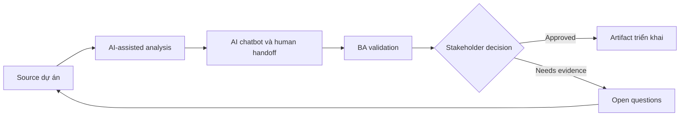

# AI chatbot và human handoff

<div class="case-meta">
  <span>AI-enabled product use cases</span>
  <span>Customer support</span>
  <span>AI product design</span>
  <span>Advanced</span>
  <span>Intent catalog</span>
  <span>Use case dự án</span>
</div>

## Project context

Customer support team muốn chatbot trả lời câu hỏi phổ biến và hand off case phức tạp cho agent. Business muốn giảm ticket, nhưng customer experience không được giảm khi bot uncertain. Trong Customer support, công việc này thường bắt đầu khi hành vi AI ảnh hưởng trực tiếp tới user và phải có uncertainty, fallback, evaluation và human review. BA nên xem Support intent list và FAQ và policy sources là evidence cần organize, không phải raw material để AI trả lời không kiểm soát. Mục tiêu là làm decision tiếp theo rõ hơn cho người own outcome.

## BA challenge

BA phải đặc tả supported intent, knowledge source, refusal behavior, handoff trigger, transcript transfer, agent context, SLA và monitoring. Handoff là workflow requirement, không phải fallback note. Với AI chatbot và human handoff, khó khăn thực tế là over-automation và confidence không an toàn. AI có thể tăng tốc AI task framing, output contract drafting, evaluation planning và safety-control critique, nhưng BA vẫn phải làm rõ assumption, approval còn thiếu và điểm cần stakeholder judgment.

## Where AI fits

<div class="ba-workbench-panel">
AI phù hợp với use case AI-enabled product khi được giới hạn vào AI task framing, output contract drafting, evaluation planning và safety-control critique. AI task hữu ích đầu tiên là: Draft intent catalog và unsupported intent behavior. AI không được approve scope, invent policy, bỏ qua approved source, model limit, evaluation case và human decision trigger, hoặc biến draft thành final decision.
</div>

- Draft intent catalog và unsupported intent behavior.
- Generate handoff trigger scenario.
- Tạo agent context và transcript requirement.
- Design quality monitoring metric cho containment và customer harm.

## Inputs to prepare

- Support intent list
- FAQ và policy sources
- Escalation process
- Agent workflow
- Customer satisfaction data

Trước khi prompt cho AI chatbot và human handoff, hãy label từng input theo owner, date, approval status, sensitivity và vai trò trong decision. Evidence lens quan trọng nhất là approved source, model limit, evaluation case và human decision trigger; nếu thiếu, AI có thể xem old note, draft design và approved rule có authority như nhau.

## BA workflow

1. Define supported và unsupported intent có source evidence.
2. Yêu cầu AI generate handoff trigger như low confidence, repeated failure, sentiment, risk hoặc regulated topic.
3. Specify context nào transfer cho human agent.
4. Design user messaging trung thực và hữu ích.
5. Tạo monitoring metric cho containment, handoff quality và repeat contact.
6. Review failure scenario với support agent trước launch.

Chạy workflow như AI operating contract trước khi build: bắt đầu với "Define supported và unsupported intent có source evidence.", sau đó giữ decision log visible khi artifact tiến tới Intent catalog. Cách này ngăn suggestion của AI âm thầm trở thành backlog, design, release hoặc operational commitment.

## Diagram



## Deliverables

| Deliverable | Nội dung | Owner | Done signal |
| --- | --- | --- | --- |
| Intent catalog | Intent, source, answer behavior, unsupported behavior và owner | BA và support | Intent boundary rõ |
| Handoff rule matrix | Trigger, user message, agent queue, SLA và context transfer | Support lead | Mọi trigger có workflow path |
| Agent context package | Conversation summary, user goal, attempted answer và source reference | BA | Agent nhận context hữu ích |
| Monitoring dashboard spec | Containment, fallback, repeat contact, CSAT và escalation pattern | Operations | Quality được monitor beyond volume reduction |

Hãy xem Intent catalog là AI behavior specification do BA own. AI có thể draft structure, nhưng BA phải validate "Intent boundary rõ" có thật sự đúng không, artifact có trace được về evidence không và receiving team có hành động được không.

## Prompt to try

```text
Hãy đóng vai senior Business Analyst hiểu AI. Hỗ trợ tôi áp dụng use case "AI chatbot và human handoff" vào dự án. Trước hết hỏi source evidence và constraint. Sau đó tạo structured analysis gồm project context, assumption, AI-fit boundary, workflow step, deliverable, risk, control, open question và stakeholder decision. Không tự bịa policy, threshold hoặc approval.
```

## Review checklist

- Support intent list được label owner, date, approval status và sensitivity.
- Intent catalog trace được về source evidence và có human owner rõ.
- AI task nằm trong boundary AI task framing, output contract drafting, evaluation planning và safety-control critique và không approve scope hoặc policy.
- Risk "Poor handoff" có control thực tế: Transfer transcript, summary và source context.
- Open assumption được chuyển thành validation question hoặc stakeholder decision.
- Success metric: Chatbot giảm workload đơn giản trong khi case phức tạp hoặc risky tới human có context và accountability.

## Risks and controls

| Rủi ro | Vì sao quan trọng | Control của BA |
| --- | --- | --- |
| Poor handoff | Customer phải lặp lại thông tin và mất trust | Transfer transcript, summary và source context |
| Over-containment | Business có thể optimize fewer tickets làm hại customer | Measure repeat contact và satisfaction |
| Unsupported intent invention | Bot có thể answer topic ngoài scope | Define refusal và escalation behavior |
| Agent workflow burden | Handoff có thể tạo thêm work cho agent | Design agent context package với support input |

Control chính cho risk "Poor handoff" là human accountability explicit: Transfer transcript, summary và source context. Nếu evidence yếu, output nên tạo validation question hoặc decision item, không phải final requirement.
