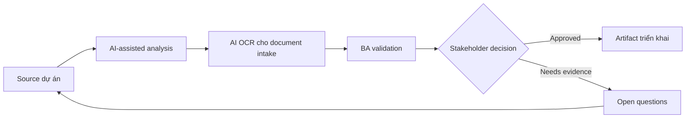

# AI OCR cho document intake

<div class="case-meta">
  <span>AI-enabled product use cases</span>
  <span>Document automation</span>
  <span>Use case dự án</span>
</div>

## Project context

Quy trình onboarding yêu cầu customer upload identity và compliance document. Operations mất thời gian đọc PDF, extract field, detect missing page và yêu cầu customer resubmit document không rõ. Trong môi trường delivery thật, tình huống này thường xuất hiện dưới áp lực thời gian: stakeholder cần clarity, delivery cần backlog, QA cần behavior test được, operations cần process chịu được exception. BA dùng AI để tăng tốc analysis và synthesis, nhưng BA vẫn chịu trách nhiệm về evidence, business meaning, stakeholder decisioning và artifact quality.

## BA challenge

BA phải đặc tả AI-assisted document extraction và validation đồng thời bảo vệ khỏi OCR error, missing evidence, privacy issue và automated rejection sai. Human review và fallback là essential. Khó khăn thực tế là AI có thể làm material ban đầu trông hoàn chỉnh hơn mức thật sự. BA giỏi giữ output ở trạng thái reviewable bằng cách tách source-backed fact, assumption, unsupported claim, decision gap và recommended next action. Mục tiêu không phải làm document dài hơn; mục tiêu là làm project decision rõ hơn và an toàn hơn.

## Where AI fits

<div class="ba-workbench-panel">
AI hữu ích trong use case này khi được giới hạn vào analysis support, pattern detection, structured drafting và critique. AI không được approve scope, invent policy, quyết định business trade-off hoặc thay thế judgment của stakeholder chịu trách nhiệm.
</div>

- Identify document type, required field và validation rule.
- Draft extraction output schema và confidence behavior.
- Generate exception scenario cho document missing, unreadable hoặc inconsistent.
- Tạo human review và audit requirement.

## Inputs to prepare

- Document type list
- Field validation rules
- Compliance policy
- Sample documents
- Operations exception logs

BA nên label các input này trước khi dùng AI: source owner, source date, approval status, sensitivity level, và source đó là fact, opinion, policy, draft hay historical evidence. Việc chuẩn bị này ngăn model xem mọi input đều current và authoritative như nhau.

## BA workflow

1. Inventory document type và required field có source policy.
2. Yêu cầu AI draft extraction schema và validation scenario.
3. Define confidence threshold theo field và document.
4. Specify review trigger cho low confidence, mismatch, missing page hoặc regulated decision.
5. Design customer messaging cho resubmission không expose sensitive logic.
6. Tạo evaluation set có real-world document variation.

Workflow hiệu quả nhất khi dùng AI theo từng stage: trước hết organize evidence, sau đó yêu cầu analysis, tiếp theo tạo artifact, rồi chạy critique pass. BA nên giữ decision log visible xuyên suốt để suggestion do AI sinh ra không âm thầm trở thành approved scope.

## Diagram



## Deliverables

| Deliverable | Nội dung | Owner | Done signal |
| --- | --- | --- | --- |
| Extraction schema | Document type, field, format, confidence và source rule | BA và data team | Schema cover required field |
| Validation rule matrix | Rule, evidence, pass condition, failure condition và review trigger | Compliance owner | Rule source-backed |
| Human review workflow | Trigger, reviewer action, SLA, audit và correction capture | Operations | Review queue operational |
| Evaluation set | Document sample, expected extraction và error category | QA và data team | Test case cover messy document |

Các deliverable này nên được xem là artifact do BA own. AI có thể draft, nhưng BA phải validate source support, stakeholder meaning, traceability và artifact đã sẵn sàng handoff hay chưa.

## Prompt to try

```text
Hãy đóng vai senior Business Analyst hiểu AI. Hỗ trợ tôi áp dụng use case "AI OCR cho document intake" vào dự án. Trước hết hỏi source evidence và constraint. Sau đó tạo structured analysis gồm project context, assumption, AI-fit boundary, workflow step, deliverable, risk, control, open question và stakeholder decision. Không tự bịa policy, threshold hoặc approval.
```

## Review checklist

- Mọi statement do AI hỗ trợ đều gắn với source, assumption hoặc validation question.
- BA đã tách drafting assistance khỏi business approval.
- Workflow step có human owner cho decision, review và exception.
- Deliverable trace được về project input và review được bởi QA, product hoặc operations.
- Risk control đủ thực tế để dùng trong meeting dự án thật.
- Success metric: Document handling nhanh hơn trong khi sensitive decision vẫn reviewable và evidence-backed.

## Risks and controls

| Rủi ro | Vì sao quan trọng | Control của BA |
| --- | --- | --- |
| OCR error | Extract field sai có thể tạo decision sai | Dùng field confidence và human review cho material field |
| Automated rejection harm | Customer có thể bị reject vì AI đọc sai document | Yêu cầu fallback và manual review trước high-impact rejection |
| Privacy exposure | Document chứa sensitive data | Specify retention, access, masking và audit |
| Unrealistic samples | Clean test document không giống production | Dùng sample đa dạng có blur, rotation và missing page |

Control quan trọng nhất là làm uncertainty visible. Nếu evidence yếu, output nên tạo validation question hoặc decision item, không phải final requirement. Nếu artifact ảnh hưởng delivery, release, compliance, customer experience hoặc operational workload, BA nên yêu cầu human review explicit trước khi handoff.
