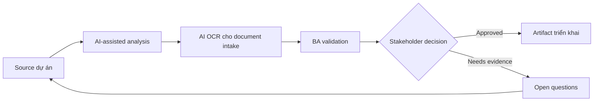

# AI OCR cho document intake

<div class="case-meta">
  <span>AI-enabled product use cases</span>
  <span>Document automation</span>
  <span>Use case dự án</span>
</div>

## Project context

Quy trình onboarding yêu cầu customer upload identity và compliance document. Operations mất thời gian đọc PDF, extract field, detect missing page và yêu cầu customer resubmit document không rõ. Trong Document automation, công việc này thường bắt đầu khi hành vi AI ảnh hưởng trực tiếp tới user và phải có uncertainty, fallback, evaluation và human review. BA nên xem Document type list và Field validation rules là evidence cần organize, không phải raw material để AI trả lời không kiểm soát. Mục tiêu là làm decision tiếp theo rõ hơn cho người own outcome.

## BA challenge

BA phải đặc tả AI-assisted document extraction và validation đồng thời bảo vệ khỏi OCR error, missing evidence, privacy issue và automated rejection sai. Human review và fallback là essential. Với AI OCR cho document intake, khó khăn thực tế là over-automation và confidence không an toàn. AI có thể tăng tốc AI task framing, output contract drafting, evaluation planning và safety-control critique, nhưng BA vẫn phải làm rõ assumption, approval còn thiếu và điểm cần stakeholder judgment.

## Where AI fits

<div class="ba-workbench-panel">
AI phù hợp với use case AI-enabled product khi được giới hạn vào AI task framing, output contract drafting, evaluation planning và safety-control critique. AI task hữu ích đầu tiên là: Identify document type, required field và validation rule. AI không được approve scope, invent policy, bỏ qua approved source, model limit, evaluation case và human decision trigger, hoặc biến draft thành final decision.
</div>

- Identify document type, required field và validation rule.
- Draft extraction output schema và confidence behavior.
- Generate exception scenario cho document missing, unreadable hoặc inconsistent.
- Tạo human review và audit requirement.

## Inputs to prepare

- Document type list
- Field validation rules
- Compliance policy
- Sample documents
- Operations exception logs

Trước khi prompt cho AI OCR cho document intake, hãy label từng input theo owner, date, approval status, sensitivity và vai trò trong decision. Evidence lens quan trọng nhất là approved source, model limit, evaluation case và human decision trigger; nếu thiếu, AI có thể xem old note, draft design và approved rule có authority như nhau.

## BA workflow

1. Inventory document type và required field có source policy.
2. Yêu cầu AI draft extraction schema và validation scenario.
3. Define confidence threshold theo field và document.
4. Specify review trigger cho low confidence, mismatch, missing page hoặc regulated decision.
5. Design customer messaging cho resubmission không expose sensitive logic.
6. Tạo evaluation set có real-world document variation.

Chạy workflow như AI operating contract trước khi build: bắt đầu với "Inventory document type và required field có source policy.", sau đó giữ decision log visible khi artifact tiến tới Extraction schema. Cách này ngăn suggestion của AI âm thầm trở thành backlog, design, release hoặc operational commitment.

## Diagram



## Deliverables

| Deliverable | Nội dung | Owner | Done signal |
| --- | --- | --- | --- |
| Extraction schema | Document type, field, format, confidence và source rule | BA và data team | Schema cover required field |
| Validation rule matrix | Rule, evidence, pass condition, failure condition và review trigger | Compliance owner | Rule source-backed |
| Human review workflow | Trigger, reviewer action, SLA, audit và correction capture | Operations | Review queue operational |
| Evaluation set | Document sample, expected extraction và error category | QA và data team | Test case cover messy document |

Hãy xem Extraction schema là AI behavior specification do BA own. AI có thể draft structure, nhưng BA phải validate "Schema cover required field" có thật sự đúng không, artifact có trace được về evidence không và receiving team có hành động được không.

## Prompt to try

```text
Hãy đóng vai senior Business Analyst hiểu AI. Hỗ trợ tôi áp dụng use case "AI OCR cho document intake" vào dự án. Trước hết hỏi source evidence và constraint. Sau đó tạo structured analysis gồm project context, assumption, AI-fit boundary, workflow step, deliverable, risk, control, open question và stakeholder decision. Không tự bịa policy, threshold hoặc approval.
```

## Review checklist

- Document type list được label owner, date, approval status và sensitivity.
- Extraction schema trace được về source evidence và có human owner rõ.
- AI task nằm trong boundary AI task framing, output contract drafting, evaluation planning và safety-control critique và không approve scope hoặc policy.
- Risk "OCR error" có control thực tế: Dùng field confidence và human review cho material field.
- Open assumption được chuyển thành validation question hoặc stakeholder decision.
- Success metric: Document handling nhanh hơn trong khi sensitive decision vẫn reviewable và evidence-backed.

## Risks and controls

| Rủi ro | Vì sao quan trọng | Control của BA |
| --- | --- | --- |
| OCR error | Extract field sai có thể tạo decision sai | Dùng field confidence và human review cho material field |
| Automated rejection harm | Customer có thể bị reject vì AI đọc sai document | Yêu cầu fallback và manual review trước high-impact rejection |
| Privacy exposure | Document chứa sensitive data | Specify retention, access, masking và audit |
| Unrealistic samples | Clean test document không giống production | Dùng sample đa dạng có blur, rotation và missing page |

Control chính cho risk "OCR error" là human accountability explicit: Dùng field confidence và human review cho material field. Nếu evidence yếu, output nên tạo validation question hoặc decision item, không phải final requirement.
