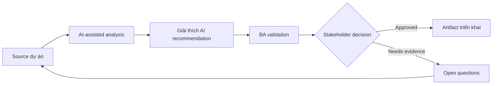

# Giải thích AI recommendation

<div class="case-meta">
  <span>AI-enabled product use cases</span>
  <span>Decision support</span>
  <span>AI product design</span>
  <span>Advanced</span>
  <span>Recommendation canvas</span>
  <span>Use case dự án</span>
</div>

## Project context

Một B2B platform recommend next-best action cho account manager. Stakeholder muốn system suggest outreach action, nhưng sales leader lo user không trust recommendation opaque. Trong Decision support, công việc này thường bắt đầu khi hành vi AI ảnh hưởng trực tiếp tới user và phải có uncertainty, fallback, evaluation và human review. BA nên xem Business goal và User journey là evidence cần organize, không phải raw material để AI trả lời không kiểm soát. Mục tiêu là làm decision tiếp theo rõ hơn cho người own outcome.

## BA challenge

BA phải đặc tả recommendation behavior, explanation requirement, user control, feedback capture, evaluation metric và boundary giữa decision support và automated decisioning. Với Giải thích AI recommendation, khó khăn thực tế là over-automation và confidence không an toàn. AI có thể tăng tốc AI task framing, output contract drafting, evaluation planning và safety-control critique, nhưng BA vẫn phải làm rõ assumption, approval còn thiếu và điểm cần stakeholder judgment.

## Where AI fits

<div class="ba-workbench-panel">
AI phù hợp với use case AI-enabled product khi được giới hạn vào AI task framing, output contract drafting, evaluation planning và safety-control critique. AI task hữu ích đầu tiên là: Draft recommendation output contract và explanation field. AI không được approve scope, invent policy, bỏ qua approved source, model limit, evaluation case và human decision trigger, hoặc biến draft thành final decision.
</div>

- Draft recommendation output contract và explanation field.
- Generate user trust và override scenario.
- Identify data input, prohibited signal và fairness concern.
- Tạo acceptance criteria cho feedback và monitoring.

## Inputs to prepare

- Business goal
- User journey
- Candidate data signals
- Sales playbook
- Risk và compliance constraints

Trước khi prompt cho Giải thích AI recommendation, hãy label từng input theo owner, date, approval status, sensitivity và vai trò trong decision. Evidence lens quan trọng nhất là approved source, model limit, evaluation case và human decision trigger; nếu thiếu, AI có thể xem old note, draft design và approved rule có authority như nhau.

## BA workflow

1. Define user decision mà recommendation support.
2. Yêu cầu AI tách recommendation, explanation, confidence và user action.
3. Specify allowed data signal và prohibited sensitive attribute.
4. Design feedback action như accept, dismiss, edit và reason code.
5. Tạo evaluation metric cho usefulness, accuracy, adoption và harm.
6. Review decision ownership và user messaging với stakeholder.

Chạy workflow như AI operating contract trước khi build: bắt đầu với "Define user decision mà recommendation support.", sau đó giữ decision log visible khi artifact tiến tới Recommendation canvas. Cách này ngăn suggestion của AI âm thầm trở thành backlog, design, release hoặc operational commitment.

## Diagram



## Deliverables

| Deliverable | Nội dung | Owner | Done signal |
| --- | --- | --- | --- |
| Recommendation canvas | Goal, user, trigger, input signal, output và action | BA | Decision support boundary rõ |
| Explanation requirements | Why shown, evidence, confidence và uncertainty language | Product owner | User hiểu rationale của recommendation |
| Feedback design | Accept, reject, edit, reason code và correction loop | UX và BA | Feedback được capture để learning |
| Evaluation plan | Offline và live metric, adoption, override và harm signal | Data team | Quality được đo sau launch |

Hãy xem Recommendation canvas là AI behavior specification do BA own. AI có thể draft structure, nhưng BA phải validate "Decision support boundary rõ" có thật sự đúng không, artifact có trace được về evidence không và receiving team có hành động được không.

## Prompt to try

```text
Hãy đóng vai senior Business Analyst hiểu AI. Hỗ trợ tôi áp dụng use case "Giải thích AI recommendation" vào dự án. Trước hết hỏi source evidence và constraint. Sau đó tạo structured analysis gồm project context, assumption, AI-fit boundary, workflow step, deliverable, risk, control, open question và stakeholder decision. Không tự bịa policy, threshold hoặc approval.
```

## Review checklist

- Business goal được label owner, date, approval status và sensitivity.
- Recommendation canvas trace được về source evidence và có human owner rõ.
- AI task nằm trong boundary AI task framing, output contract drafting, evaluation planning và safety-control critique và không approve scope hoặc policy.
- Risk "Opaque recommendation" có control thực tế: Yêu cầu explanation và uncertainty language.
- Open assumption được chuyển thành validation question hoặc stakeholder decision.
- Success metric: User hiểu recommendation, giữ quyền decision và cung cấp feedback cải thiện product.

## Risks and controls

| Rủi ro | Vì sao quan trọng | Control của BA |
| --- | --- | --- |
| Opaque recommendation | User có thể ignore hoặc misuse suggestion | Yêu cầu explanation và uncertainty language |
| Automation creep | Decision support có thể biến thành automated decisioning | Define user control và approval boundary |
| Sensitive signal use | Model có thể dùng attribute không phù hợp | List prohibited data và review fairness |
| Feedback gap | Team không học được từ override | Capture reason code và monitor pattern |

Control chính cho risk "Opaque recommendation" là human accountability explicit: Yêu cầu explanation và uncertainty language. Nếu evidence yếu, output nên tạo validation question hoặc decision item, không phải final requirement.
