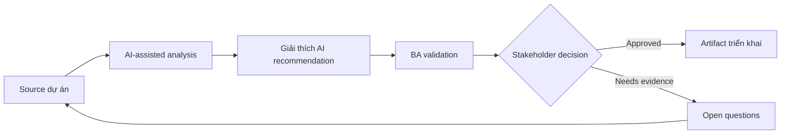

# Giải thích AI recommendation

<div class="case-meta">
  <span>AI-enabled product use cases</span>
  <span>Decision support</span>
  <span>Use case dự án</span>
</div>

## Project context

Một B2B platform recommend next-best action cho account manager. Stakeholder muốn system suggest outreach action, nhưng sales leader lo user không trust recommendation opaque. Trong môi trường delivery thật, tình huống này thường xuất hiện dưới áp lực thời gian: stakeholder cần clarity, delivery cần backlog, QA cần behavior test được, operations cần process chịu được exception. BA dùng AI để tăng tốc analysis và synthesis, nhưng BA vẫn chịu trách nhiệm về evidence, business meaning, stakeholder decisioning và artifact quality.

## BA challenge

BA phải đặc tả recommendation behavior, explanation requirement, user control, feedback capture, evaluation metric và boundary giữa decision support và automated decisioning. Khó khăn thực tế là AI có thể làm material ban đầu trông hoàn chỉnh hơn mức thật sự. BA giỏi giữ output ở trạng thái reviewable bằng cách tách source-backed fact, assumption, unsupported claim, decision gap và recommended next action. Mục tiêu không phải làm document dài hơn; mục tiêu là làm project decision rõ hơn và an toàn hơn.

## Where AI fits

<div class="ba-workbench-panel">
AI hữu ích trong use case này khi được giới hạn vào analysis support, pattern detection, structured drafting và critique. AI không được approve scope, invent policy, quyết định business trade-off hoặc thay thế judgment của stakeholder chịu trách nhiệm.
</div>

- Draft recommendation output contract và explanation field.
- Generate user trust và override scenario.
- Identify data input, prohibited signal và fairness concern.
- Tạo acceptance criteria cho feedback và monitoring.

## Inputs to prepare

- Business goal
- User journey
- Candidate data signals
- Sales playbook
- Risk và compliance constraints

BA nên label các input này trước khi dùng AI: source owner, source date, approval status, sensitivity level, và source đó là fact, opinion, policy, draft hay historical evidence. Việc chuẩn bị này ngăn model xem mọi input đều current và authoritative như nhau.

## BA workflow

1. Define user decision mà recommendation support.
2. Yêu cầu AI tách recommendation, explanation, confidence và user action.
3. Specify allowed data signal và prohibited sensitive attribute.
4. Design feedback action như accept, dismiss, edit và reason code.
5. Tạo evaluation metric cho usefulness, accuracy, adoption và harm.
6. Review decision ownership và user messaging với stakeholder.

Workflow hiệu quả nhất khi dùng AI theo từng stage: trước hết organize evidence, sau đó yêu cầu analysis, tiếp theo tạo artifact, rồi chạy critique pass. BA nên giữ decision log visible xuyên suốt để suggestion do AI sinh ra không âm thầm trở thành approved scope.

## Diagram



## Deliverables

| Deliverable | Nội dung | Owner | Done signal |
| --- | --- | --- | --- |
| Recommendation canvas | Goal, user, trigger, input signal, output và action | BA | Decision support boundary rõ |
| Explanation requirements | Why shown, evidence, confidence và uncertainty language | Product owner | User hiểu rationale của recommendation |
| Feedback design | Accept, reject, edit, reason code và correction loop | UX và BA | Feedback được capture để learning |
| Evaluation plan | Offline và live metric, adoption, override và harm signal | Data team | Quality được đo sau launch |

Các deliverable này nên được xem là artifact do BA own. AI có thể draft, nhưng BA phải validate source support, stakeholder meaning, traceability và artifact đã sẵn sàng handoff hay chưa.

## Prompt to try

```text
Hãy đóng vai senior Business Analyst hiểu AI. Hỗ trợ tôi áp dụng use case "Giải thích AI recommendation" vào dự án. Trước hết hỏi source evidence và constraint. Sau đó tạo structured analysis gồm project context, assumption, AI-fit boundary, workflow step, deliverable, risk, control, open question và stakeholder decision. Không tự bịa policy, threshold hoặc approval.
```

## Review checklist

- Mọi statement do AI hỗ trợ đều gắn với source, assumption hoặc validation question.
- BA đã tách drafting assistance khỏi business approval.
- Workflow step có human owner cho decision, review và exception.
- Deliverable trace được về project input và review được bởi QA, product hoặc operations.
- Risk control đủ thực tế để dùng trong meeting dự án thật.
- Success metric: User hiểu recommendation, giữ quyền decision và cung cấp feedback cải thiện product.

## Risks and controls

| Rủi ro | Vì sao quan trọng | Control của BA |
| --- | --- | --- |
| Opaque recommendation | User có thể ignore hoặc misuse suggestion | Yêu cầu explanation và uncertainty language |
| Automation creep | Decision support có thể biến thành automated decisioning | Define user control và approval boundary |
| Sensitive signal use | Model có thể dùng attribute không phù hợp | List prohibited data và review fairness |
| Feedback gap | Team không học được từ override | Capture reason code và monitor pattern |

Control quan trọng nhất là làm uncertainty visible. Nếu evidence yếu, output nên tạo validation question hoặc decision item, không phải final requirement. Nếu artifact ảnh hưởng delivery, release, compliance, customer experience hoặc operational workload, BA nên yêu cầu human review explicit trước khi handoff.
