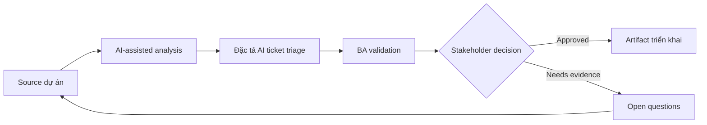

# Đặc tả AI ticket triage

<div class="case-meta">
  <span>AI-enabled product use cases</span>
  <span>Support automation</span>
  <span>Use case dự án</span>
</div>

## Project context

Support organization muốn AI classify incoming ticket theo category, urgency, product area và routing queue. Routing sai làm tăng SLA breach và customer frustration. Trong môi trường delivery thật, tình huống này thường xuất hiện dưới áp lực thời gian: stakeholder cần clarity, delivery cần backlog, QA cần behavior test được, operations cần process chịu được exception. BA dùng AI để tăng tốc analysis và synthesis, nhưng BA vẫn chịu trách nhiệm về evidence, business meaning, stakeholder decisioning và artifact quality.

## BA challenge

BA phải đặc tả probabilistic triage behavior, confidence threshold, human review, correction capture, training data constraint, metric và operational monitoring. Feature này không chỉ là classifier; nó là thay đổi support workflow. Khó khăn thực tế là AI có thể làm material ban đầu trông hoàn chỉnh hơn mức thật sự. BA giỏi giữ output ở trạng thái reviewable bằng cách tách source-backed fact, assumption, unsupported claim, decision gap và recommended next action. Mục tiêu không phải làm document dài hơn; mục tiêu là làm project decision rõ hơn và an toàn hơn.

## Where AI fits

<div class="ba-workbench-panel">
AI hữu ích trong use case này khi được giới hạn vào analysis support, pattern detection, structured drafting và critique. AI không được approve scope, invent policy, quyết định business trade-off hoặc thay thế judgment của stakeholder chịu trách nhiệm.
</div>

- Draft label taxonomy và routing requirement.
- Generate confidence và human review scenario.
- Tạo evaluation case cho category precision và high-risk routing.
- Identify operational metric và correction feedback loop.

## Inputs to prepare

- Historical ticket data
- Support category taxonomy
- SLA rules
- Queue ownership
- Escalation policy

BA nên label các input này trước khi dùng AI: source owner, source date, approval status, sensitivity level, và source đó là fact, opinion, policy, draft hay historical evidence. Việc chuẩn bị này ngăn model xem mọi input đều current và authoritative như nhau.

## BA workflow

1. Define allowed label, queue owner và routing consequence.
2. Yêu cầu AI identify ambiguous category và training example cần có.
3. Specify model output contract và confidence threshold behavior.
4. Design human review queue cho low-confidence hoặc high-impact ticket.
5. Tạo evaluation set và acceptance threshold.
6. Define correction capture và monitoring metric sau launch.

Workflow hiệu quả nhất khi dùng AI theo từng stage: trước hết organize evidence, sau đó yêu cầu analysis, tiếp theo tạo artifact, rồi chạy critique pass. BA nên giữ decision log visible xuyên suốt để suggestion do AI sinh ra không âm thầm trở thành approved scope.

## Diagram



## Deliverables

| Deliverable | Nội dung | Owner | Done signal |
| --- | --- | --- | --- |
| Triage taxonomy | Category, definition, example, owner và SLA impact | Support operations | Label mutually understandable |
| AI output contract | Required field, confidence, explanation và fallback | BA | Output drive workflow an toàn |
| Evaluation plan | Test case, expected label, precision target và high-risk focus | QA và data team | Metric reflect business risk |
| Operational workflow | Human review, correction capture và monitoring event | Support lead | Correction cải thiện future quality |

Các deliverable này nên được xem là artifact do BA own. AI có thể draft, nhưng BA phải validate source support, stakeholder meaning, traceability và artifact đã sẵn sàng handoff hay chưa.

## Prompt to try

```text
Hãy đóng vai senior Business Analyst hiểu AI. Hỗ trợ tôi áp dụng use case "Đặc tả AI ticket triage" vào dự án. Trước hết hỏi source evidence và constraint. Sau đó tạo structured analysis gồm project context, assumption, AI-fit boundary, workflow step, deliverable, risk, control, open question và stakeholder decision. Không tự bịa policy, threshold hoặc approval.
```

## Review checklist

- Mọi statement do AI hỗ trợ đều gắn với source, assumption hoặc validation question.
- BA đã tách drafting assistance khỏi business approval.
- Workflow step có human owner cho decision, review và exception.
- Deliverable trace được về project input và review được bởi QA, product hoặc operations.
- Risk control đủ thực tế để dùng trong meeting dự án thật.
- Success metric: Ticket routing cải thiện SLA trong khi case low-confidence và high-risk được human review.

## Risks and controls

| Rủi ro | Vì sao quan trọng | Control của BA |
| --- | --- | --- |
| Ambiguous taxonomy | Model không classify sạch nếu human chưa thống nhất | Define label có example và owner decision |
| Low-confidence automation | Ticket route sai nếu không review | Dùng confidence threshold và human queue |
| Feedback loss | Correction có thể không được capture | Specify reason code và correction event |
| Metric mismatch | Overall accuracy che lỗi category high-risk | Measure precision cho priority category |

Control quan trọng nhất là làm uncertainty visible. Nếu evidence yếu, output nên tạo validation question hoặc decision item, không phải final requirement. Nếu artifact ảnh hưởng delivery, release, compliance, customer experience hoặc operational workload, BA nên yêu cầu human review explicit trước khi handoff.
