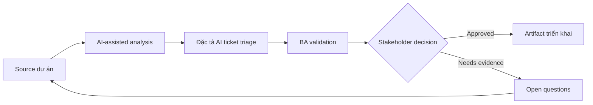

# Đặc tả AI ticket triage

<div class="case-meta">
  <span>AI-enabled product use cases</span>
  <span>Support automation</span>
  <span>Use case dự án</span>
</div>

## Project context

Support organization muốn AI classify incoming ticket theo category, urgency, product area và routing queue. Routing sai làm tăng SLA breach và customer frustration. Trong Support automation, công việc này thường bắt đầu khi hành vi AI ảnh hưởng trực tiếp tới user và phải có uncertainty, fallback, evaluation và human review. BA nên xem Historical ticket data và Support category taxonomy là evidence cần organize, không phải raw material để AI trả lời không kiểm soát. Mục tiêu là làm decision tiếp theo rõ hơn cho người own outcome.

## BA challenge

BA phải đặc tả probabilistic triage behavior, confidence threshold, human review, correction capture, training data constraint, metric và operational monitoring. Feature này không chỉ là classifier; nó là thay đổi support workflow. Với Đặc tả AI ticket triage, khó khăn thực tế là over-automation và confidence không an toàn. AI có thể tăng tốc AI task framing, output contract drafting, evaluation planning và safety-control critique, nhưng BA vẫn phải làm rõ assumption, approval còn thiếu và điểm cần stakeholder judgment.

## Where AI fits

<div class="ba-workbench-panel">
AI phù hợp với use case AI-enabled product khi được giới hạn vào AI task framing, output contract drafting, evaluation planning và safety-control critique. AI task hữu ích đầu tiên là: Draft label taxonomy và routing requirement. AI không được approve scope, invent policy, bỏ qua approved source, model limit, evaluation case và human decision trigger, hoặc biến draft thành final decision.
</div>

- Draft label taxonomy và routing requirement.
- Generate confidence và human review scenario.
- Tạo evaluation case cho category precision và high-risk routing.
- Identify operational metric và correction feedback loop.

## Inputs to prepare

- Historical ticket data
- Support category taxonomy
- SLA rules
- Queue ownership
- Escalation policy

Trước khi prompt cho Đặc tả AI ticket triage, hãy label từng input theo owner, date, approval status, sensitivity và vai trò trong decision. Evidence lens quan trọng nhất là approved source, model limit, evaluation case và human decision trigger; nếu thiếu, AI có thể xem old note, draft design và approved rule có authority như nhau.

## BA workflow

1. Define allowed label, queue owner và routing consequence.
2. Yêu cầu AI identify ambiguous category và training example cần có.
3. Specify model output contract và confidence threshold behavior.
4. Design human review queue cho low-confidence hoặc high-impact ticket.
5. Tạo evaluation set và acceptance threshold.
6. Define correction capture và monitoring metric sau launch.

Chạy workflow như AI operating contract trước khi build: bắt đầu với "Define allowed label, queue owner và routing consequence.", sau đó giữ decision log visible khi artifact tiến tới Triage taxonomy. Cách này ngăn suggestion của AI âm thầm trở thành backlog, design, release hoặc operational commitment.

## Diagram



## Deliverables

| Deliverable | Nội dung | Owner | Done signal |
| --- | --- | --- | --- |
| Triage taxonomy | Category, definition, example, owner và SLA impact | Support operations | Label mutually understandable |
| AI output contract | Required field, confidence, explanation và fallback | BA | Output drive workflow an toàn |
| Evaluation plan | Test case, expected label, precision target và high-risk focus | QA và data team | Metric reflect business risk |
| Operational workflow | Human review, correction capture và monitoring event | Support lead | Correction cải thiện future quality |

Hãy xem Triage taxonomy là AI behavior specification do BA own. AI có thể draft structure, nhưng BA phải validate "Label mutually understandable" có thật sự đúng không, artifact có trace được về evidence không và receiving team có hành động được không.

## Prompt to try

```text
Hãy đóng vai senior Business Analyst hiểu AI. Hỗ trợ tôi áp dụng use case "Đặc tả AI ticket triage" vào dự án. Trước hết hỏi source evidence và constraint. Sau đó tạo structured analysis gồm project context, assumption, AI-fit boundary, workflow step, deliverable, risk, control, open question và stakeholder decision. Không tự bịa policy, threshold hoặc approval.
```

## Review checklist

- Historical ticket data được label owner, date, approval status và sensitivity.
- Triage taxonomy trace được về source evidence và có human owner rõ.
- AI task nằm trong boundary AI task framing, output contract drafting, evaluation planning và safety-control critique và không approve scope hoặc policy.
- Risk "Ambiguous taxonomy" có control thực tế: Define label có example và owner decision.
- Open assumption được chuyển thành validation question hoặc stakeholder decision.
- Success metric: Ticket routing cải thiện SLA trong khi case low-confidence và high-risk được human review.

## Risks and controls

| Rủi ro | Vì sao quan trọng | Control của BA |
| --- | --- | --- |
| Ambiguous taxonomy | Model không classify sạch nếu human chưa thống nhất | Define label có example và owner decision |
| Low-confidence automation | Ticket route sai nếu không review | Dùng confidence threshold và human queue |
| Feedback loss | Correction có thể không được capture | Specify reason code và correction event |
| Metric mismatch | Overall accuracy che lỗi category high-risk | Measure precision cho priority category |

Control chính cho risk "Ambiguous taxonomy" là human accountability explicit: Define label có example và owner decision. Nếu evidence yếu, output nên tạo validation question hoặc decision item, không phải final requirement.
