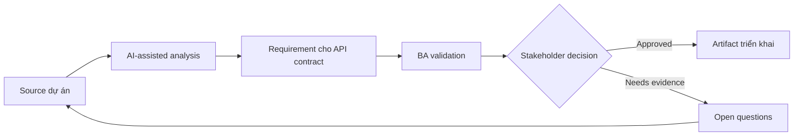

# Requirement cho API contract

<div class="case-meta">
  <span>Backend and API</span>
  <span>API contracts</span>
  <span>Use case dự án</span>
</div>

## Project context

Frontend và backend team cần integrate customer profile API mới. Story mô tả screen, nhưng request field, response field, validation behavior, error response và pagination rule chưa agreed. Trong môi trường delivery thật, tình huống này thường xuất hiện dưới áp lực thời gian: stakeholder cần clarity, delivery cần backlog, QA cần behavior test được, operations cần process chịu được exception. BA dùng AI để tăng tốc analysis và synthesis, nhưng BA vẫn chịu trách nhiệm về evidence, business meaning, stakeholder decisioning và artifact quality.

## BA challenge

BA phải giúp define API behavior bằng business term để frontend, backend, QA và product aligned. API requirement nên cover meaning của data, không chỉ technical schema. Khó khăn thực tế là AI có thể làm material ban đầu trông hoàn chỉnh hơn mức thật sự. BA giỏi giữ output ở trạng thái reviewable bằng cách tách source-backed fact, assumption, unsupported claim, decision gap và recommended next action. Mục tiêu không phải làm document dài hơn; mục tiêu là làm project decision rõ hơn và an toàn hơn.

## Where AI fits

<div class="ba-workbench-panel">
AI hữu ích trong use case này khi được giới hạn vào analysis support, pattern detection, structured drafting và critique. AI không được approve scope, invent policy, quyết định business trade-off hoặc thay thế judgment của stakeholder chịu trách nhiệm.
</div>

- Draft API contract checklist từ screen requirement.
- Identify missing request, response, validation, error và pagination rule.
- Generate API acceptance criteria và integration question.
- Critique schema field có business meaning chưa rõ.

## Inputs to prepare

- Screen behavior spec
- Data field definitions
- Backend domain model
- Existing API examples
- Validation rules

BA nên label các input này trước khi dùng AI: source owner, source date, approval status, sensitivity level, và source đó là fact, opinion, policy, draft hay historical evidence. Việc chuẩn bị này ngăn model xem mọi input đều current và authoritative như nhau.

## BA workflow

1. Map UI behavior tới API operation cần có.
2. Yêu cầu AI propose contract field và missing business definition.
3. Define request, response, filtering, sorting, pagination, validation và error behavior.
4. Review schema với backend và frontend về feasibility.
5. Thêm API acceptance criteria và contract test scenario.
6. Track unresolved contract decision trong decision log.

Workflow hiệu quả nhất khi dùng AI theo từng stage: trước hết organize evidence, sau đó yêu cầu analysis, tiếp theo tạo artifact, rồi chạy critique pass. BA nên giữ decision log visible xuyên suốt để suggestion do AI sinh ra không âm thầm trở thành approved scope.

## Diagram



## Deliverables

| Deliverable | Nội dung | Owner | Done signal |
| --- | --- | --- | --- |
| API behavior spec | Operation, request, response, rule, pagination và owner | BA và backend | API behavior business-readable |
| Field definition catalog | Field, meaning, source, type, nullability và example | BA | Không có data field mơ hồ |
| Error behavior table | Condition, status, code, message, frontend action và owner | Backend | Error actionable |
| Contract test scenarios | Input, expected response, validation và edge case | QA | API test được trước khi UI complete |

Các deliverable này nên được xem là artifact do BA own. AI có thể draft, nhưng BA phải validate source support, stakeholder meaning, traceability và artifact đã sẵn sàng handoff hay chưa.

## Prompt to try

```text
Hãy đóng vai senior Business Analyst hiểu AI. Hỗ trợ tôi áp dụng use case "Requirement cho API contract" vào dự án. Trước hết hỏi source evidence và constraint. Sau đó tạo structured analysis gồm project context, assumption, AI-fit boundary, workflow step, deliverable, risk, control, open question và stakeholder decision. Không tự bịa policy, threshold hoặc approval.
```

## Review checklist

- Mọi statement do AI hỗ trợ đều gắn với source, assumption hoặc validation question.
- BA đã tách drafting assistance khỏi business approval.
- Workflow step có human owner cho decision, review và exception.
- Deliverable trace được về project input và review được bởi QA, product hoặc operations.
- Risk control đủ thực tế để dùng trong meeting dự án thật.
- Success metric: Frontend và backend integrate theo contract trace được tới business behavior.

## Risks and controls

| Rủi ro | Vì sao quan trọng | Control của BA |
| --- | --- | --- |
| Schema without meaning | Team agree field nhưng không agree business interpretation | Document field meaning và example |
| Frontend-backend mismatch | UI expect behavior API không provide | Trace UI behavior tới API operation |
| Error ambiguity | Frontend không guide được user từ generic error | Define error taxonomy và action |
| Late contract decision | Integration delay vì field chưa resolve | Track contract decision sớm |

Control quan trọng nhất là làm uncertainty visible. Nếu evidence yếu, output nên tạo validation question hoặc decision item, không phải final requirement. Nếu artifact ảnh hưởng delivery, release, compliance, customer experience hoặc operational workload, BA nên yêu cầu human review explicit trước khi handoff.
