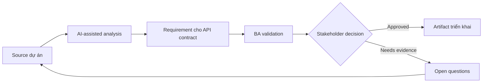

# Requirement cho API contract

<div class="case-meta">
  <span>Backend and API</span>
  <span>API contracts</span>
  <span>Backend/API refinement</span>
  <span>Practitioner</span>
  <span>API behavior spec</span>
  <span>Use case dự án</span>
</div>

## Project context

Frontend và backend team cần integrate customer profile API mới. Story mô tả screen, nhưng request field, response field, validation behavior, error response và pagination rule chưa agreed. Trong API contracts, công việc này thường bắt đầu khi API contract, permission, error, audit và operational behavior phải đủ explicit cho backend delivery. BA nên xem Screen behavior spec và Data field definitions là evidence cần organize, không phải raw material để AI trả lời không kiểm soát. Mục tiêu là làm decision tiếp theo rõ hơn cho người own outcome.

## BA challenge

BA phải giúp define API behavior bằng business term để frontend, backend, QA và product aligned. API requirement nên cover meaning của data, không chỉ technical schema. Với Requirement cho API contract, khó khăn thực tế là service behavior mơ hồ và security gap. AI có thể tăng tốc contract critique, rule extraction, error taxonomy, permission review và NFR gap detection, nhưng BA vẫn phải làm rõ assumption, approval còn thiếu và điểm cần stakeholder judgment.

## Where AI fits

<div class="ba-workbench-panel">
AI phù hợp với use case Backend và API khi được giới hạn vào contract critique, rule extraction, error taxonomy, permission review và NFR gap detection. AI task hữu ích đầu tiên là: Draft API contract checklist từ screen requirement. AI không được approve scope, invent policy, bỏ qua API draft, data model, auth rule, error sample, audit policy và integration need, hoặc biến draft thành final decision.
</div>

- Draft API contract checklist từ screen requirement.
- Identify missing request, response, validation, error và pagination rule.
- Generate API acceptance criteria và integration question.
- Critique schema field có business meaning chưa rõ.

## Inputs to prepare

- Screen behavior spec
- Data field definitions
- Backend domain model
- Existing API examples
- Validation rules

Trước khi prompt cho Requirement cho API contract, hãy label từng input theo owner, date, approval status, sensitivity và vai trò trong decision. Evidence lens quan trọng nhất là API draft, data model, auth rule, error sample, audit policy và integration need; nếu thiếu, AI có thể xem old note, draft design và approved rule có authority như nhau.

## BA workflow

1. Map UI behavior tới API operation cần có.
2. Yêu cầu AI propose contract field và missing business definition.
3. Define request, response, filtering, sorting, pagination, validation và error behavior.
4. Review schema với backend và frontend về feasibility.
5. Thêm API acceptance criteria và contract test scenario.
6. Track unresolved contract decision trong decision log.

Chạy workflow như contract validation trước implementation: bắt đầu với "Map UI behavior tới API operation cần có.", sau đó giữ decision log visible khi artifact tiến tới API behavior spec. Cách này ngăn suggestion của AI âm thầm trở thành backlog, design, release hoặc operational commitment.

## Diagram



## Deliverables

| Deliverable | Nội dung | Owner | Done signal |
| --- | --- | --- | --- |
| API behavior spec | Operation, request, response, rule, pagination và owner | BA và backend | API behavior business-readable |
| Field definition catalog | Field, meaning, source, type, nullability và example | BA | Không có data field mơ hồ |
| Error behavior table | Condition, status, code, message, frontend action và owner | Backend | Error actionable |
| Contract test scenarios | Input, expected response, validation và edge case | QA | API test được trước khi UI complete |

Hãy xem API behavior spec là backend behavior contract do BA own. AI có thể draft structure, nhưng BA phải validate "API behavior business-readable" có thật sự đúng không, artifact có trace được về evidence không và receiving team có hành động được không.

## Prompt to try

```text
Hãy đóng vai senior Business Analyst hiểu AI. Hỗ trợ tôi áp dụng use case "Requirement cho API contract" vào dự án. Trước hết hỏi source evidence và constraint. Sau đó tạo structured analysis gồm project context, assumption, AI-fit boundary, workflow step, deliverable, risk, control, open question và stakeholder decision. Không tự bịa policy, threshold hoặc approval.
```

## Review checklist

- Screen behavior spec được label owner, date, approval status và sensitivity.
- API behavior spec trace được về source evidence và có human owner rõ.
- AI task nằm trong boundary contract critique, rule extraction, error taxonomy, permission review và NFR gap detection và không approve scope hoặc policy.
- Risk "Schema without meaning" có control thực tế: Document field meaning và example.
- Open assumption được chuyển thành validation question hoặc stakeholder decision.
- Success metric: Frontend và backend integrate theo contract trace được tới business behavior.

## Risks and controls

| Rủi ro | Vì sao quan trọng | Control của BA |
| --- | --- | --- |
| Schema without meaning | Team agree field nhưng không agree business interpretation | Document field meaning và example |
| Frontend-backend mismatch | UI expect behavior API không provide | Trace UI behavior tới API operation |
| Error ambiguity | Frontend không guide được user từ generic error | Define error taxonomy và action |
| Late contract decision | Integration delay vì field chưa resolve | Track contract decision sớm |

Control chính cho risk "Schema without meaning" là human accountability explicit: Document field meaning và example. Nếu evidence yếu, output nên tạo validation question hoặc decision item, không phải final requirement.
